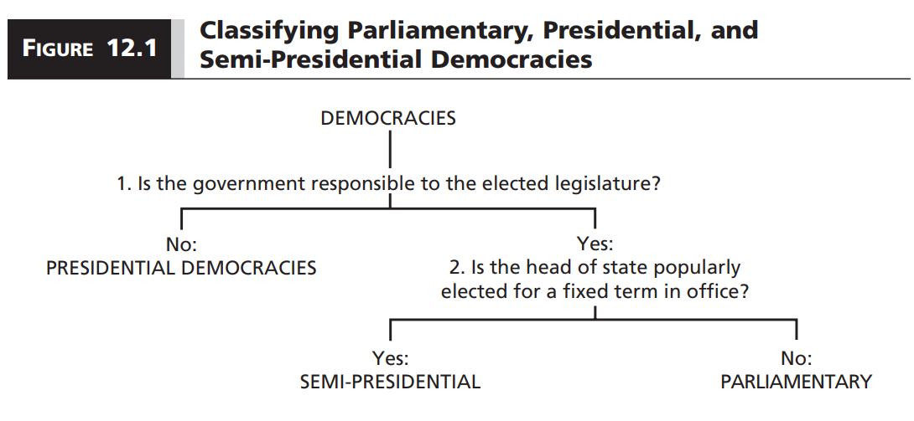
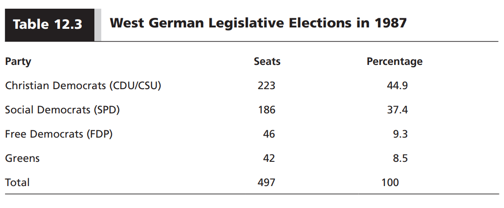
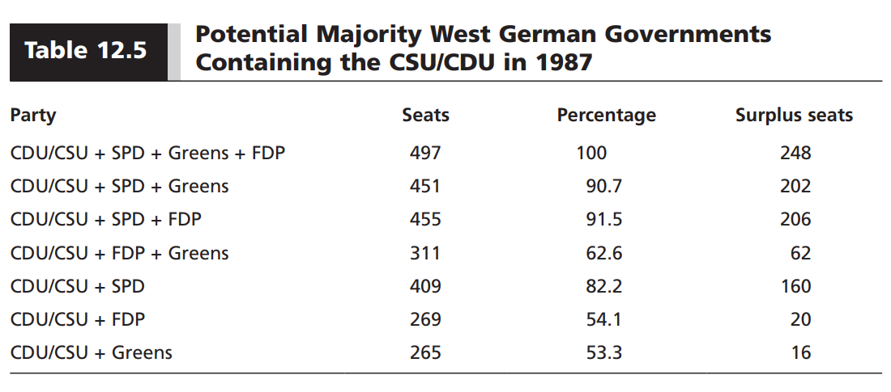
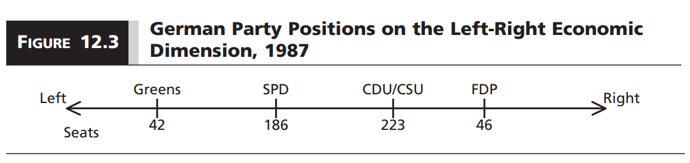

```{r setup, include=FALSE}
options(htmltools.dir.version = FALSE)

library(knitr)
opts_chunk$set(
  fig.width=9, fig.height=5, fig.retina=3,
  out.width = "100%",
  cache = FALSE,
  echo = FALSE,
  message = FALSE, 
  warning = FALSE,
  hiline = TRUE
)
```

```{r xaringan-themer, include=FALSE, warning=FALSE}
# In the future you want to move this to a separate file and source it every time you create a new file
library(xaringanthemer)
style_duo_accent(
  title_slide_background_image = "figs/logo.png",
  title_slide_background_size = "8%",
  title_slide_background_position = "50% 95%",
  primary_color = "#336666",
  secondary_color = "#71C5E8",
  inverse_header_color = "#FFFFFF",
  background_color = "#EAE9EA",
  link_color = "#71C5E8",
  # easy to fetch colors
  colors = c( 
    white = "#FFFFFF",
    green = "#336666",
    lblue = "#71C5E8"
    )
)
```

```{r other-options}
library(tidyverse)
library(kableExtra)
library(fontawesome)

# ggplot global options
theme_set(theme_bw(base_size = 20))
```

## Last time

- Democracy is all about making decisions via majority rule

- We discussed problems of group decision making that come from this

- Yet governments in democracies manage to overcome these problems through institutions

- **This week:** Government formation

---
## Types of democracy

.center[
```{r, out.width = "90%"}

```
]

--

- The formal title of the head of state does not matter

- **Legislative responsibility:** Legislative majority has constitutional power to remove a government from office *without cause*

---
background-image: url("figs/10_dem_map.png")
background-size: contain

---
## Parliamentary democracies

- The **government** is composed by a **prime minister** and a **cabinet**

- **Prime minister:** Chief executive and head of government

- **Cabinet:** Ministers `(secretaries)` in charge of various departments

- The **executive branch** and the **government** are the same thing

- Government members are **elected legislators**

---
## Legislative responsibility

- Legislature can vote to remove a government *without cause*

- **Vote of no confidence:** Legislature initiates, government resigns if fails to secure majority

- **Constructive vote of no confidence:** Must also propose a new government

- **Vote of confidence:** Government initiates, must resign if fails to obtain majority

- No fixed terms, but rules specify restrictions to the frequency of these votes

---
## Responsibility doctrines

- Different beliefs on who cabinet members respond to

- **Ministerial responsibility:** Cabinet ministers bear ultimate responsibility of what happens in their ministry

- **Collective cabinet responsibility:** Ministers publicly support collective cabinet decisions or must resign otherwise

---
## Government formation in parliamentary democracies

- Voters **DO NOT** elect governments

- They elect legislators that negotiate over how to form a government

- Head of state presides over government formation

- Sometimes a mere formality `(e.g. British crown)`, sometimes they play a role `(e.g. Czech president)`

- They usually appoint an elected legislator to lead government formation:

    - **Formateur:** Designated to form the government, often becomes MP
    - **Informateur:** A more neutral figure, suggests politically feasible coalitions and nominates a formateur
    
---
## Cabinet formation

- In practice, the formateur is usually the leader of the largest legislative party

- They must put together a cabinet that is acceptable to the legislative majority

- Most of the time, a single party does not have a majority, so they must bargain with other parties

- Usually, once formed, the new government must be confirmed by an **investiture vote**

- Government rules until:

    1. They are defeated in a vote of no confidence **OR**
    2. A new election is necessary
    
- If defeated, a **caretaker government** takes place `(sometimes the same government)`

- Caretaker governments are usually not expected to lead major reforms

---
## How to form a government?

.center[
```{r, out.width = "90%"}

```
]

- No party received enough votes to have a legislative majority

---
background-image: url("figs/10_germany_1.png")
background-size: contain

---
## Possible coalitions

.center[
```{r, out.width = "90%"}

```
]

- In return for their loyalty, the formateur offers cabinet positions

- Offer in proportion to party size in the legislature `(Gamson's law)`

- Ideally, you want a **minimal winning coalition (MWC):** No more parties than those required to keep a majority

- But, who to side with?

---
## Assumptions

- Whether a coalition is feasible depends on what we assume about politicians' goals

- **Office-seeking politicians:** Want as much office as possible

- **Policy-seeking politicians:** Wants to shape policy

- In reality, a mixture of both, but it helps to analyze these separately

---
## Office-seeking world

- You would want a MWC

- You also want the **least minimal winning coalition**

- **Least minimal winning coalition:** The MWC with the lowest number of surplus seats

---
## Office-seeking in the Germany example

- Three MWC:

    1. CDU/CSU + SPD (160 seats)
    
    2. CDU/CSU + FDP (20 surplus seats)
    
    3. CDU/CSU + Greens (16 surplus seats)
    
---
count: false

## Office-seeking in the Germany example

- Three MWC:

    1. CDU/CSU + SPD (160 seats)
    
    2. CDU/CSU + FDP (20 surplus seats)
    
    3. **CDU/CSU + Greens (16 surplus seats)**
    
---
## Policy-seeking world

- Formateur gets other parties to join by **making policy concessions**

- Larger parties will likely get larger policy concessions

- To minimize concessions, you want to form coalitions with parties close to you in the policy space

- You also want a **connected least minimal winning coalition**

---
## Policy-seeking in the Germany example

.center[
```{r, out.width = "90%"}

```
]

- **CDU/CSU + Greens** is the smallest coalition, but not connected

- **CDU/CSU + SPD** is connected but not the smallest

- **CDU/CSU + FDP** is the **smallest connected coalition** `(This happened in real life)`

--

- **Bottomline:** Coalitions are a mix of office-seeking and policy-seeking considerations

---
## Government types

- **Single-party majority:** One party with majority

- **Minimal winning coalition:** Many parties, just enough to get majority

- **Single-party minority government:** One party, no majority

- **Minority coalition government:** Many parties, no majority

- **Surplus majority government** Many parties, way above majority

---
## Minority and surplus majority

- Why do we see anything beyond strict majorities?

- **Minority governments:** 

    - Implicit majority without cabinent concessions `(perhaps emphasis in policy)`
    - Government forms ad hoc coalitions depending on policy objectives `(similar to median voter theorem)`
    
- **Surplus majorities:**

    - Periods of crisis that require national unity
    - Government wants to implement major reforms that require supermajorities `(e.g. constituional reforms)`


---
## Presidential democracies

---
## Semi-presidential democracies

---
## Principal-agent model

[DELEGATION AS UNIFYING FRAMEWORK]

---
class: inverse center middle

## Reminder:
### No assignment due this week
### Enjoy Thanksgivng break!

## After Break:
### Elections and Electoral Systems