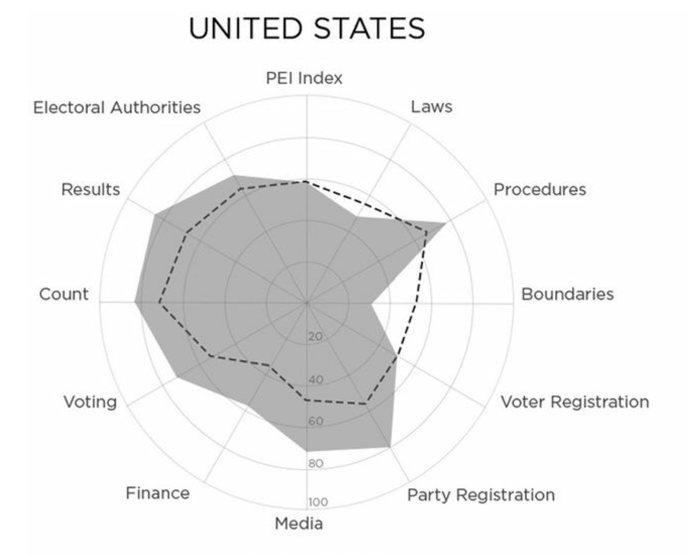
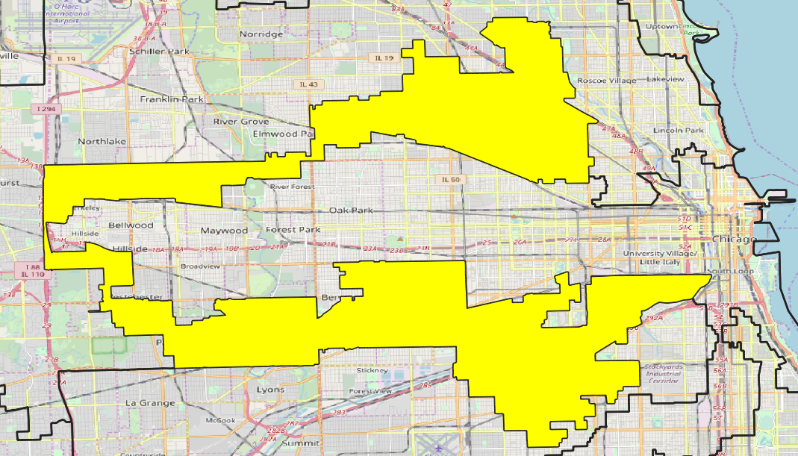
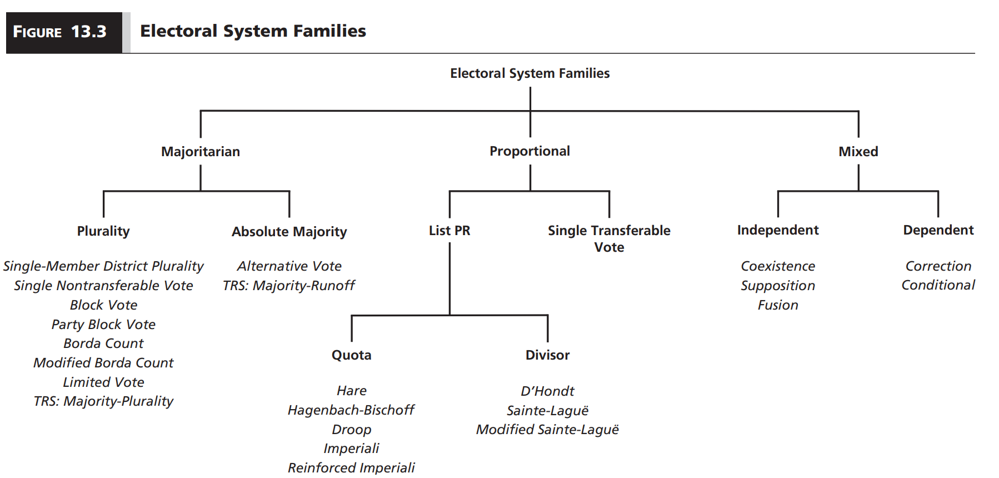
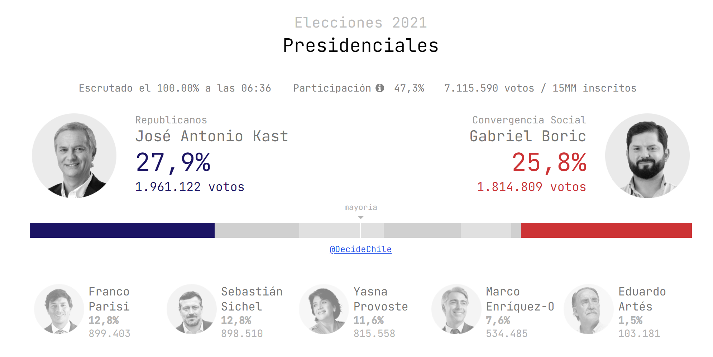
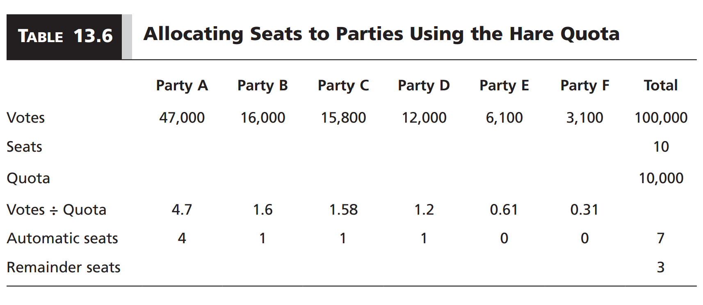
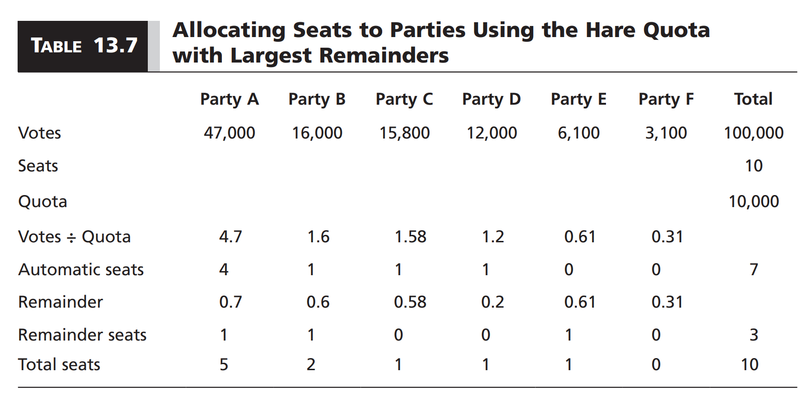
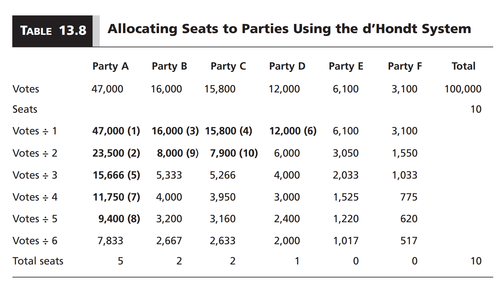
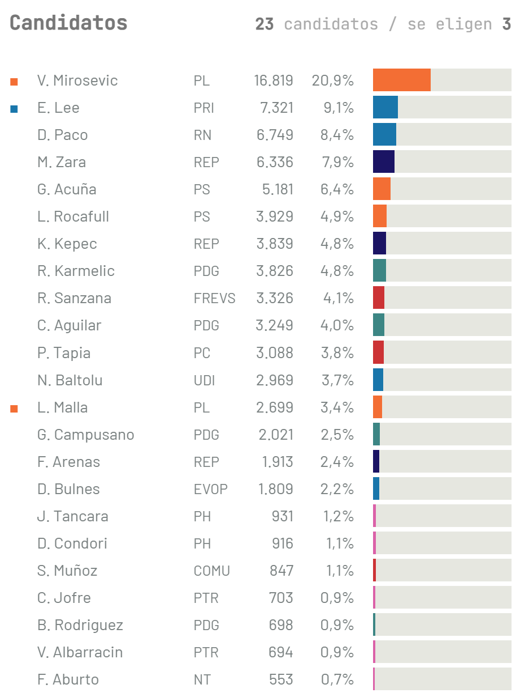

```{r setup, include=FALSE}
options(htmltools.dir.version = FALSE)

library(knitr)
opts_chunk$set(
  fig.width=9, fig.height=5, fig.retina=3,
  out.width = "100%",
  cache = FALSE,
  echo = FALSE,
  message = FALSE, 
  warning = FALSE,
  hiline = TRUE
)
```

```{r xaringan-themer, include=FALSE, warning=FALSE}
# In the future you want to move this to a separate file and source it every time you create a new file
library(xaringanthemer)
style_duo_accent(
  title_slide_background_image = "figs/logo.png",
  title_slide_background_size = "8%",
  title_slide_background_position = "50% 95%",
  primary_color = "#336666",
  secondary_color = "#71C5E8",
  inverse_header_color = "#FFFFFF",
  background_color = "#EAE9EA",
  link_color = "#71C5E8",
  # easy to fetch colors
  colors = c( 
    white = "#FFFFFF",
    green = "#336666",
    lblue = "#71C5E8"
    )
)
```

```{r other-options}
library(tidyverse)
library(kableExtra)
library(fontawesome)

# ggplot global options
theme_set(theme_bw(base_size = 20))
```

## Last time

- Different institutions shape government formation in democracies

- At the core: Delegation creates principal-agency interactions

- Bargaining and policy concessions depend on the distribution of seats in the legislature

- How are legislative seats assigned?

- **This week:** Elections and electoral systems

---
## Electoral systems

- **Electoral system:** Laws that regulate competition between candidates or parties

- Every elected office has an electoral system, although most meaningful variation around the world occurs in the context of **legislative seats**

- Elections are increasingly common, not only in **democracies** but also in **dictatorships**, but the goals are different

- **Democracy:** Solve problems with group decision-making

- **Dictatorship:** Political survival

    - Measure support for the regime
    - Evaluate the performance of local level officials
    - Settle disputes among selectorate
    - Create the illusion of democracy `(electoral authoritarianism)`

---
## Electoral integrity

- Even in formal democracies, elections may not always be free and fair

- **Electoral integrity:** Whether elections conform to international standards and global norms

- **Violations:** Electoral malpractice `(e.g. ballot stuffing, voter intimidation, pro-government media bias, restrictive ballot access)`

- Malpractice generally more pronounced in developing countries, but industrialized democracies also face challenges


---
## Example

.center[
```{r, out.width = "80%"}

```
]

---
## Gerrymandering

.center[
```{r, out.width = "90%"}

```
]

.footnote[Illinois 4th Congressional District]
---
## How to detect electoral malpractice?

1. **Election monitoring** (before an election)

    - But sometimes election monitors only displace irregulartities!
    
2. **Election forensics** (after an election)

    - But not all forms of malpractice can be detected looking at numbers!

---
## Election forensics: Benford's law

- Naturally occurring numbers exhibit regular patterns in the distribution of digits at different locations

- We can use this to detect malpractice in campaign contributions, turnout, votes, etc

.center[
```{r, out.width = "90%"}

```
]

---
## Electoral systems

- The main distinction is differences in **electoral formula**

- **Electoral formula:** Rules to translate votes into seats

- Three families:

    1. Majoritarian
    
    2. Proportional
    
    3. Mixed
    
---
class: center middle

.center[
```{r, out.width = "100%"}

```
]

---
## Majoritarian systems

- The party or candidate that receives the most votes wins

- **Plurality:** Most voted candidate wins `(first-past-the-post)`

- **Absolute majority:** Need $50\% + 1$ votes to win

---
## Plurality

- **Single-member district plurality (SMDP):**

    - One candidate elected per district
    - Each voter casts a preference for one candidate
    - Candidate with most votes wins
    
- **Single non-transferable vote (SNTV):**

    - A generalization of SMDP
    - $N$ seats per district `(can vary)`
    - Each voter casts a preference for one candidate
    - The $N$ most voted candidates win
    
---
## Absolute majority

- A candidate automatically wins if they get $50\% + 1$ votes

- Otherwise, we need to find ways to identify an absolute majority

- **Alternative vote:**

    - Voters rank candidates in order of preference
    - If no candidate wins an absolute majority, then the candidate with the fewest first-preference votes is eliminated and their votes allocated to the second preferences

---
## Example: 2011 UK referendum

.center[
<iframe width="660" height="415" src="https://www.youtube.com/embed/wA3_t-08Vr0" title="YouTube video player" frameborder="0" allow="accelerometer; autoplay; clipboard-write; encrypted-media; gyroscope; picture-in-picture" allowfullscreen></iframe>
]

.footnote[<https://youtu.be/wA3_t-08Vr0>]

---
## Absolute majority

- A candidate automatically wins if they get $50\% + 1$ votes

- Otherwise, we need to find ways to identify an absolute majority

- **Alternative vote:**

    - Voters rank candidates in order of preference
    - If no candidate wins an absolute majority, then the candidate with the fewest first-preference votes is eliminated and their votes allocated to the second preferences

--

- **Mayority-runoff two-round-system (TRS):**

    - Voters cast a preference for a single candidate
    - If no candidate wins absolute majority in the first round, the top two vote winners compete in a runoff election in the second round

---
## Example: Chile 2021 elections

.center[
```{r, out.width = "100%"}

```
]

---
## Proportional systems (PR)

- Each district elects multiple seats

- **District magnitude:** Number of seats elected per district `(can vary across districts)`

- The idea is to produce a **proportional** translation of votes into seats

- **List PR:** Vote for parties or pre-electoral coalitions

- **Single-transferable vote (STV):** Rank candidates, use alternative voting rules until all seats are filled 

---
## List PR

- Parties or coalitions receive votes in proportion to their overall share of votes

- Two non-trivial issues:

    1. How to allocate seats **across** lists? `(quota vs. divisor)`
    
    2. How to allocate seats **within** lists? `(closed vs. open lists)`
    
---
## Quotas

- The price in terms of votes that a party must pay to guarantee themselves a seat in a particular district

- A quota $Q(n)$ is calculated as

$$
Q(n) = \frac{V_d}{M_d + n}
$$

- $V_d$: Number of valid votes in district $d$

- $M_d$: Number of available seats in district $d$ `(district magnitude)`

- $n$: Quota *modifier*

    - **Hare quota:** $n = 0$
    - **Hagenbach-Bischoff quota:** $n = 1$
    - **Imperiali quota:** $n = 2$
    
---
## Example: Hare quota

.center[
```{r, out.width = "100%"}

```
]

--

- What happens to the remainder seats?

- The most common approach is the **largest remainder method**

---
## Hare quota with largest remainders

.center[
```{r, out.width = "100%"}

```
]

---
## Divisors

- Divide the total number of votes by a **divisor** to obtain a **quotient**

- District seats are allocated to parties with highest quotients

- Common divisors:

    - **D'Hont:** $1, 2, 3, 4, \ldots$
    - **Sainte-Laguë:** $1, 3, 5, 7, \ldots$
    - **Modified Sainte-Laguë:** $1.4, 3, 5, 7, \ldots$
    
---
## Example: d'Hont

.center[
```{r, out.width = "100%"}

```
]

---
## Electoral thresholds

- Both quota and divisor PR systems imply **electoral thresholds**

- **Electoral threshold:** Minimum level of support a party needs to obtain representation

- **Natural threshold:** Mathematical by-product of the electoral system

- **Formal threshold:** Explicit minimum in the electoral law

- A **lower electoral threshold** implies a **more proportional** translation from votes to seats

---
## Closed vs. open lists

- **Closed list:** Voters cast a preference for a party, parties decide the order in which candidates will receive seats

- **Open list:** Voters can indicate their preferred party, as well as their favored candidate within the list

- **Free list:** Voters have multiple votes that they can allocate within a list or across lists

---
## Example: Open list PR in Chile 2021 elections (d'Hont)

.pull-left[
```{r, out.width = "90%"}

```
]

.pull-right[
### District 1

- 23 candidates

- 3 seats

- Many parties

- First place got enough votes to "drag" the second candidate from their party with them
]

---
## Single transferable vote (STV)

- Also PR, but without party lists

- Instead, candidate-centered preferential voting

- Voters rank candidates

- Candidates that surpass a quota of first-preference votes are immediately elected

- Candidates with least votes are eliminated

- Surplus votes from winners + eliminated candidates are reallocated to the next preference ranking

- Repeat process until all seats filled

---
## Example: Scottish council elections

.center[
<iframe width="660" height="415" src="https://www.youtube.com/embed/P38Y4VG1Ibo" title="YouTube video player" frameborder="0" allow="accelerometer; autoplay; clipboard-write; encrypted-media; gyroscope; picture-in-picture" allowfullscreen></iframe>
]

.footnote[<https://youtu.be/P38Y4VG1Ibo>]

---
## Mixed electoral systems

- Any **combination of majoritarian and proportional** is a mixed system

- Most mixed systems use multiple **electoral tiers**

- **Example:** District-level plurality + Nationwide list PR

- Two types of mixed system

    1. **Independent:** Majoritarian and proportional components are independent of one another
    
    2. **Dependent:** The application of the proportional formula depends on the distribution of seats produced by the majoritarian formula
    
---
## Independent example: Mexico's Chamber of Deputies

.pull-left[
- 500 seats

- 300 SMDP constituencies

- 200 nationwide PR district

- PR seats distributed based on national votes
]

.pull-right[
```{r, out.width = "100%"}
include_graphics("figs/11_mexico.png")
```
]

---
## Dependent example: New Zealand's House of Representatives

- 120 seats

- Each citizen hast two votes

- **Electorate vote** and **party vote**

- 63 regional + 7 maori SMDP seats from `electorate vote`

- 50 nationwide list PR seats from `party vote`

- Electorate vote seats are allocated first

- If a party has fewer seats than their share of the party vote, they get additional seats from their PR list to match proportions

- If a party wins more seats from the electoral votes than their share of party votes, they keep them. These are called **overhang seats**

---
## Which electoral system is better? (Chapter 16)

- **Arrow's theorem:** Every government formation procedure faces trade-offs

- The question is what we want to accomplish through democracy

- **Majoritarian vision:** Concentrate power in the hands of a majority to ensure accountable government `(then majoritarian systems are better)`

- **Consensus vision:** Disperse power so that all interests are represented `(So PR is better)`

- Different variation of the electoral system aim to maximize one of the two visions, or to balance the shortcomings of each

- Recent scholarsship suggest that **PR with low district magnitude** is the sweet spot, but the evidence so far is weak `r fa("fire-alt")`

---
## Takeaways

- Elections are increasingly common in both democracies and dictatorship

- This brings concerns over **electoral integrity** around the world

- We classify electoral systems based on how they translate vote to seats

- **Majoritarian:** Plurality vs absolute majority

- **PR:** Quota vs divisor, closed vs open lists, STV

- **Mixed:** Independent vs dependent

- Which one is better depends on whether we prioritize **accountable government** or **representation**

---
class: inverse center middle

## Reminder:
### Quiz 4 due Friday by 5 PM

## Next week:
### Social Cleavages and Party Systems