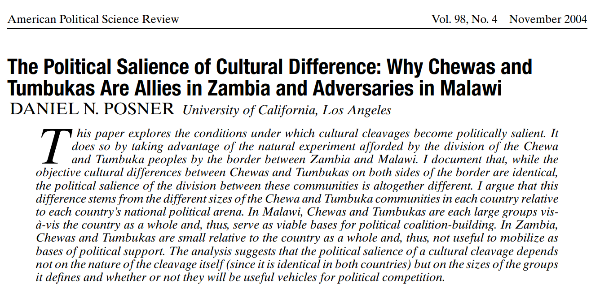
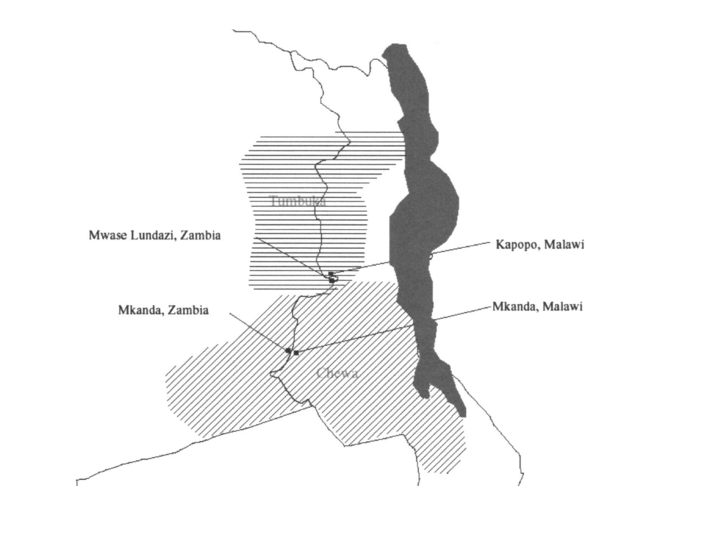
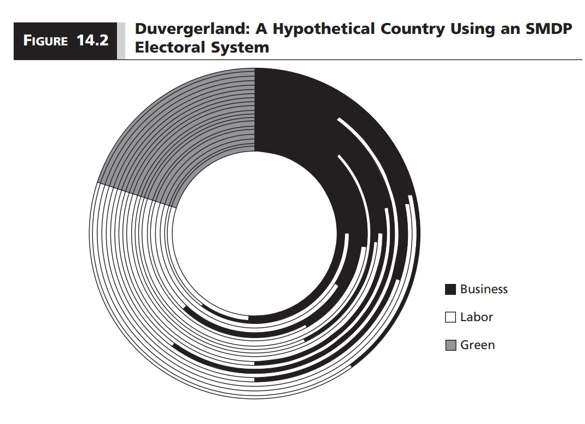
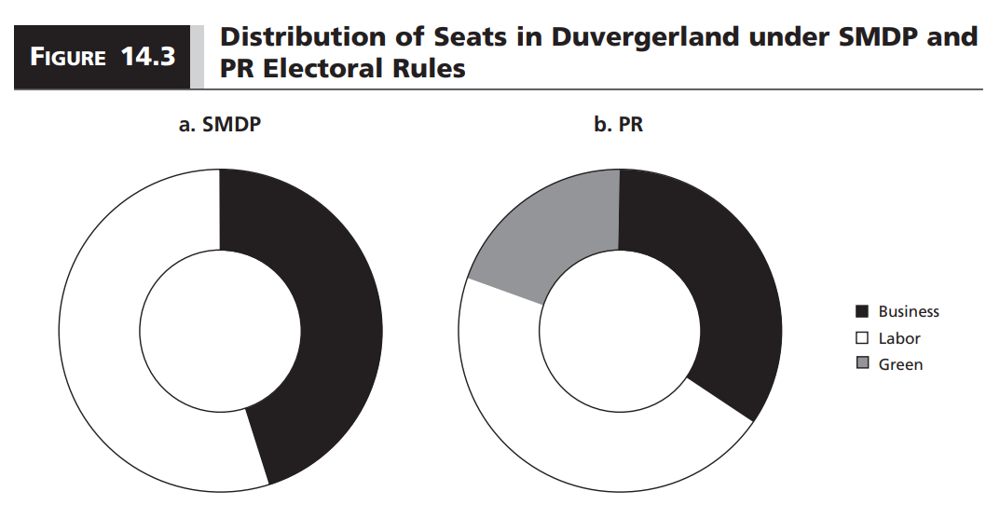

```{r setup, include=FALSE}
options(htmltools.dir.version = FALSE)

library(knitr)
opts_chunk$set(
  fig.width=9, fig.height=5, fig.retina=3,
  out.width = "100%",
  cache = FALSE,
  echo = FALSE,
  message = FALSE, 
  warning = FALSE,
  hiline = TRUE
)
```

```{r xaringan-themer, include=FALSE, warning=FALSE}
# In the future you want to move this to a separate file and source it every time you create a new file
library(xaringanthemer)
style_duo_accent(
  title_slide_background_image = "figs/logo.png",
  title_slide_background_size = "8%",
  title_slide_background_position = "50% 95%",
  primary_color = "#336666",
  secondary_color = "#71C5E8",
  inverse_header_color = "#FFFFFF",
  background_color = "#EAE9EA",
  link_color = "#71C5E8",
  inverse_link_color = "#FFFFFF",
  # easy to fetch colors
  colors = c( 
    white = "#FFFFFF",
    green = "#336666",
    lblue = "#71C5E8"
    )
)
```

```{r other-options}
library(tidyverse)
library(kableExtra)
library(fontawesome)

# ggplot global options
theme_set(theme_bw(base_size = 20))
```

class: inverse

## End-of-semester announcements!

- You will receive a **temporary** final grade on Monday, December 13 by 5:00 PM

- That grade will assume that your Quiz 5 score is the average of your previous 4 quizzes

- **This is not a real grade!** Just there to help you make decisions

- You have until Thursday, December 16 at 5:00 PM to decide if you want to take the final exam `(I will post a sign-up form on Canvas)`

---
class: inverse

## Final exam

- Take home, open book essay, upload to Canvas as a PDF `(Find the link on the Modules section)`

- Only available to those who sign up

- You are automatically signed up if your final grade after quiz 5 is below **D-** `(67 points)`

- If you sign up, **your exam will be graded even if you don't submit!**

- **Available:** Friday, December 17, 5:00 PM 

- **Due:** Tuesday, December 21, 11:59 PM `(You will get an incomplete if you submit late)`

- Choose 2 out of 3 questions to answer. 50 points each

- Focus on applying knowledge of course material to a political consulting scenario `(Show off what you have learned!)`

---
class: inverse

## Participation grades

- Available along with temporary grades

- You have until December 17, 5:00 PM to dispute participation grades

- Send a one page document via email explaining why your grade should be better

---
class: inverse

## Final grades

- **School deadlines:** December 23 for graduating students, January 5 for everyone else

- Will do my best to have final grades by December 23

- **Grade grievance procedure:** [https://advising.tulane.edu/resources/policies-catalog `r fa("external-link-alt", fill = "#FFFFFF")`](https://advising.tulane.edu/resources/policies-catalog)


---
## So far...

- We talked about how **parties** form governments to solve group-decision making problems in democracies

- We discussed how elections translate the votes that **parties** get into seats

- But what are **political parties**?

- **This week:** Where do they come from? What explains differences in party systems across the world?

---
## Political parties

- **Political party:** Group of people including those who hold office and those who help them to get and remain there

- Political parties serve **four main purposes**:

    1. Structure the political world
    2. Recruit and socialize political elite
    3. Mobilize masses
    4. Serve as the link between rulers and ruled

- Because of their connection with elections and electoral systems, we say that **official political parties** are those recognized by law

---
## Party systems

- **Nonpartisan democracy:** Democracy with no official parties

- **Single-party system:** Only one political party is legally allowed to hold power

- **One-party dominant system:** Multiple parties may legally operate but only one has a realistic chance of holding power

- **Two-party system:** Only two parties have a realistic chance of holding power

- **Multiparty system:** More than two parties have a realistic chance of holding power

--

&nbsp;

- How do we know what counts as having a realistic chance to hold power?

- Any of the last three party systems can have 10 official parties

- But clearly not all parties count the same in each case!

---
## Counting parties

- **Effective number of parties:** Use weights to count parties by both **number** and **size**

- **Effective number of electoral parties:** Number of parties that win votes

$$
\frac{1}{\sum v_i^2}
$$
- **Effective number of legislative parties:** Number of parties that win seats

$$
\frac{1}{\sum s_i^2}
$$
- $v_i$ and $s_i$ are the share of votes and seats, respectively

---
## Example: Counting legislative parties


```{r}
enlp = data.frame(
  Party = c("Seats", "Share"),
  A = c("5", "0.1"),
  B = c("17", "0.34"),
  C = c("3", "0.06"), 
  D = c("24", "0.48"),
  E = c("1", "0.02"),
  Total = c("50", "1")
)

enlp %>% 
  kbl(align = "r") %>% 
  column_spec(1, bold = TRUE)
```


$$
\begin{split}
ENLP = \frac{1}{(0.1)^2 + (0.34)^2 + (0.06)^2 + (0.48)^2 + (0.02)^2}\\
= \frac{1}{0.01 + 0.1156 + 0.0036 + 0.2304 + 0.0004} \\
= \frac{1}{0.36}\\
\approx 2.78
\end{split}
$$
---
## Social cleavages

- We now know how to count parties and categorize the resulting party system

- But why do we have different parties to begin with?

- One of the roles of political parties is to represent **social cleavages**

- **Social cleavage:** Historically determined line which divides citizens within a society into groups with different political interests, resulting in conflict among these groups.

---
## Common cleavages

- Urban-rural

- Confessional

- Secular-clerical

- Class

- Post-materialist

- Ethnic and linguistic

--

&nbsp;

- **Why are some cleavages pronounced in some societies but not in others?**

---
## Where do cleavages come from?

- Individuals have a repertoire of **attributes** that make them eligible for membership in some **identity category**

- Examples: Religion, language, class, gender, etc.

- Attributes are **fixed** in that most of the time we cannot change them and they are self-evident to others

- **Identity category:** Is a social group in which individuals can place themselves

- Identity categories are **socially constructed** in that they may or may not be **relevant depending on the context**

---
## Running example: Chewas and Tumbukas in Malawi and Zambia

.center[
```{r, out.width = "90%"}

```
]

---
## Puzzle

- $2/3$ of both Chewas and Tumbukas live in Malawi, $1/3$ live in Zambia

- **Malawi:** Political enemies

- **Zambia:** Political allies

- Other than being in different sides of the border, they are the exact same ethnic groups!

---
## They even live around the border!

.center[
```{r, out.width = "80%"}

```
]

---
## Cultural differences

- Chewas speak Chichewa, Tumbukas speak Chitumbuka

- Chewas dance nyau, Tumbukas dance vinbuza

- Chewa parents expect a chicken as dowry, Tumbuka parents expect seven cows

---
## Political attitudes vary by country

- Would a member of your ethnic group vote for a presidential candidate from the other ethnic group?

    - **Zambia:** 21% no
    - **Malawi:** 61% no
    
- Would you marry a member from the other ethnic group?

    - **Zambia:** 24% no
    - **Malawi:** 55% no
    
---
## Why allies in Zambia but enemies in Malawi

- Both countries have a SMDP electoral system

- Both have similar party systems

- Both former British colonies

- **So what explais the difference?**

---
## Malawi

- Chewas (57%) and Tumbukas (12%)

- Given their size and electoral system, it makes sense to politicize the Chewa-Tumbuka division

- Malawi Congress Party (MCP) is seen as the Chewa party

- Alliance for Democracy (AFORD) is seen as the Tumbuka party

---
## Zambia

- Chewas (7%) and Tumbukas (4%)

- Given the size and electoral system, it **does not** make sense to politicize the Chewa-Tumbuka division

- The main division is among Easterners (Chewas and Tumbukas), Northerners, Westerners, and Southerners

- A **regional** rather than **ethnic** cleavage

- Chewas and Tumbukas have to work together if they hope to win political power

---
## What activates cleavages?

- The logic of political competition focuses elite and voter attention on some cleavages but not others

- Politicians seek build winning political coalitions

- Not all cultural and ethnic divisions become politicized

- **Electoral institutions** turn **latent** social cleavages into **politicized** social cleavages

---
## Returning to the number of parties

- **Duverger's theory:** Social divisions are the primary driving force behind the formation of parties

- Electoral institutions influence how social divisions are translated into political parties

- The more **distinct** social cleavages there are, the greater demand for distinctive representation and political parties

.footnote[**Note:** The textbook talks about **cross-cutting** instead of **distinct** cleavages. How does that matter?]

---
## The role of electoral institutions

- Social cleavages create **demand** for political parties

- But electoral institutions determines **whether it makes sense** to meet the demand with supply

- **Least proportional electoral systems** act as a brake on the tendency for social cleavages to be translated into new parties

- **More proportional electoral systems** create incentives to politicize social cleavages

- So there is a **positive correlation** between the proportionality of the electoral system and the number of parties

---
## Effects in Duverger's theory

- Two ways in which electoral systems affect the number of parties

- **Mechanical effect:** 

    - The translation from votes to seats determines which and how many parties are viable
    - **Example:** SMDP tends to reward large parties, usually converging to two
    
- **Strategic effect:**

    - Knowledge of how the electoral formula works influences the strategic behavior of voters and political elites
    - **Example:** SMDP creates incentives to vote for the lesser evil
    
---
## Mechanical effect: Duvergerland

.center[
```{r, out.width = "80%"}

```
]

---
## Mechanical effect: SMDP vs PR

.center[
```{r, out.width = "80%"}

```
]


---
## Strategic effect: Voting and entry

1. **Strategic voting:** Voting for the most preferred candidate or party **that has a realistic chance of winning**

2. **Strategic entry:** Political elites decide whether to enter the political scene under the label of their most preferred party **that has a realistic chance of winning**

- Notice that large parties are not always the ones more likely to win

- **Voters perspective:** A small party nationwide may be competitive in my district

- **Elite perspective:** A smaller party can focus more resources on your campaign

---
## A caveat on Durverger's theory

- It only works at the district level!

- In average, we can have more parties competing at the national level than at the district level

- Even if district magnitude is constant across district!

- **Example:** Canada has around four major parties at the national level despite SMDP because different provinces have different two-party systems

- A party system is **nationalized** if the local and national party systems have similar size

- Nationalized party systems are **more common** under:

    1. Fiscal centralization
    2. Political centralization
    3. Concurrent presidential elections
    4. National cleavage patterns

---
## Takeaways

- We can classify party systems depending on the number of parties

- But counting the **effective** number of parties is not trivial

- Latent social cleavages create demand for political representation

- Cleavages become politicized when parties choose to organize around them

- Electoral institutions and the distribution of distinct cleavages in society determines whether it makes sense to meet demand with supply

- This happens through the mechanical and strategic effects

- Sometimes district and national party systems look the same, sometimes they do not

---
class: inverse center middle

## Reminder:
### News Report 5 due Friday by 5 PM

## Next week:
### Institutional Veto Players