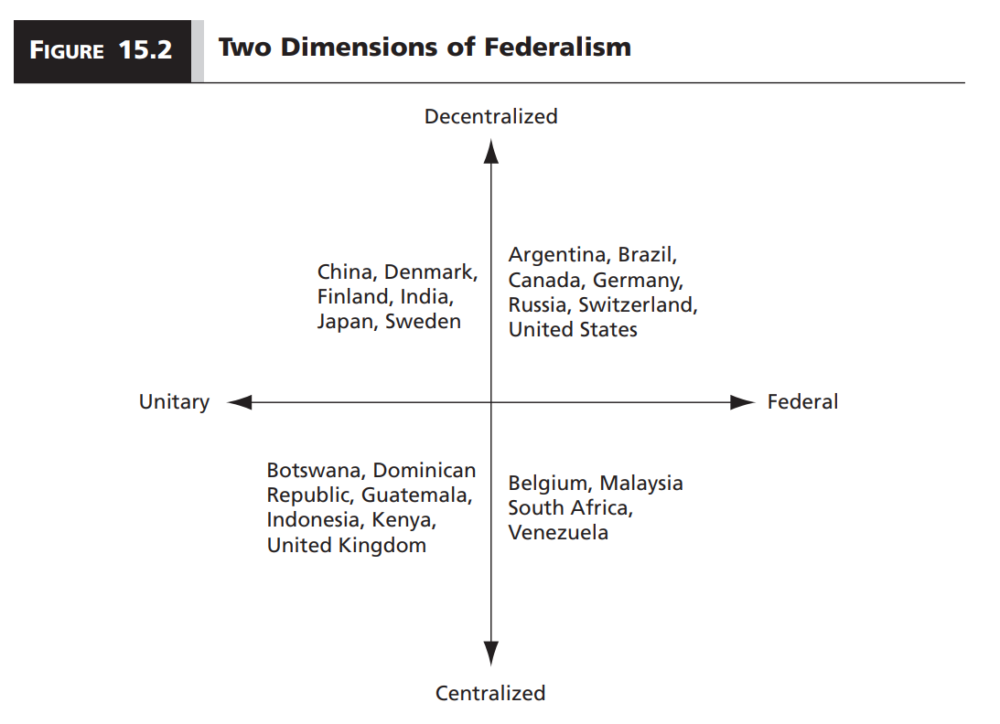
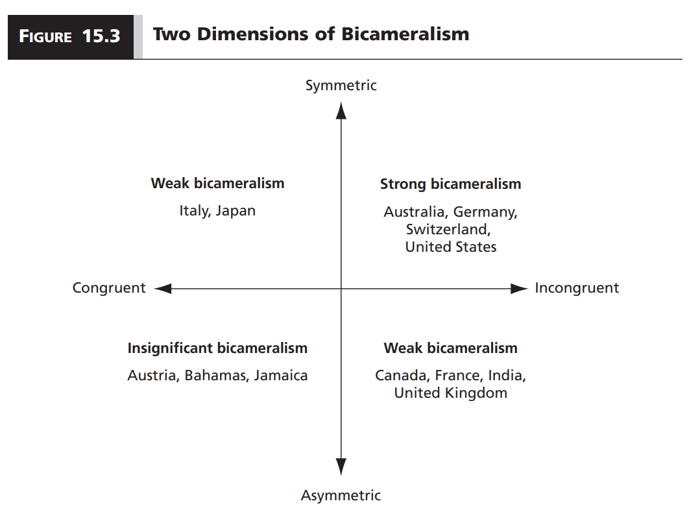

```{r setup, include=FALSE}
options(htmltools.dir.version = FALSE)

library(knitr)
opts_chunk$set(
  fig.width=9, fig.height=5, fig.retina=3,
  out.width = "100%",
  cache = FALSE,
  echo = FALSE,
  message = FALSE, 
  warning = FALSE,
  hiline = TRUE
)
```

```{r xaringan-themer, include=FALSE, warning=FALSE}
# In the future you want to move this to a separate file and source it every time you create a new file
library(xaringanthemer)
style_duo_accent(
  title_slide_background_image = "figs/logo.png",
  title_slide_background_size = "8%",
  title_slide_background_position = "50% 95%",
  primary_color = "#336666",
  secondary_color = "#71C5E8",
  inverse_header_color = "#FFFFFF",
  background_color = "#EAE9EA",
  link_color = "#71C5E8",
  inverse_link_color = "#FFFFFF",
  # easy to fetch colors
  colors = c( 
    white = "#FFFFFF",
    green = "#336666",
    lblue = "#71C5E8"
    )
)
```

```{r other-options}
library(tidyverse)
library(kableExtra)
library(fontawesome)

# ggplot global options
theme_set(theme_bw(base_size = 20))
```

class: inverse

## Teaching evaluations

- Available until 12/14/2021 11:59 PM

- You will keep getting reminders until you complete them

- Your answers are confidential and I can only see the report after the final grades submission period

- A chance to help your instructors improve in a post-pandemic world

- For some of your instructors they matter for promotion! `(Not for me though)`

- A lot of research shows that women, POC, and other minorities tend to get worse evaluations for comparable performance `(Think about implicit biases!)`

---

## So far...

- We have discussed many institutional features of democracy and how they vary around the world

- **Goal:** Overcome problems in group decision-making

- **Arrow's theorem:** Investing in one aspect of fairness sacrifices other dimensions

- **This week:** Additional institutional arrangements to counter the negative consequences

    - How much decision-making power should regions have?
    
    - How many chambers should a legislature have?
    
    - How much detail should we include in the constitution?
    
- **At the core:** The role of institutional veto players

---
## We will focus on three institutional features

1. Federalism

2. Bicameralism

3. Constitutionalism

---
## Federalism

- **Federal (nation-)state:** Sovereignty is **constitutionally** split between at least two territorial levels so that independent governmental units at each level have final authority in at least one policy realm

- **Federal level:** National

- **Subnational/regional:** States, provinces, cantons, etc.

- States that are not federal are **unitary states**

- Federal states can be either democracies `(e.g. Brazil)` or dictatorships `(e.g. United Arab Emirates)`

---
## Devolution $\neq$ Federalism

- **Devolution:** Unitary state grants power to subnational governments but retains the right to unilaterally recall or reshape those powers `(e.g. India)`

- **Federalism:** Subnational governments have a constitutional right to their powers, cannot be recalled without changing the constitution

---
## Congruent vs. incongruent federalism

- **Congruent:** Territorial units share a similar demographic makeup with one another and the country as a whole `(e.g. United States, Brazil)`

- **Incongruent:** Different demographic makeup among territorial units and country as a whole `(e.g. Switzerland, Belgium)`

- Sometimes congruence/incongruence emerges naturally, sometimes it is a political decision

---
## Symmetric vs asymmetric federalism

- **Symmetric:** Territorial units possess equal powers relative to the central government `(e.g. United States)`

- **Asymmetric:** Some territorial units enjoy more extensive powers than others relative to the central government `(e.g. Canada)`

---
## Federalism in structure and in practice

- **Federalism** implies constitutional recognition of decision-making autonomy

- But having the power to make decisions does not translate automatically to policy making

- **Decentralization:** Whether **actual** policy making power lies within central or regional governments

- This is hard to observe directly

- Easier to determine whether regions have the resources to implement policy decisions, so we tend to look at the **distribution of tax revenue**

- **The greater the share of tax revenues going to the central government, the less decentralized the state**

.footnote[**Note:** Differences in symmetry and congruence apply to decentralization as well]

---
## Federalism does not imply decentralization

.center[
```{r, out.width = "80%"}

```
]

---
## Where does federalism come from?

- **Coming-together federalism:** Bargaining process in which independent polities agree to give up part of their sovereignty to pool resources, improve collective security, or achieve economic goals

- **Holding-together federalism:** Central government of a polity chooses to decentralize to diffuse secessionist pressures

---
## Pros and cons of federalism

.pull-left[
### Pros

- Closer match between policy and citizen preferences

- More accountability

- Competition among states incentivizes good government

- Policy experimentation

- Checks and balances
]

.pull-right[
### Cons

- Policy duplication and contradiction

- Collective action problems in policy formulation

- Competition leads to downward harmonization

- Competition amplifies pre-existing inequalities

- Facilitates blame shifting and credit claiming
]

---
## Bicameralism

- **Unicameral legislature:** Deliberation occurs in a single assembly

- **Bicameral legislature:** Deliberation occurs in two distinct assemblies

- About 40% of countries have bicameral legislatures

---
## Congruent vs. incongruent bicameral systems

- **Congruent:** Two legislative chambers have similar political composition

- **Incongruent:** Different political composition

- The level of congruence depends on:

    1. How chamber members are selected
    
    2. Whom that chamber is supposed to represent
    
.footnote[**Note:** I wonder if bicameralism changes what we have discussed about government formation in parliamentary and semi-presidential systems. Maybe the textbook says something about it?]
    
---
## Methods to select chamber members

- Lower house members are almost always elected by popular vote

- Upper house members can be selected by any combination of:

    1. Heredity
    
    2. Appointment
    
    3. Indirect elections
    
    4. Direct elections
    
- Appointment can be good to include representatives with policy expertise

- But, like heredity, it can be perceived as undemocratic

---
## Representation goals

- Lower chambers are almost always meant to represent all citizens equally

- Upper chambers are more commonly meant to represent the citizens of subnational geographic units `(especially, but not only, in federal states)`

- Different representation goals can be good to prevent a geographically concentrated national majority to impose their preferences over the rest of the country

- But it can be bad since it can induce **malapportionment**

- **Malapportionment:** The distribution of political representation between constituencies is not based on the size of each constituency's population

- **Example:** All provinces elect one senator, no matter their population

- In a malapportioned system, the votes of some citizens weigh more than the vote of others

---
## Symmetric vs. asymmetric bicameral systems

- **Symmetric:** The two chambers have equal or near equal constitutional power

- **Asymmetric:** The two chambers have unequal constitutional power

- For example, in some countries only the lower chamber can start an impeachment vote

---
## Dimensions of bicameralism

.center[
```{r, out.width = "80%"}

```
]

---
## Where does bicameralism come from?

[CONTINUE HERE THE GREEKS]


---
class: inverse center middle

## Reminder:
### Quiz 5 due December 17 at 5:00 PM
### Final exam available later that day
### Sign-up only!
### Due: December 21 11:59 PM

&nbsp;

## Thank you!