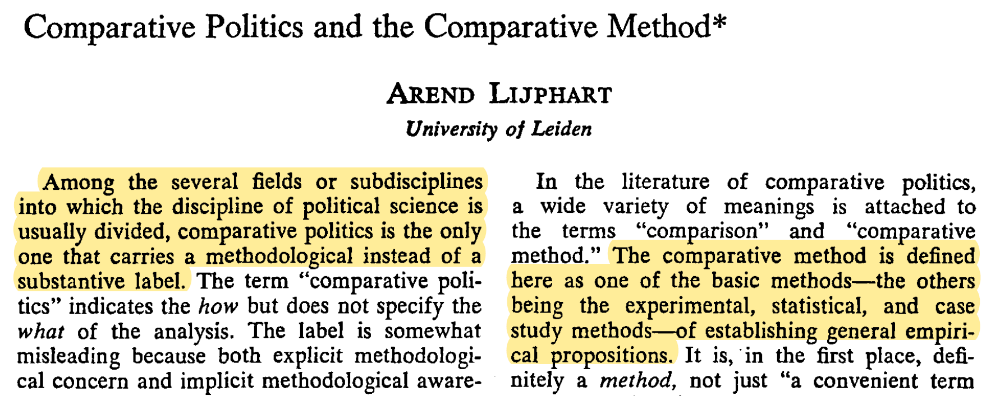
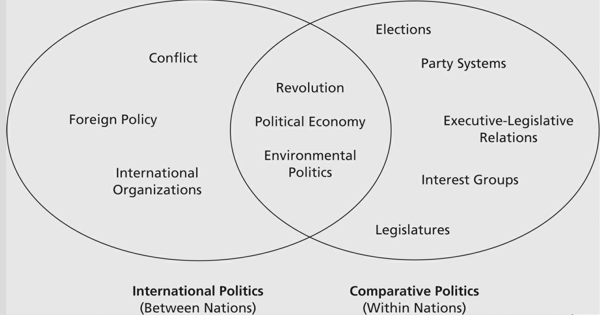

```{r setup, include=FALSE}
options(htmltools.dir.version = FALSE)
knitr::opts_chunk$set(
  fig.width=9, fig.height=3.5, fig.retina=3,
  out.width = "100%",
  cache = FALSE,
  echo = FALSE,
  message = FALSE, 
  warning = FALSE,
  hiline = TRUE
)
```

```{r xaringan-themer, include=FALSE, warning=FALSE}
library(xaringanthemer)
style_duo_accent(
  base_font_size = "25px",
  title_slide_background_image = "figs/logo.png",
  title_slide_background_size = "8%",
  title_slide_background_position = "50% 95%",
  primary_color = "#336666",
  secondary_color = "#71C5E8",
  inverse_header_color = "#FFFFFF",
  background_color = "#EAE9EA",
  link_color = "#71C5E8"
)
```

```{r other-options}
library(knitr)
library(tidyverse)
library(kableExtra)
library(fontawesome)
```


## About me

--

**Pronouns:** He/him

--

Postdoc @ **Center for Inter-American Policy and Research** [`r fa("external-link-alt")`](http://cipr.tulane.edu/)

--

**Ok to address me as:**

- Prof. Diaz  
- Dr. Diaz  
- First name  

--

**Contact:** <gustavodiaz@tulane.edu>

---

## About this course

An introduction to **comparative politics**

--

- A subfield of political science

--

- Also a methodological approach
--

```
Yes, no, maybe?, it's complicated...
```
---
layout: true

## What is comparative politics?

---

### Old definition

.center[
```{r}

```
]

---

### The problem with this definition

--

1. **Methodological pluralism:** Comparativists today use experiments, statistics, case studies, and many more methods

--

2. **Science** is all about *making comparisons*

--

Why was this the predominant view?

---

### Some history

--

- **Cold War:** Geopolitical incentives to *understand* and *classify* countries

--

- Neither **American Politics** nor **International Relations**

--

- **Academics:** Try to make sense of the *everything else* category 

---

### Current definition

--

.pull-left[.center[

**American politics**

**International relations**

**Comparative politics**

]]

--

.pull-right[.center[

*Domestic politics*

*Politics among nations*

*Politics within (other) nations*

]]

--

But...

- Outside of the U.S. $\rightarrow$ `AP = CP`
- IR and CP not mutually exclusive `(e.g. audience costs)`

---

### Course definition `r fa("fire-alt")`

**Comparative politics** is the study of politics *predominantly* **within countries**

.center[
```{r, out.width="70%"}

```
]

---
layout: false

## Course roadmap

1. What is comparative politics?
2. Origins of political systems (nation-states, governments, regime types)
3. Causes and consequences of regime types
4. Varieties of democracies and dictatorships

---
## Who should take this course?

--

- PoliSci majors

--

- Those seeking academic careers (esp. in the social sciences)

--

- Interested in understanding world politics

--

- Politics/policy/consulting

--

- Everyone!


---
layout: false

class: inverse center middle

# Course Requirements

---
layout: true

## Requirements

---

.left-column[
### Textbook
]

.right-column[
```{r, out.width="55%"}
include_graphics("figs/cgg_front.png")
```
]

---

### Assignments


```{r}
assignments = data.frame(
  Assignment = c("Quizzes (6)", "News Reports (6)", "Participation", "Final Exam"),
  Percentage = c("40%", "40%", "20%", "30% of final grade")
)

assignments %>% 
  kbl() %>% 
  kable_classic(position = "center")
```

---

### Grading


```{r, fig.align='center', fig.height=2, fig.width=12}
grading = data.frame(
  Grade = c("A", "A-", "B+", "B", "B-", "C+", "C", "C-", "D+", "D", "D-", "F"),
  Percentage = c(93, 90, 87, 83, 80, 77, 73, 70, 67, 63, 60, NA),
  position = c(95, 91.5, 88.5, 85, 81.5, 78.5, 75, 71.5, 68.5, 65, 61.5, 58)
)

ggplot(grading) +
  aes(x = 58:100, label = Grade) +
  geom_vline(xintercept = grading$Percentage) +
  geom_text(aes(x = position, y = 1), size = 8) +
  scale_x_continuous(breaks = grading$Percentage) +
  labs(x = "Grade") +
  theme(panel.border = element_rect(colour = "black", fill=NA),
        axis.title.y = element_blank(),
        axis.text.y = element_blank(),
        axis.ticks.y = element_blank(),
        panel.grid = element_blank()) +
  theme_xaringan(accent_color = NULL)
```


--

- **Decimal grades** truncated to largest integer `(92.1 = 93)`

--

- **Grades at the limit** get the highest letter grade `(93 = A)`

---
layout: false

## Important dates

```{r}
dates = data.frame(
  Assignment = c("Quiz 1", "News Report 1", "Quiz 2", "News Report 2", "Quiz 3", "Fall Break (NO CLASS)",
                 "News Report 3", "Quiz 4", "News Report 4",
                 "Quiz 5", "News Report 5", "Thanksgiving Break (NO CLASS)",
                 "Quiz 6", "News Report 6", "Final Exam"),
  Date = c("September 3", "September 10", "September 17", "September 24", "October 1", "October 4-8", "October 15",
           "October 22", "October 29", "November 5", "November 12", "November 22-26", "December 3", "December 10", "TBD")
)

dates %>% 
  kbl() %>% 
  kable_classic(position = "center", bootstrap_options = c("condensed", "responsive"), font_size = 15)
```

---
class: inverse center middle

# Canvas [`r fa("external-link-alt", fill = "#FFFFFF")`](https://tulane.instructure.com/courses/2237766)


---
class: inverse center middle

# Thursday:
## What is Science?


