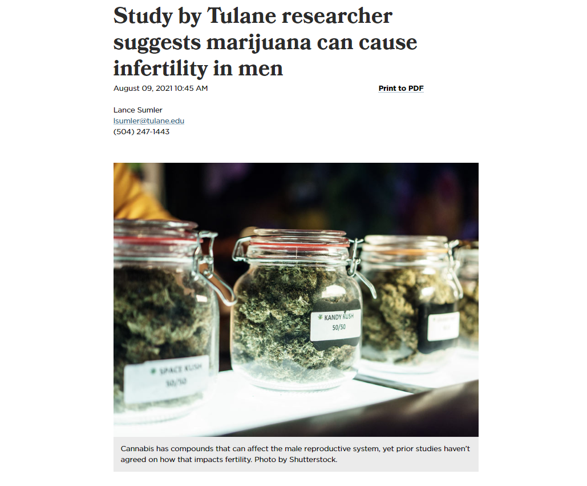

```{r setup, include=FALSE}
options(htmltools.dir.version = FALSE)
knitr::opts_chunk$set(
  fig.width=9, fig.height=3.5, fig.retina=3,
  out.width = "100%",
  cache = FALSE,
  echo = FALSE,
  message = FALSE, 
  warning = FALSE,
  hiline = TRUE
)
```

```{r xaringan-themer, include=FALSE, warning=FALSE}
library(xaringanthemer)
style_duo_accent(
  base_font_size = "25px",
  title_slide_background_image = "figs/logo.png",
  title_slide_background_size = "8%",
  title_slide_background_position = "50% 95%",
  primary_color = "#336666",
  secondary_color = "#71C5E8",
  inverse_header_color = "#FFFFFF",
  background_color = "#EAE9EA",
  link_color = "#71C5E8"
)
```

```{r other-options}
library(knitr)
library(tidyverse)
library(kableExtra)
library(fontawesome)
```


## Last time

--

Comparative politics is a subfield of **Political** **Science**

--

Some philosophers may think this is an oxymoron:

--

1. **Politics:** Normative opinions

2. **Science:** True, unquestionable knowledge

--

Can there be a **SCIENCE** of **POLITICS**?

--

**Today:** Focus on the **Science** part

--

**Tuesday:** Focus on **Politics**

---
class: inverse center middle

# Jamboard [`r fa("external-link-alt", fill = "#FFFFFF")`](https://jamboard.google.com/d/1wsoJHoA0-YtwEmDhQljlUK_K2YNRHIaVbVAR7W1-nRw/edit?usp=sharing)

---

## The goal of science

--

- **Inference:** Using `what we know` to learn about `what we do not know`

--

- CGG: *"Science is the quest for knowledge that relies on criticism"*

--

- Science embraces the idea that we can be wrong, even if we seem to be right now

--

- **Scientific statements** are **falsifiable**

---

## Definition

A *scientific statement* is:

A `meaningful`

--
`declarative` sentence

--
that is `unambiguously true or false`

--

- **Meaningful:** We agree on its interpretation

--

- **Declarative:** Claims or asserts something

--

- **Unambiguously true or false:** One or the other, but not both, not neither

---

## Unscientific statements

--

*Political Science is the scientific study of politics*

--

*Strong states overcome special interests to implement policies that are best for the nation*

--

*I feel good today*

--

*God created the world* `vs.` *Edison created the light bulb*

---

class: center middle

## Aside `r fa("fire-alt")`

**Scientific statements** are true or false

**Scientific knowledge/evidence** is neither

--

Why?

--

How do you **evaluate** a scientific statement?

---

## The Scientific Method

--

- **Step 1:** Question

- **Step 2:** Theory/Model

- **Step 3:** Implications/Hypotheses 

- **Step 4:** Observation/Testing

- **Step 5:** Evaluation

---

## An exercise

.center[
```{r, out.width="75%"}

```
]
---

## An exercise

--

1. **Question:**

--
Does marijuana cause infertility?

--

2. **Theory:**

--
THC kills cells

--

3. **Implication:**

--
Male smokers have lower semen volume than non-smokers

--

4. **Observation:**

--
Bring men to lab, measure sperm, findings go along with expectations

--

5. **Evaluation:**

--
"Study by Tulane researcher `suggests` marijuana `can` cause infertility in men"

---

## Testing theories

--

- Can't test a theory because it's a **statement** 

--

- Need to **believe** (or **pretend**) a theory is true to engage with it scientifically

--

- Instead, we test hypotheses, implications, arguments that **follow from the theory**

--

- **Argument:** Logically connected statement

--

- **Valid argument:** Accepting premises compels us to accept conclusion

--

- **Invalid argument:** Accepting premises frees us from accepting/rejecting conclusion

---

## Example 1

--

.left-column[
**Premise**

**Observation**

**Conclusion**
]

--

.right-column[
Marijuana causes infertility

Person consumes marijuana

Person is infertile
]

--

.center[
### VALID
]

---

## Example 2

.left-column[
**Premise**

**Observation**

**Conclusion**
]

.right-column[
Marijuana causes infertility

Person does not consume marijuana

Person is not infertile
]

--

.center[
### INVALID
]

---

## Example 3

.left-column[
**Premise**

**Obs. 1**

**Obs. 2**

**Conclusion**
]

.right-column[
Marijuana causes infertility among men

Person consumes marijuana

Person is a woman

Person is fertile
]

--

.center[
### INVALID
]

---

## Scientific challenges in CP

--

We want to test:

- `Marijuana causes infertility`

--

But we can only test:

- `Marijuana causes infertility among men`

--

- `Marijuana causes infertility among women`

--

- `Smoking marijuana causes infertility among men who go to a clinic to consult about potential fertility problems` 

--
(very specific!)

---

## Scientific critiques `r fa("fire-alt")`

**Valid critiques** to **valid arguments** fall in **three categories:**

--

1. Omitted variable bias:

--

  - `Stress causes men both to smoke marijuana and to become infertile`

--

2. Reverse causation:

--

  - `Infertility causes men to smoke marijuana`
  
--

3. Selection bias:

--

  - `Men who smoke marijuana wait longer before going to the doctor`

---

## Valid critiques

In any case, a valid critique implies:

--

1. Observed implications also follow from **alternative theories**

--

2. **Cannot falsify** the theory

--

3. Need to identify **better implications**

--

So...

- When things go well, your theory is **~~accepted~~** **not rejected**
- When things go wrong, your theory is **~~rejected~~** **not accepted**
- But future research can always flip things around!

---

## Takeaways

1. Science differs from other forms of knowledge generation in that it embraces uncertainty
2. Scientific statements/arguments are falsifiable
3. We can only test a few implications of an theory at a time
4. Findings can align with many alternative theories
5. Good science tries really hard to prove itself wrong


---
class: inverse center middle

# Next week

## Tuesday: What is politics?

## Thursday: Origins of the state


