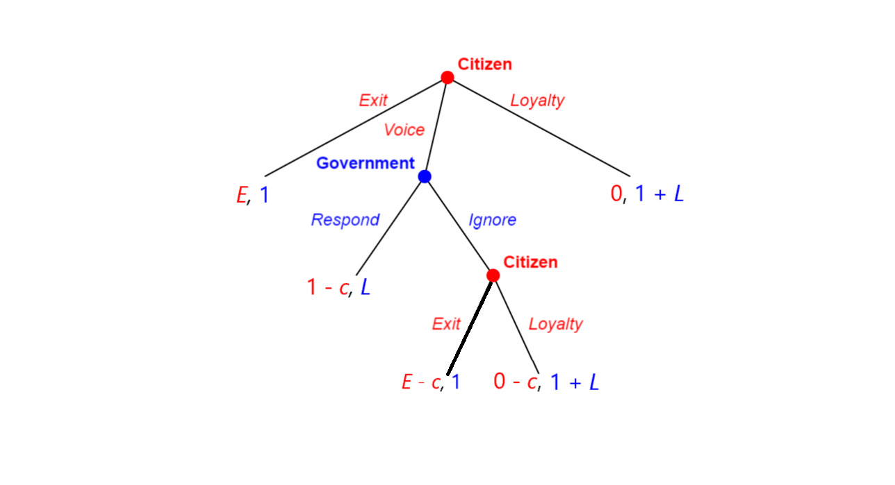
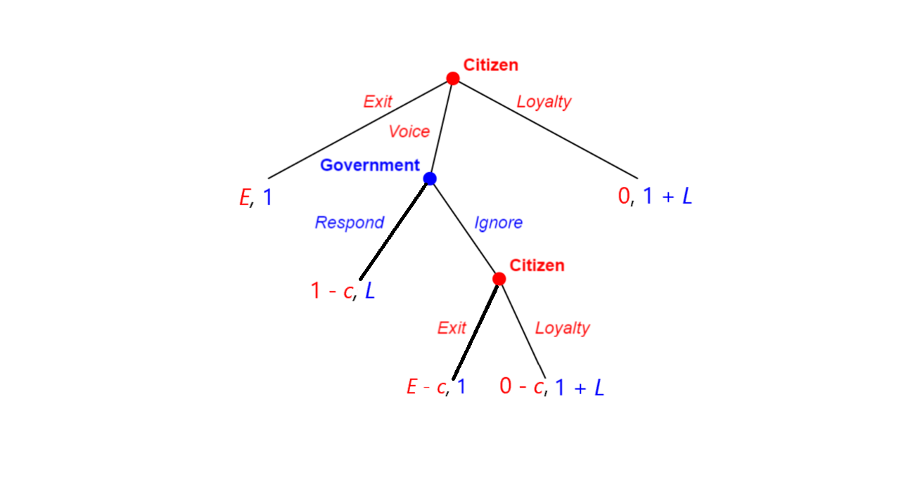
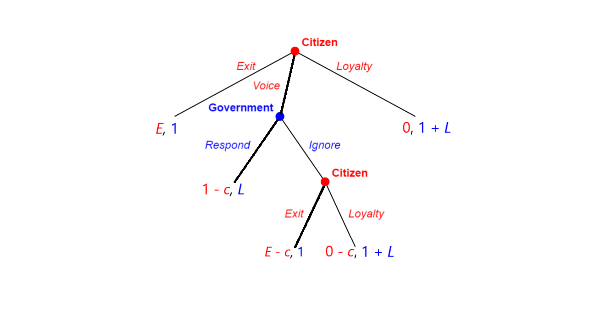
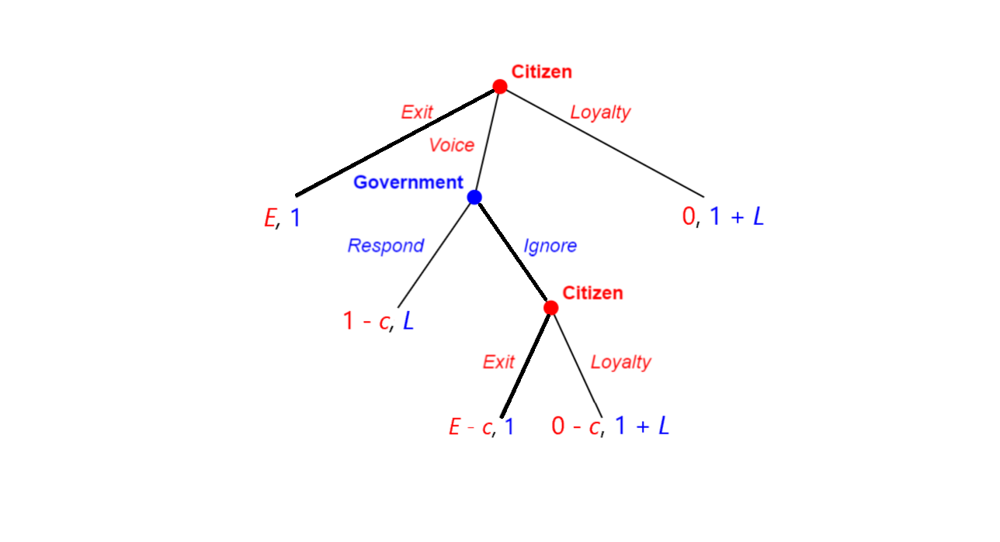
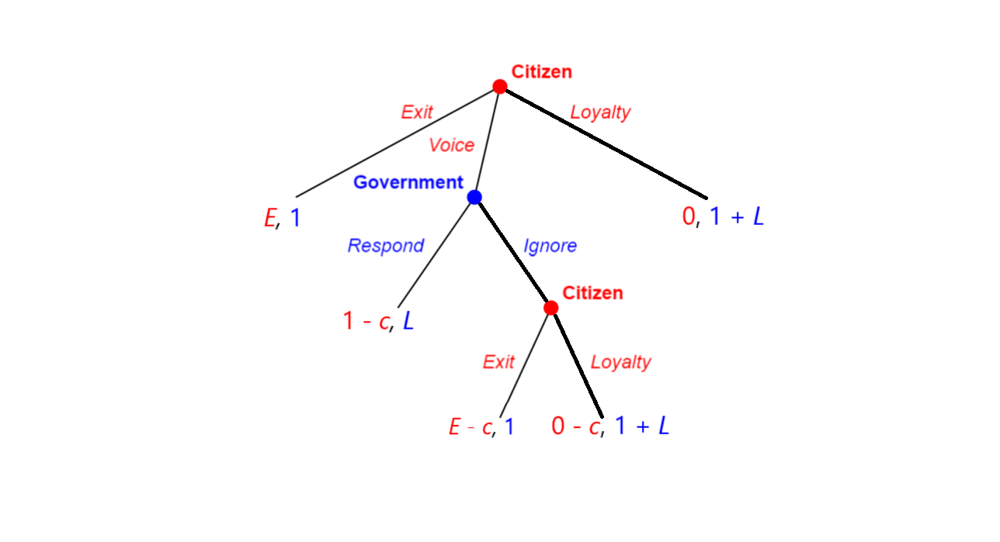

```{r setup, include=FALSE}
options(htmltools.dir.version = FALSE)

library(knitr)
opts_chunk$set(
  fig.width=9, fig.height=3.5, fig.retina=3,
  out.width = "100%",
  cache = FALSE,
  echo = FALSE,
  message = FALSE, 
  warning = FALSE,
  hiline = TRUE
)
```

```{r xaringan-themer, include=FALSE, warning=FALSE}
library(xaringanthemer)
style_duo_accent(
  title_slide_background_image = "figs/logo.png",
  title_slide_background_size = "8%",
  title_slide_background_position = "50% 95%",
  primary_color = "#336666",
  secondary_color = "#71C5E8",
  inverse_header_color = "#FFFFFF",
  background_color = "#EAE9EA",
  link_color = "#71C5E8",
  # easy to fetch colors
  colors = c( 
    white = "#FFFFFF",
    green = "#336666",
    lblue = "#71C5E8"
    )
)
```

```{r other-options}
library(knitr)
library(tidyverse)
library(kableExtra)
library(fontawesome)
```

layout: true
## Scenario 1: $E > 0; L > 1$


---

.center[
```{r}

```
]

---
count: false

.center[
```{r}

```
]

---
count: false

.center[
```{r}

```
]

---
count: false

.center[
```{r}

```
]

--

- **Equilibrium:** (Voice, Exit; Respond)

---
layout: true
## Scenario 2: $E < 0; L > 1$

---

.center[
```{r}

```
]

---
count: false

.center[
```{r}

```
]

--

- **Equilibrium:** (Loyalty, Loyalty; Ignore)

---
layout: true
## Scenario 3: $E > 0; L < 1$

---

.center[
```{r}

```
]

---
count: false

.center[
```{r}

```
]

--

- **Equilibrium:** (Exit, Exit; Ignore)

---
layout: true
## Scenario 4: $E < 0; L < 1$

---

.center[
```{r}

```
]

---
count: false

.center[
```{r}

```
]

--

- **Equilibrium:** (Loyalty, Loyalty; Ignore)   