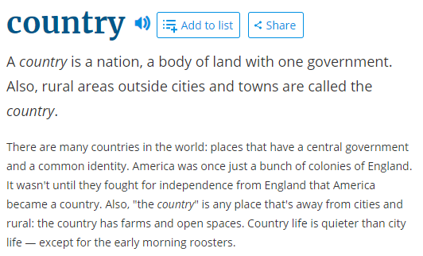
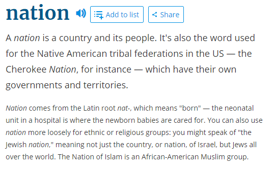

```{r setup, include=FALSE}
options(htmltools.dir.version = FALSE)

library(knitr)
opts_chunk$set(
  fig.width=9, fig.height=3.5, fig.retina=3,
  out.width = "100%",
  cache = FALSE,
  echo = FALSE,
  message = FALSE, 
  warning = FALSE,
  hiline = TRUE
)
```

```{r xaringan-themer, include=FALSE, warning=FALSE}
library(xaringanthemer)
style_duo_accent(
  title_slide_background_image = "figs/logo.png",
  title_slide_background_size = "8%",
  title_slide_background_position = "50% 95%",
  primary_color = "#336666",
  secondary_color = "#71C5E8",
  inverse_header_color = "#FFFFFF",
  background_color = "#EAE9EA",
  link_color = "#71C5E8",
  # easy to fetch colors
  colors = c( 
    white = "#FFFFFF",
    green = "#336666",
    lblue = "#71C5E8"
    )
)


```

```{r other-options}
library(knitr)
library(tidyverse)
library(kableExtra)
library(fontawesome)
```

## Last time

- Everything is politics

- Not always useful to approach stuff from a political lens

- Exit, Voice, Loyalty as one of many **models to understand political situations**

--

- Now we have a sense of what **Political Science** is about

- **Comparative Politics** is one of its subfields

- *The study of politics within countries*

---

## What is a country?

.pull-left[
```{r}

```
]

--

.pull-right[
```{r}

```
]

--

- We tend to use words like country, nation, and state interchangeably

- We need more precision than everyday language

- The focal term in CP is *the* **state**

---
layout: true

## Classic definitions of the **state**


---

- **Weber** (1918): A human community that (successfully) claims the `monopoly of the legitimate use of physical force` within a given `territory`

--

- Important pieces:

    - **Territory:** Distinguishes states from nations
    - **Legitimacy:** Depends on who you ask
    - **Monopoly of force:** A very high bar, many countries deal with organized crime and paramilitary organizations

---

- **Tilly** (1985): Relatively `centralized, differentiated` organizations, the officials of which, more or less, successfully claim `control over the chief concentrated means of violence` within a population inhabiting a `large contiguous territory`

--

    - **Centralized, differentiated:** Some form of government
    - **Control over chief means of violence:** Recognizes monopoly is high bar
    - **Large contiguous territory:** Small countries? Indonesia? France?

---

- **North** (1981): An organization with `comparative advantage in violence`, extending over a `geographic area` whose boundaries are determined by its `power to tax citizens`

--

    - **Comparative advantage:** Recognizes monopoly is hard
    - **Geographic area:** Territory
    - **Taxation:** Control (violence) + legitimacy
    
---
layout: false

## Working definitions

- **State:** Entity that uses threat of force to rule in a given territory `(USA, Louisiana, Afghanistan?)`

- **Nation:** Group of people sharing common identity `(language, religion, ethnicity)`

- **Nation-state** State in which a single nation predominates and has a meaningful connection to the state

--
`(single nation?)`

---
class: inverse

## Aside: Polity

- **Polity** is the most generous, uncontroversial definition for a country-like entity

- **Definition:** An identifiable political entity

    - A group of people with collective identity, organized by institutions, with capacity to mobilize resources
    - `Examples:` Countries, (regional) states, empires, cities, international organizations


---

## Failed states

- `State-like` entities that `cannot coerce` and are `unable to successfully control` the inhabitants of a given territory


