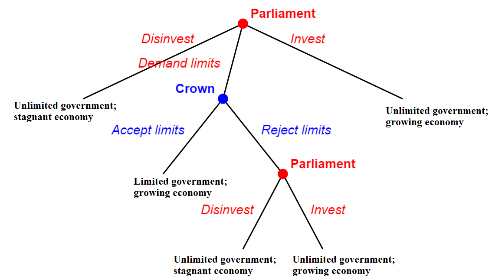

```{r setup, include=FALSE}
options(htmltools.dir.version = FALSE)

library(knitr)
opts_chunk$set(
  fig.width=9, fig.height=3.5, fig.retina=3,
  out.width = "100%",
  cache = FALSE,
  echo = FALSE,
  message = FALSE, 
  warning = FALSE,
  hiline = TRUE
)
```

```{r xaringan-themer, include=FALSE, warning=FALSE}
# In the future you want to move this to a separate file and source it every time you create a new file
library(xaringanthemer)
style_duo_accent(
  title_slide_background_image = "figs/logo.png",
  title_slide_background_size = "8%",
  title_slide_background_position = "50% 95%",
  primary_color = "#336666",
  secondary_color = "#71C5E8",
  inverse_header_color = "#FFFFFF",
  background_color = "#EAE9EA",
  link_color = "#71C5E8",
  # easy to fetch colors
  colors = c( 
    white = "#FFFFFF",
    green = "#336666",
    lblue = "#71C5E8"
    )
)
```

```{r other-options}
library(tidyverse)
library(kableExtra)
library(fontawesome)

# ggplot global options
theme_set(theme_bw(base_size = 20))

# Plot democracy and WDI data
library(countrycode)
library(WDI)
# remotes::install_github('rensa/ggflags')
library(ggflags)
```

## Last time

- We discussed classifying regime types

    - Continuous or categorical
    - Minimalist or substantive

- This all matters because we want to understand the consequences of being a democracy or a dictatorship

- We usually promote democracy because we believe it brings good outcomes

- But how do countries become democracies?

- And once they do, how do they stay democracies?

- This week is about the **economic** explanations for regime change and survival

- Next week is about the **cultural** explanations

---

## Modernization theory

- All societies pass through the same stages of economic development

.pull-left[
### Traditional society

- Large agriculture
- Small industry
- Small service
- Dictatorship
]

.pull-right[
### Modern society

- Small agriculture
- Large industry
- Large service
- Democracy
]

- As societies develop, they are `more likely` to become a democracy

- So we say that *development* **causes** *democracy*

---
class: inverse 

## Causal statements in the social sciences

.center[
### Economic development $\rightarrow$ Democracy
]

--

.center[
### Explanatory variable $\rightarrow$ Outcome variable
]

--

.center[
### X $\rightarrow$ Y
]

--

- We do not see `causation` happening, only `association`

--

- So just because richer countries tend to be democracies it does not mean that development `causes` democracy

--

- It could be the other way around

--

- Or a big coincidence!

--

- Hence the importance of finding **critical tests** for our theories

---

## Using DD index

```{r, fig.height=5}
load("data/dem_scores.RData")

gdp = WDI(indicator = "NY.GDP.PCAP.KD", country = "all", start = 2007, end = 2020)

# some recoding
gdp$iso3c = countrycode(gdp$iso2c, origin = "iso2c", destination = "iso3c")

gdp$gdp_pc = gdp$NY.GDP.PCAP.KD/1000

# merge
dd_gdp = left_join(dd, gdp %>% filter(year == 2007), by = "iso3c")

# visualize
dd_gdp_df = dd_gdp %>% 
  group_by(dd) %>% 
  summarize(gdp_avg = mean(gdp_pc, na.rm = TRUE))


ggplot(dd_gdp_df) +
  aes(x = as.factor(dd), y = gdp_avg) +
  geom_col() +
  labs(x = "2008 DD Index", y = "mean GDP per capita in\n2000 PPP USD (thousands)") +
  scale_x_discrete(labels = c("Dictatorships", "Democracies")) +
  theme_xaringan()
```

---

## Using Polity

```{r, fig.height = 5}
gdp$iso2c = tolower(gdp$iso2c)

polity_gdp = left_join(polity, gdp %>% filter(year == 2017), by = "iso3c")

# Kosovo is messing things up
polity_gdp = polity_gdp %>% 
  filter(polity_annual_country != "Kosovo") %>% 
  mutate(polity = ifelse(abs(polity) > 10, NA, polity))

ggplot(polity_gdp) +
  aes(x = log(gdp_pc), y = polity) +
  geom_flag(aes(x = log(gdp_pc), y = polity, country = iso2c)) +
  geom_smooth(size = 2, se = FALSE) +
  labs(x = "2017 GDP per capita (logged)", y = "2018 Polity score") +
  theme_xaringan()
```

---

## Using Freedom House

```{r, fig.height = 5}
fh_gdp = left_join(fh, gdp %>% filter(year == 2019), by = "iso3c")

# drop duplicate countries
fh_gdp = fh_gdp %>%  filter(fh_country != "Micronesia" & fh_country != "Kosovo")

ggplot(fh_gdp) +
  aes(x = log(gdp_pc), y = fh_total_reversed) +
  geom_flag(aes(x = log(gdp_pc), y = fh_total_reversed, country = iso2c)) +
  geom_smooth(size = 2, se = FALSE) +
  labs(x = "2019 GDP per capita (logged)", y = "2020 FH score (reversed)") +
  theme_xaringan()
```

---

## Using V-DEM

```{r, fig.height = 5}
vdem_gdp = left_join(vdem, gdp %>% filter(year == 2019), by = "iso3c")

# drop duplicates
vdem_gdp = vdem_gdp %>%
  filter(country_name != "Zanzibar" & country_name != "Kosovo") %>% 
  filter(!is.na(iso3c))

ggplot(vdem_gdp) +
  aes(x = log(gdp_pc), y = v2x_polyarchy) +
  geom_flag(aes(x = log(gdp_pc), y = v2x_polyarchy, country = iso2c)) +
  geom_smooth(size = 2, se = FALSE) +
  labs(x = "2019 GDP per capita (logged)", y = "2020 V-DEM polyarchy score") +
  theme_xaringan()
```

---

## Two interpretations

- The positive association between economic development and democracy is consistent with **two explanations**

1. **Modernization Theory (Lipset):**

    - Development makes democracy `more likely to emerge` **AND**
    - Development makes democracy `more likely to survive`
    
2. **Survival Story (Przeworski):**

    - Development makes democracy `neither more nor less likely to emerge` **BUT**
    - Development makes democracy `more likely to survive`
 
--
    
- **CGG** show support for modernization theory by looking at transition probabilities

- Let's look at it from a different angle

---
## Revisiting the survival story

```{r, fig.height = 5}
polity_gdp = polity_gdp %>% 
  mutate(group = ifelse(polity > 0, 1, 0))

ggplot(polity_gdp) +
  aes(x = log(gdp_pc), y = polity, color = as.factor(group)) +
  geom_hline(yintercept = 0, size = 1, linetype = "dashed") +
  geom_flag(aes(x = log(gdp_pc), y = polity, country = iso2c)) +
  geom_smooth(size = 2, se = FALSE) +
  labs(x = "2017 GDP per capita (logged)", y = "2018 Polity score") +
  theme(legend.position = "none") +
  scale_color_manual(values = c("#71C5E8", "#336666")) +
  theme_xaringan()
```

---

## Revisiting the survival story

- `Rich democracies` are "more democratic"
- `Rich dictatorships` are "more autocratic"

- Which supports the survival story! More money makes any regime more stable

&nbsp;

--

- This is not to say that **CGG** are wrong

- Rather, this is an open debate and the devil is on the details

- How we `define` and `operationalize` development and democracy matters a lot

--
```
(Research methods matter a lot too, but this course is not about that...)
```

---

## Critiques to development $\rightarrow$ democracy

- Once again, a story based mostly in the experience of industrialized countries in the West

- They industrialized first, and under different conditions than the Global South

- The experiences are not the same, so asking countries to seek economic development to secure democracy (and other benefits) is not as easy as modernization theory suggests

- This critique is called **dependency theory**

---

## Dependency theory

- **Background:**

    - Modernization theory is a product of the Cold War. Pursuing democracy through development was in the interest of countries seeking to be in good terms with the Western Bloc
    - The emphasis was to expand industry and service through **import substitution**

--

- **Critique:**

    - National economies are interconnected
    - There is a **center** and a **periphery** (developed and underdeveloped)
    - The periphery faces much more challenges being competitive in global markets
    - Modernization as a path to democracy is not viable
    
---

## Dependency theory parallels

- Dependency theory is not as relevant today, but we still find interesting parallels

- **Emerging economies** refusing to take measures against **climate change**

- **Safety nets** in **higher education**

---

## Why does development cause democracy?

- As economic structures shift in a society, so do the distribution of economic assets

- Fixed assets $\rightarrow$ mobile assets

- The economy depends less on land ownership, more on activities that are harder to count accurately

- Much easier to tax land than to tax people!

- This creates a **credible commitment problem**


---

## Credible commitments

- A **credible commitment problem** happens when:

    1. Actor makes a promise
    2. Actor has an incentive to break promise in the future
    3. Power is in the hands of the actor that makes the promise, not on those who should benefit from the promise
    
--

- This is most obvious in England's early transition to democracy

    - **Crown** needs individuals to invest in the state (pay taxes)
    - New **economic elites** want protection from future exploitation
    - Crown cannot guarantee under current institutions
    - **Solution:** "Parliamentary Supremacy"
    
---

## And it is an EVL game!

.center[
```{r}

```
]

---

## What matters is the **type** of development

- We can have a `growing economy` with `unlimited government`

- So, perhaps we can help countries develop the right way

- This brings questions on the role of two sources of income:

    1. Natural resources
    2. Foreign aid
    
---

## The political resource curse

```{r, fig.height = 5}
oil = WDI(indicator = "NY.GDP.PETR.RT.ZS", country = "all", start = 2017, end = 2017)

oil$iso3c = countrycode(oil$iso2c, origin = "iso2c", destination = "iso3c")

oil$iso2c = tolower(oil$iso2c)

polity_oil = left_join(polity, oil, by = "iso3c")

polity_oil = polity_oil %>%
  filter(polity_annual_country != "Kosovo")  %>% 
  mutate(polity = ifelse(abs(polity) > 10, NA, polity))

ggplot(polity_oil) +
  aes(x = NY.GDP.PETR.RT.ZS, y = polity) +
  geom_hline(yintercept = 0, size = 1, linetype = "dashed") +
  geom_flag(aes(x = NY.GDP.PETR.RT.ZS, y = polity, country = iso2c)) +
  geom_smooth(size = 2, se = FALSE) +
  labs(x = "2017 Oil rents (% GDP)", y = "2018 Polity score") +
  theme_xaringan()
```

---

## Why does this happen?

- Natural resources are fixed assets

- Fixed assets are easier to tax than mobile assets

- Especially oil and mineral resources

- Fewer incentives to tax people

- Fewer incentives to represent, respond to demands `(demand-side explanation)`

- More resources to coerce or buy people off `(supply-side explanation)`

---

## What about foreign aid?

- Similar logic, aid can replace the necessity to invest in social contract

- Except that we have to take into account donor's incentives

- Foreign aid **can** promote democracy if:

    1. Recipient is dependent on foreign aid
    2. Aid donor wants to promote democracy
    3. Aid donor can credibly threaten to withdraw aid if demands are not met
    
--

- Recent trend in foreign aid is to try to `bypass governments` since they can use aid money for their own purposes

- Less about changing regimes, more about improving people's life

- A potential `indirect pathway` to democratization

---
## Takeaways

- Modernization theory suggests that `economic development` causes `democracy`

- But it could be that `economic development` just facilitates `regime survival`

- What matters is the `specificity` of economic assets (fixed vs. mobile)

```
(This will be important again in the context of democratization)
```

- Thinking about the right forms of development also opens questions about

    1. Natural resources (Oil $\rightarrow$ less incentives to democratize)
    2. Foreign aid (Depends on the interests of the donor)
    
---
class: inverse center middle

## Reminder:
### News Report 2 due Friday 5:00 PM 
### (I said it wrong last time, syllabus prevails)

## Next time: 
### Cultural Determinants of Democracy and Dictatorship