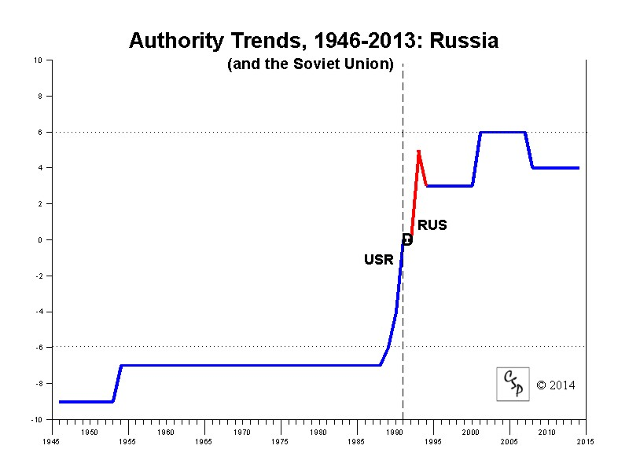
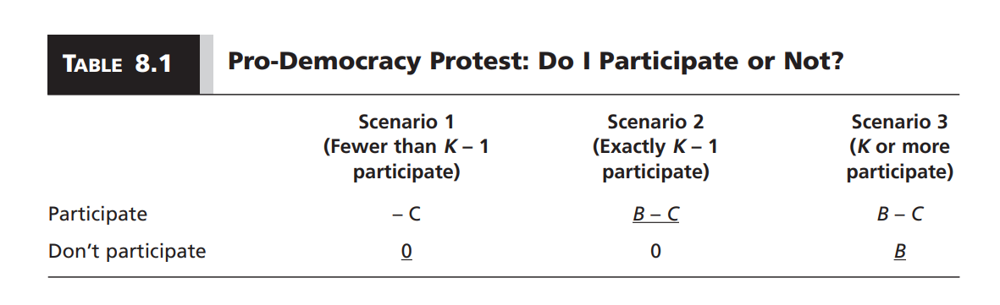
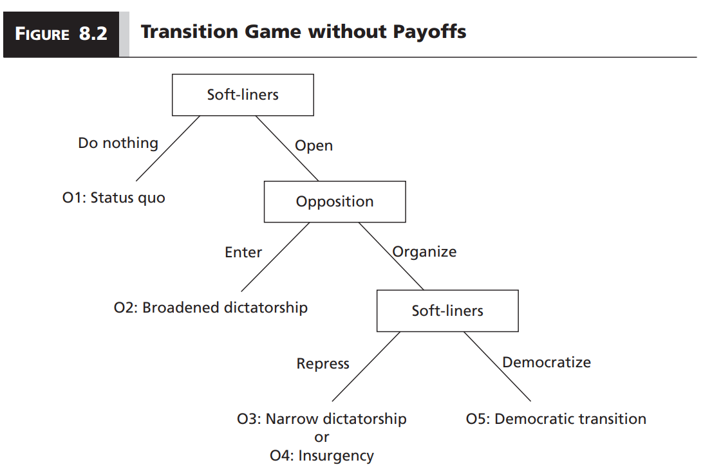
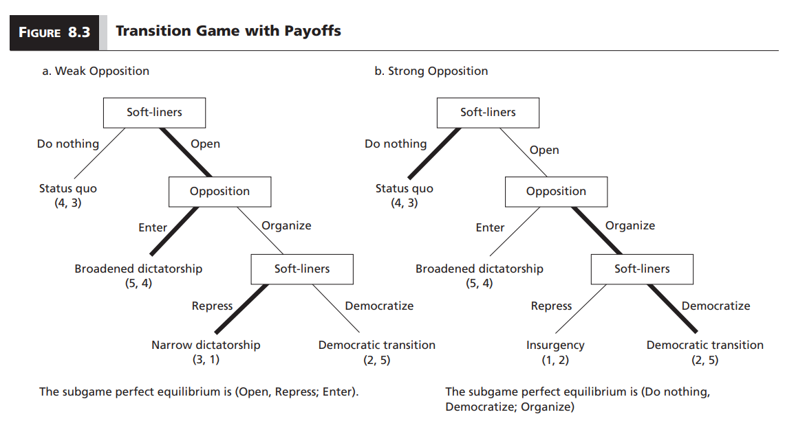
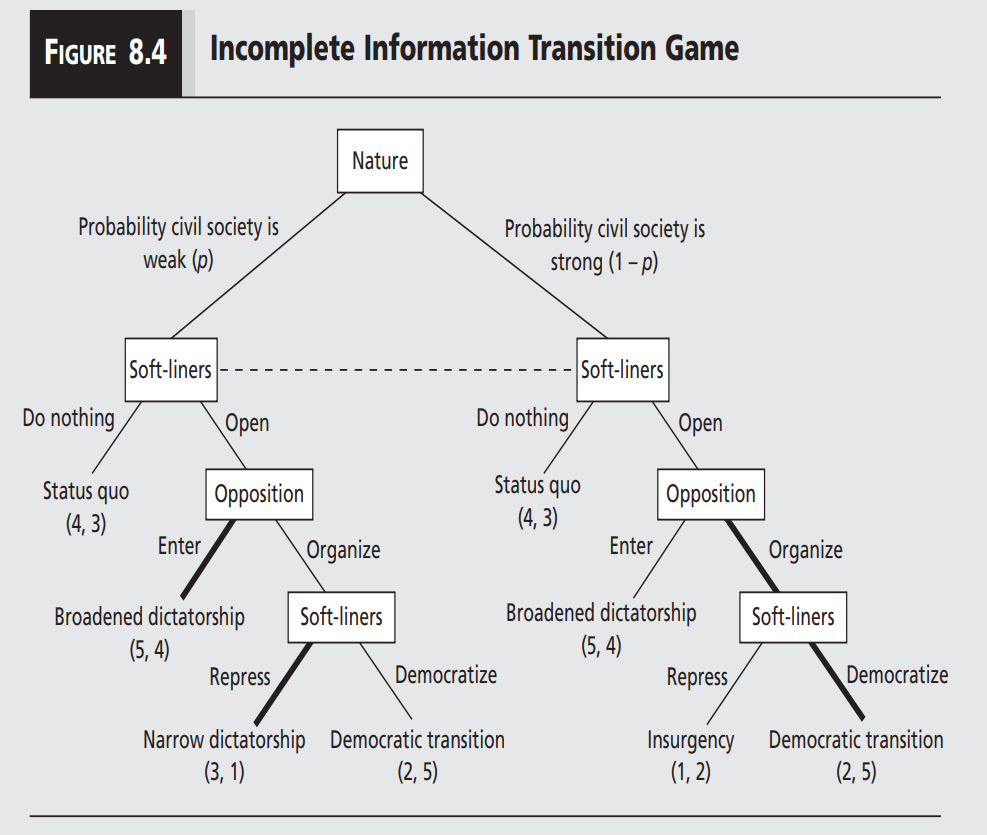

```{r setup, include=FALSE}
options(htmltools.dir.version = FALSE)

library(knitr)
opts_chunk$set(
  fig.width=9, fig.height=5, fig.retina=3,
  out.width = "100%",
  cache = FALSE,
  echo = FALSE,
  message = FALSE, 
  warning = FALSE,
  hiline = TRUE
)
```

```{r xaringan-themer, include=FALSE, warning=FALSE}
# In the future you want to move this to a separate file and source it every time you create a new file
library(xaringanthemer)
style_duo_accent(
  title_slide_background_image = "figs/logo.png",
  title_slide_background_size = "8%",
  title_slide_background_position = "50% 95%",
  primary_color = "#336666",
  secondary_color = "#71C5E8",
  inverse_header_color = "#FFFFFF",
  background_color = "#EAE9EA",
  link_color = "#71C5E8",
  # easy to fetch colors
  colors = c( 
    white = "#FFFFFF",
    green = "#336666",
    lblue = "#71C5E8"
    )
)
```

```{r other-options}
library(tidyverse)
library(kableExtra)
library(fontawesome)
library(democracyData) # various democracy scores. See dem_scores.R for a guide

# ggplot global options
theme_set(theme_bw(base_size = 20))
```

## Last time

- We examined the cultural determinants of democracy and dictatorship

- Putting the last few weeks together, we have a sense of what democracy and dictatorship are and where they come from

- But when/how/why do transitions happen?

- **This week:** Focus on transitions to democracy `(for a very good reason)`

---
## When does a transition happen?

```{r}
dd = pacl %>% 
  mutate(dictatorship = 1 - democracy) %>% 
  group_by(year) %>% 
  summarize(Democracy = sum(democracy, na.rm = TRUE), Dictatorship = sum(dictatorship, na.rm = TRUE), Total = n()) %>%
  pivot_longer(!year, names_to = "Group", values_to = "count")

dd$Group = fct_relevel(dd$Group, "Total", "Democracy", "Dictatorship")

ggplot(dd) +
  aes(x = year, y = count, shape = Group, color = Group) +
  geom_point(size = 2) + geom_line(size = 1) +
  labs(title = "Regime types over time (DD Index)", x = "Year", y = "Count") +
  theme(legend.position = "bottom",
        plot.title = element_text(size = 20)) +
  theme_xaringan() 
```

---
## When does a transition happen?

```{r, cache = TRUE}
polity = download_polity_annual(verbose = FALSE)
```

```{r}
poli = polity %>% filter(year >= 1950 & year <= 2018) %>% 
  select(year, polity_annual_country, polity) %>% 
  mutate(dem = ifelse(polity >= 6, 1, 0),
         ano = ifelse(polity <= 5 & polity >= -5, 1, 0),
         aut = ifelse(polity <= -6, 1, 0)) %>% 
  group_by(year) %>% 
  summarize(Total = n(),
            Democracy = sum(dem, na.rm = TRUE),
            Anocracy = sum(ano, na.rm = TRUE),
            Autocracy = sum(aut, na.rm = TRUE)) %>% 
  pivot_longer(!year, names_to = "Group", values_to = "Count")

poli$Group = fct_relevel(poli$Group, "Total", "Democracy", "Anocracy", "Autocracy")

ggplot(poli) +
  aes(x = year, y = Count, shape = Group, color = Group) +
  geom_point(size = 2) + geom_line(size = 1) +
  labs(title = "Regime types over time (Polity)", x = "Year", y = "Count") +
  theme(legend.position = "bottom",
        plot.title = element_text(size = 20)) +
  theme_xaringan() 
```
---
## Zooming in on polity

.center[
```{r, out.width="70%"}

```
]

- Does this mean that the country is on the brink of transitioning?
- Has a transition already started?

---

## Huntington: Three Waves of Democracy

1. 1828-1926: American and French revolutions, WWII

2. 1943-1962: Italy, West Germany, Japan, Austria, etc.

3. 1974-: Greece, Spain, Portugal, Latin America, Africa, etc.

---

## Types of transition

- **Bottom-up transition:** People rise up to overthrow an authoritarian regime in a popular revolution `(e.g. Jasmine Revolution in Tunisia 2011)`

- **Top-down transition:** Ruling elite introduces liberalizing reforms that ultimately lead to democratic transition `(e.g. Chile 1989)`

- Most transitions have a component of both

- Hard to pinpoint a beginning or end, yet transitions always seem unavoidable in retrospective

---
## Why is it tricky to classify transitions?

Some general findings from recent years:

- Dictators have incentives to craft transitions to democracy in a way that benefits them and their supporters

- Revolutions fail when there is no alternative elite that can credibly replace the ruling elite

- So all bottom-up transitions have a top-down component (and the other way around!)

---

## Bottom-up transitions

 - How can we explain them?
 
 - Why are revolutions so rare and hard to predict?
 
 - Why do dictatorships seem so stable beforehand but so fragile after the fact?

---
## Collective action theory

- Groups of individuals pursuing an objective, usually public goods

```{r}
goods = data.frame(
  Excludable = c("Private goods", "Club goods"),
  Non_excludable = c("Common-pool resources", "Public goods")
)

rownames(goods) = c("Rivalrous", "Non-rivalrous")

colnames(goods) = c("Excludable", "Non-excludable")

goods %>% 
  kbl() %>% 
  column_spec(3, bold = c(FALSE, TRUE))
```

- **Non-excludability:** Cannot exclude other people from enjoying the public good

- **Non-rivalry:** There is as much for people to enjoy no matter how many people consume it

- **Examples:** Lighthouse, fire station, national park, *democracy*

---
## The problem with public goods

- Everyone benefits from and wants public goods

- Individuals with common interest should coordinate to provide public goods

- However, because of **non-excludability** and **non-rivalry**, individuals have incentives to consume the good without contributing

- This is the **free-rider** problem

---
## An example

- There is a group of $N$ individuals

- Everyone would benefit from a protest that sparks a transition to democracy

- If $K$ people participate, the public good is provided

- The value of the public good for each individual is $B$

- Cost of participating is $C$

- Assume $B > C$

---

## Public goods game

.center[
```{r}

```
]

--

- Two equilibria:

    1. No one participates
    
    2. Exactly $K$ people participate
    
- To obtain a public good, we need **exactly** $K$ people who believe they are the only ones likely to contribute

- Whether collective action succeeds depends on $N - K$ and the size of $N$

---
layout:true 

## Visualizing the public goods game

---

```{r, fig.align='center', fig.height=2, fig.width=12}
pg0 = data.frame(
  letter = c("N", "K"),
  number = c(100, 20)
)

ggplot(pg0) +
  aes(x = 0:100, y = 0:1, label = letter) +
  geom_vline(xintercept = pg0$number, size = 2) +
  annotate("text", x = 60, y = 0.5, label = "Incentive to\nfree ride", size = 5) +
  coord_cartesian(xlim = c(0, 100)) +
  scale_x_continuous(breaks = pg0$number, labels = pg0$letter) +
  labs(x = "") +
  theme(panel.border = element_rect(colour = "black", fill=NA),
        axis.title.y = element_blank(),
        axis.text.y = element_blank(),
        axis.ticks.y = element_blank(),
        panel.grid = element_blank()) +
  theme_xaringan()
```

---
count: false

```{r, fig.align='center', fig.height=2, fig.width=12}
pg1 = data.frame(
  letter = c("N", "K"),
  number = c(100, 50)
)

ggplot(pg1) +
  aes(x = 0:100, y = 0:1, label = letter) +
  geom_vline(xintercept = pg1$number, size = 2) +
  annotate("text", x = 75, y = 0.5, label = "Incentive to\nfree ride", size = 5) +
  coord_cartesian(xlim = c(0, 100)) +
  scale_x_continuous(breaks = pg1$number, labels = pg1$letter) +
  labs(x = "") +
  theme(panel.border = element_rect(colour = "black", fill=NA),
        axis.title.y = element_blank(),
        axis.text.y = element_blank(),
        axis.ticks.y = element_blank(),
        panel.grid = element_blank()) +
  theme_xaringan()
```

---
count: false

```{r, fig.align='center', fig.height=2, fig.width=12}
pg2 = data.frame(
  letter = c("N", "K"),
  number = c(100, 80)
)

ggplot(pg2) +
  aes(x = 0:100, y = 0:1, label = letter) +
  geom_vline(xintercept = pg2$number, size = 2) +
  annotate("text", x = 90, y = 0.5, label = "Incentive to\nfree ride", size = 5) +
  coord_cartesian(xlim = c(0, 100)) +
  scale_x_continuous(breaks = pg2$number, labels = pg2$letter) +
  labs(x = "") +
  theme(panel.border = element_rect(colour = "black", fill=NA),
        axis.title.y = element_blank(),
        axis.text.y = element_blank(),
        axis.ticks.y = element_blank(),
        panel.grid = element_blank()) +
  theme_xaringan()
```

--

- $K < N$ creates incentives to free-ride

- Incentive gets smaller as $K$ approaches $N$

- At $K = N$ no one has incentives to free ride

- Collective action more successful when:

    - The difference between $K$ and $N$ is small
    - $N$ is small
    - In both cases people are more likely to believe their contribution matters

---
layout: false

## What does this mean for bottom-up transitions?

- Smaller groups are more likely to coordinate and protest against a regime

- But smaller groups are also more easily repressed

- Perhaps this is why many visible revolutions fail

- Many people living under a dictatorship share a common interest of overthrowing the regime, but this does not imply that everyone will take action

- But we do see revolutions! How can we explain participation in light of the  collective action problem?

---
## Tipping models

- Individuals must choose whether to publicly support or oppose the dictatorship

- **Preference falsification:** Because it is dangerous to reveal opposition, individuals *falsify* their true preference in public

- Bigger protest $\rightarrow$ lower chance of being individually punished by the dictatorship

- Each individual has a number at which they would feel safe joining the protest

- We call this a **revolutionary threshold**

---

## A tipping model in action

.center[
<iframe width="660" height="415" src="https://www.youtube.com/embed/fW8amMCVAJQ" title="YouTube video player" frameborder="0" allow="accelerometer; autoplay; clipboard-write; encrypted-media; gyroscope; picture-in-picture" allowfullscreen></iframe>
]

.footnote[<https://youtu.be/fW8amMCVAJQ>]

---
## Revolutionary thresholds

- The distribution of revolutionary thresholds in a society explains whether a revolt becomes a revolution

- Suppose we need 10 people to overthrow the regime

- A **revolutionary cascade** happens when one's participation triggers another, and that person triggers another, and so on

--

$A = \{0,\underline{2},2,3,4,5,6,7,8,10\}$
--
 **no revolt**

--

$B = \{0,\underline{1},2,3,4,5,6,7,8,10\}$
--
 **nine person cascade**
 
--

$C = \{0,\underline{1},\underline{3},3,4,5,6,7,8,10\}$
--
 **two person revolt, no cascade**

---
## Changes in thresholds

- Small changes in economic, political, and social conditions may lead to changes in the distribution of revolutionary thresholds

- Small changes in the distribution of revolutionary thresholds may cascade very quickly (or not)

- Because of **preference falsification**, we can be at the brink of a revolution and never know it

- But preference falsification **works both ways!** Supporters of a dictatorship may shift to pro-democracy protests as a revolutionary cascade snowballs

---
## Top-down transitions

- Dictatorial ruling elite introduces **liberalizing reforms** that ultimately lead to a transition

- **Liberalization:** Controlled opened of the political space. Including things like:

    - Allowing the formation of political parties
    - Holding elections
    - Establishing a judiciary
    - Opening a legislature

- Why would dictators want to do this?

    - **Short answer:** Balance support within their coalition (*selectorate*)

 
---
## Long answer

- A split between **soft-liners** and **hard-liners**

- The split happens because of declining economic conditions or social unrest

- **Hard-liners:** They like the status quo

- **Soft-liners:** Prefer to liberalize and broaden the social base of the dictatorship

- Soft-liners must decide whether to stick with the status quo or liberalize

- This is a game between the **soft-liners** and the **opposition** to the regime

---
## Transition game

.center[
```{r, out.width = "90%"}

```
]

---
## Two versions of the game

.center[
```{r, out.width = "90%"}

```
]

--

How do we know what version of the game we are playing?

---
## Reminder

```{r}
games = data.frame(
  moves = c("Simultaneous", "Extensive"),
  perfect = c("Nash Equilibrium", "Subgame Perfect Equilibrium"),
  imperfect = c("Bayesian Nash Equilibrium", "Perfect Bayesian Equilibrium"))

colnames(games) = c("Order", "Perfect", "Imperfect")

kbl(games) %>% 
  add_header_above(c("", "Information" = 2)) %>% 
  column_spec(1, bold = T, border_right = T)
```

---
count: false

## Reminder

```{r}
games = data.frame(
  moves = c("Simultaneous", "Extensive"),
  perfect = c("Nash Equilibrium", "Subgame Perfect Equilibrium"),
  imperfect = c("Bayesian Nash Equilibrium", "Perfect Bayesian Equilibrium"))

colnames(games) = c("Order", "Perfect", "Imperfect")

kbl(games) %>% 
  add_header_above(c("", "Information" = 2)) %>% 
  column_spec(1, bold = T, border_right = T) %>% 
  column_spec(3, background = c("#EAE9EA", "yellow"))
```

--

- Transition game is an **extensive game with imperfect information**

- The idea of a **Bayesian** equilibrium suggests that outcomes and payoffs depend on beliefs about which state of the world we are in

---
## The Bayesian version of the game

.center[
```{r, out.width = "80%"}

```
]

---
## Solving the transition game

--

- **Don't**

- It involves making statements about the probability of each state of the world and doing deceptively tricky math

- We won't have one equilibrium, but a set of equilibria depending on the value of $p$

--

- The important parts are:

    - The soft-liners liberalize when they believe the opposition in civil society is weak `(bottom-up component)`
    - Liberalization pays off when the soft-liners' beliefs are correct
    - As it stands, the game never ends up in democracy
    - **Top-down transitions** only happen when **someone makes a mistake**

---
## Implications of the top-down model

- Bringing up the notion of **beliefs about the world** opens the door for a lot more strategic nuance:

    - Some dictatorships may repress more than strictly necessary if they over-estimate the strength of civil society `(Hence why a lot of them appear overly violent)`
    - A strong democratic opposition has incentives to avoid revealing its strength `(Explains why some opposition movements remain undercover)`
    
- Incomplete information games highligh the importance of **information** and **beliefs** in politics

---
## Takeaways

- Transitions to democracy have been more common in recent years

- We have **bottom-up** and **top-down** transitions

- They are hard to predict, but unavoidable in retrospective

- In bottom-up transitions, this is because of **preference falsification** and **tipping points**

- In top-down transitions, this is because of a **split in the support base** and **incomplete information**

- Some extensions of the models we used to understand transitions also help us understand the **political behavior of citizens and elites in a dictatorship**

---
class: inverse center middle

## Reminder:
### News Report 3 Due Friday 5:00 PM

## Next Week:
### Democracy vs. Dictatorship