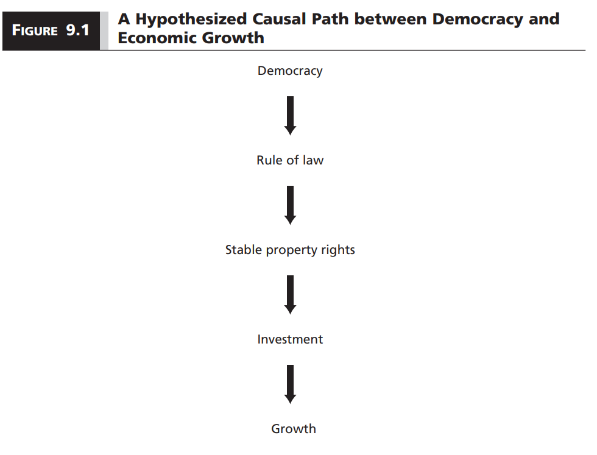
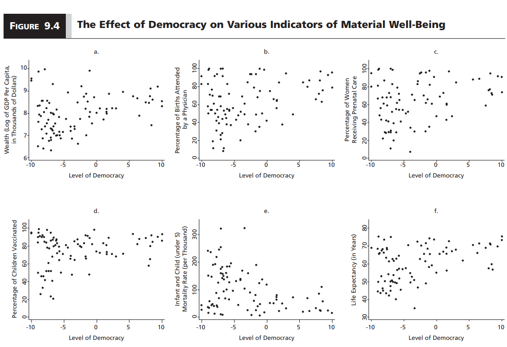
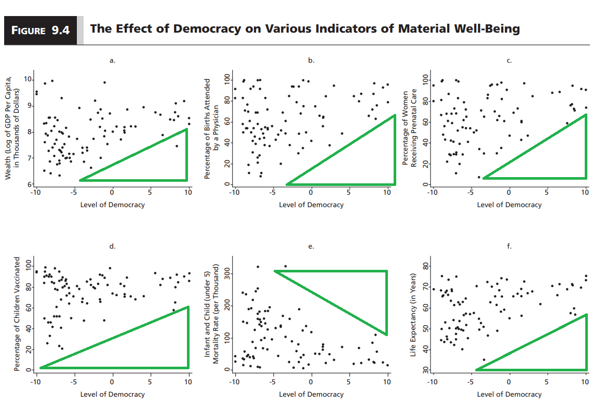
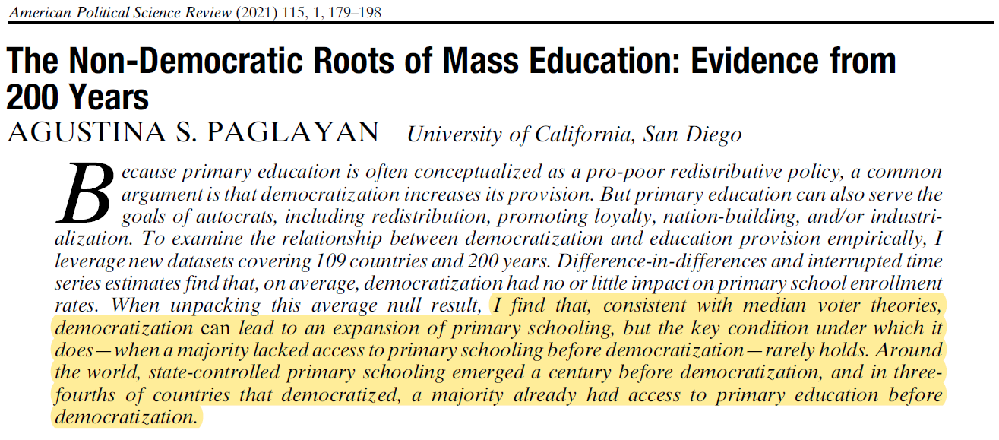

```{r setup, include=FALSE}
options(htmltools.dir.version = FALSE)

library(knitr)
opts_chunk$set(
  fig.width=9, fig.height=5, fig.retina=3,
  out.width = "100%",
  cache = FALSE,
  echo = FALSE,
  message = FALSE, 
  warning = FALSE,
  hiline = TRUE
)
```

```{r xaringan-themer, include=FALSE, warning=FALSE}
# In the future you want to move this to a separate file and source it every time you create a new file
library(xaringanthemer)
style_duo_accent(
  title_slide_background_image = "figs/logo.png",
  title_slide_background_size = "8%",
  title_slide_background_position = "50% 95%",
  primary_color = "#336666",
  secondary_color = "#71C5E8",
  inverse_header_color = "#FFFFFF",
  background_color = "#EAE9EA",
  link_color = "#71C5E8",
  # easy to fetch colors
  colors = c( 
    white = "#FFFFFF",
    green = "#336666",
    lblue = "#71C5E8"
    )
)
```

```{r other-options}
library(tidyverse)
library(kableExtra)
library(fontawesome)

# ggplot global options
theme_set(theme_bw(base_size = 20))
```

## Last time

- We learned about the **predictable unpredictability** of transitions to democracy

- We have spent about four weeks of the semester talking about democracy and dictatorship

- Why do we care so much about this?

- **This week:** Does it make a difference to live in a democracy or a dictatorship?

- Focus on material well-being `(using a very low bar)`

---
## Normative perspective

- We live in a part of the world that values democracy and believes it makes people's lives better

- We also believe that dictatorships are bad because of their poor human rights record

- But in recent years we have seen protests against democratic governments resisted with unprecedented violence `(e.g. Latin America)`

- We also recently saw a not-so-small group of people willing to completely disregard the result of an election in the United States

- Not to mention that a lot of people have suffered and died in the name of both democracy and dictatorship

- **Aristotle:** Any regime is susceptible to corruption `(government for the benefit of the ruling class)`

---
## What we know

- **Normatively:** We believe that democracy leads to better outcomes

- **In theory:** We have reasons to believe it can go both ways

- **In practice:** It looks like democracy is `sufficient` but `not necessary` to guarantee material well-being

---
## Theoretical explanations

**Do democracies produce higher economic growth?**

1. Property rights story

2. Consumption vs. investment story

3. Dictatorial autonomy story

--

- These are all very dense explanations! Let's make sure we are on the same page

---
## 1. Property rights story

.center[
```{r, out.width = "80%"}

```
]

---

.center[
```{r, out.width = "80%"}
include_graphics("figs/8_rule_of_law.png")
```
]

--

- Democracy generates good economic outcomes by creating a predictable legal environment, which is good for investment

- The empirical evidence for this argument is weak:

    - Rule of law **IS** linked with economic growth
    - But electoral democracy **IS NOT** associated with rule of law
    
---
## Some examples (Barro 2000)

```{r}
rol = data.frame(
  elect = c("High", "Low"),
  hi = c("Germany", "Singapore"),
  lo = c("Bolivia", "Afghanistan")
)

colnames(rol) = c("", "High", "Low")

rol %>% 
  kbl() %>% 
  add_header_above(c("", "Rule of law" = 2)) %>% 
  pack_rows("Electoral rights", 1, 2)
```

- These examples reflect the general pattern

- We can find democracies and dictatorships with high and low electoral rights and rule of law

- Democracies are no more likely than dictatorships to guarantee property rights

---
## Why do democracies fail to protect property rights?

- To answer that, we need to take a step back

- What interests do governments pay attention to?

- Do incentives vary across regimes?

- For this, we need a model

---
## Meltzer-Richard model

- This is a model that explains variation in the **size of a government**

- By "size" we mean how much money they collect in taxes and redistribute

- We assume that more distribution imply governments working harder to ensure people's material well being

---
## Setup

- Everyone in society pays a portion $t$ of their income as tax

- Government distributes revenue equally across individuals

- Those with below-average income are **net recipients**

- Those with above-average income are **net contributors**

- **net recipients** are happy with the highest possible tax rate

- **net contributors** would prefer to pay no tax at all

- People in the middle are ok paying some taxes as long as they end up in the positive

---
## Visualizing preferences for taxation

.center[
```{r, out.width = "80%"}
include_graphics("figs/8_meltzer_richard.png")
```
]

---
## What does this mean for democracy vs dictatorship?

- The Meltzer-Richard model is about the distribution of preferences over taxation in a society

- We also need to know how governments choose what the tax rate will be

- **Democracy:** Governments care more about the preferences of those below average income

- **Dictatorship:** Governments care more about the preferences of those above average income

- If this is true, then the rich may not be willing to invest in a democracy as much as they would in a dictatorship `(keeping everything else the same)`

- From this point of view, democracy is bad for economic growth

---
## Critiques to the Meltzer-Richard model

1. **Poor people are less likely to vote:** So the tax rate in a democracy won't be too different from that of a dictatorship `(Why exactly? Maybe this is a good question for the quiz... )`

2. **Structural dependence of the state on capital:** Regardless of the distribution of preferences, capitalists have a veto power over state policies. It may be counterproductive for a democracy to redistribute too much if it means that all the key investors will move their money elsewhere `(Hmm... the textbook has a figure about this thay may be important)`

---
## 2. Consumption vs investment story

- The rich can choose whether to consume or invest their income

- The poor can only consume

- Since the poor vote in democracies, they encourage governments to redistribute prioritizing consumption over investment

- Future-oriented dictators can force the poor to save/invest, which can promote growth

---
## Example: Swallowing the bitter pill

<!-- In the future this slide could use some visual support -->

- Free-market reforms implemented by dictatorships in the 70s/80s `(e.g. China, South Korea, Chile, Peru)`

- Some cases were more or less successful in bringing economic growth

- But the agreement at the time was that adopting pro-market reforms would produce a period of economic decline early on

- It was easier to "convince" people to accept this transition period for countries that were dictatorships at the time

---
## Critiques to the consumption vs investment story

- Do the poor really consume more?

- Is economic growth all about investment? Is "forcing" people to do so the only way?

- Why would dictators care more about the future than democratic leaders?

--

- **This story seems specific to the post Cold War period. Not so much a general explanation**

---
## 3. Dictatorial autonomy story

.pull-left[
### Version I

- Dictators face less pressure from special interests

- No need for inefficient spending to satisfy different constituencies
]

.pull-right[
### Version II

- Dictators face less pressure from special interest

- So they are free to predate, which discourages investment
]

--

- Which one is right? We circle back to previous explanations and their gaps

- **Why would a dictator want to promote growth?** `(We'll return to this in our discussion)`

- **Why would a democracy want to protect property rights more?**

---
class: inverse 

## A big assumption

- We talk a lot about the effect of regime types on economic growth and investment `(Usually in terms of GDP per capita)` 

- This is an **invalid** yet **reliable** measure of development and other forms of material well-being

- Implicitly, we are assuming that **economic growth is a necessary condition** for all other good things `(e.g. wages, healthcare, education, pensions, security, infrastructure, freedom)`

- Notice that a good economy is **necessary** but **not sufficient** for these things

- An important part of the massive protests we have seen in recent years in both democracies and dictatorships has to do with growing economies not fulfilling their promises

---
class: inverse

## Necessary and sufficient conditions

- A **necessary** condition is one without which we would not observe the outcome, but that does not imply that it always produces the outcome

- A **sufficient** condition is one with which we would always observe the outcome, but there may be alternative causes

- Conditions can be either **necessary** or **sufficient**, or **both** at the same time

---
class: inverse

## Examples

- If democracy is **necessary** for material well-being:

    - All the countries that do well are democracies
    - Not all democracies do well
    
- If democracy is **sufficient**:

    - Not all countries that do well are democracies
    - All democracies do well
    
- If democracy is **necessary AND sufficient**:

    - All the countries that do well are democracies
    - All democracies do well

- The last example implies that democracy is the only path to material well-being

---
## Empirical evidence

.center[
```{r, out.width = "90%"}

```
]

---
count: false

## Empirical evidence

.center[
```{r, out.width = "90%"}

```
]

---
## Democracy is sufficient but not necessary

- The triangles of empty space suggest two things:

    1. All democracies have high material well-being
    2. Dictatorships can perform either way
    
- These are **low bar** indicators of well-being

- We should read these results as democracy being **sufficient** to guarantee **the most basic living conditions**

- These conditions are in turn **necessary** for more ambitious dimensions of well-being `(e.g. education, wages)`

- That does not mean that democracy is **necessary**

---
## What does this all mean?

- Democracy is **sufficient** but not **necessary** for material well-being

- So we cannot just go and say that democracy **causes** material well-being

--

- Why not? **The single point in time critique!**

---
## Newer evidence

.center[
```{r}

```
]

--

- Universal primary education is a **higher bar** than infant mortality, life expectancy, etc

- Most improvements to basic material well-being happened **before democratization**

---
## Takeaways

- We have many explanations of why democracy may or may not improve material well-being

    1. Property rights story
    2. Consumption vs. investment story
    3. Dictatorial autonomy story
    
- In practice, all we can learn is that democracy is **sufficient** for material well-being

- But we have to make some **caveats**:

    - We are using very **low bars** to measure material well-being
    - Many of the improvements in democracies happened **before democratization**

- We do not have a complete picture

- We keep going back to why rulers in a democracy or dictatorship would care about promoting material well-being to begin with

---
class: inverse center middle

## Reminder:
### Quiz 3 Due Friday 5:00 PM

## Next Week:
### Problems with Group Decision-Making