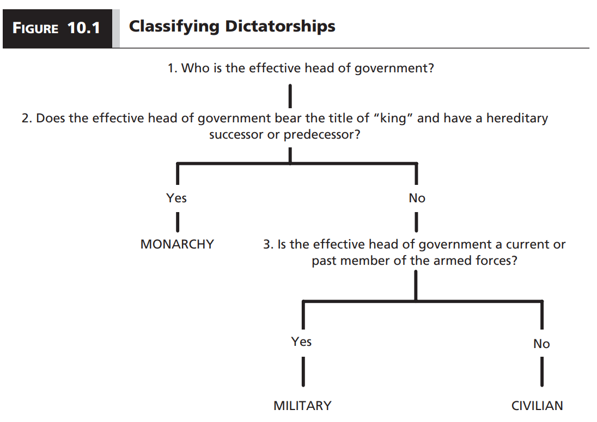
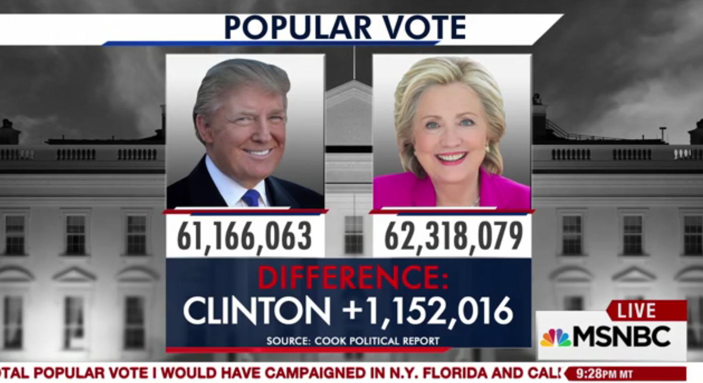
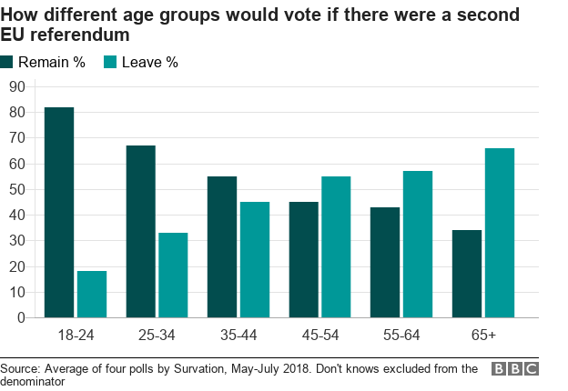
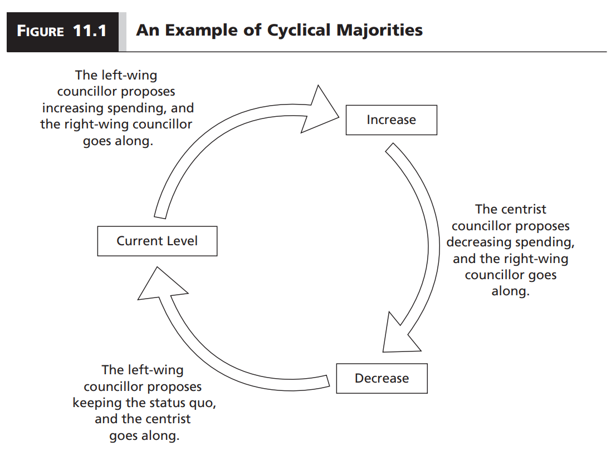
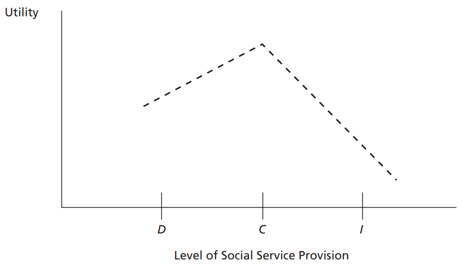
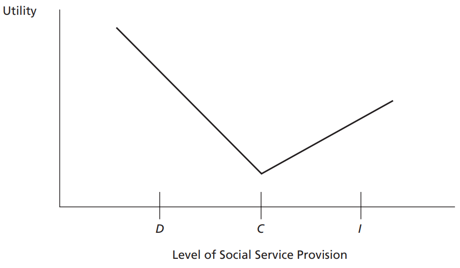
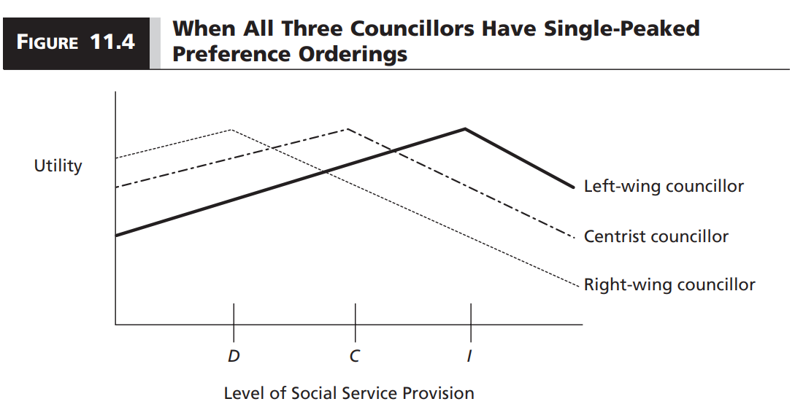
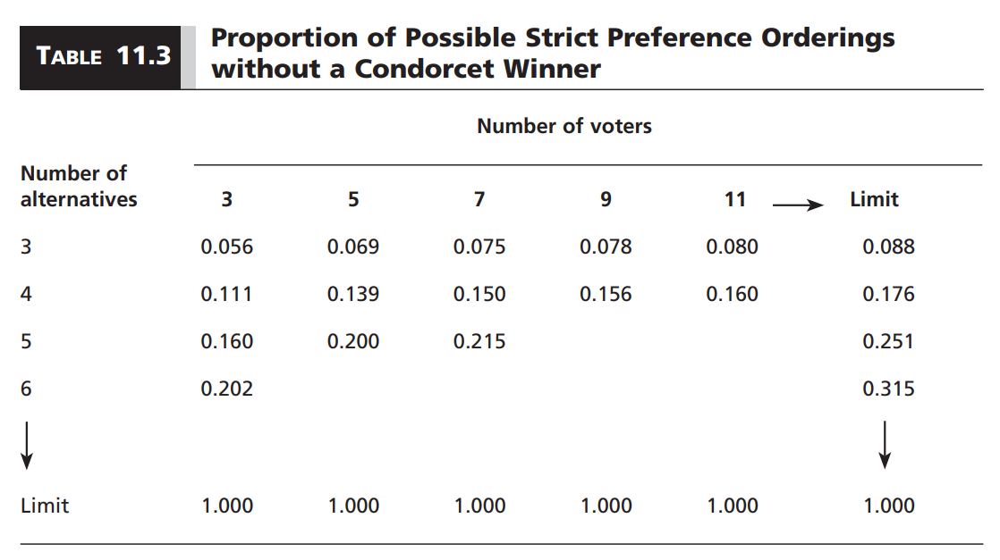
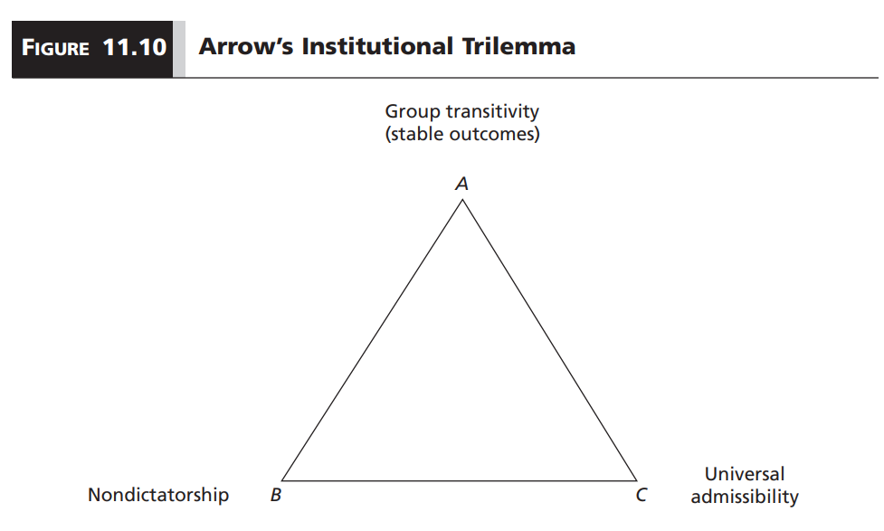

```{r setup, include=FALSE}
options(htmltools.dir.version = FALSE)

library(knitr)
opts_chunk$set(
  fig.width=9, fig.height=5, fig.retina=3,
  out.width = "100%",
  cache = FALSE,
  echo = FALSE,
  message = FALSE, 
  warning = FALSE,
  hiline = TRUE
)
```

```{r xaringan-themer, include=FALSE, warning=FALSE}
# In the future you want to move this to a separate file and source it every time you create a new file
library(xaringanthemer)
style_duo_accent(
  title_slide_background_image = "figs/logo.png",
  title_slide_background_size = "8%",
  title_slide_background_position = "50% 95%",
  primary_color = "#336666",
  secondary_color = "#71C5E8",
  inverse_header_color = "#FFFFFF",
  background_color = "#EAE9EA",
  link_color = "#71C5E8",
  # easy to fetch colors
  colors = c( 
    white = "#FFFFFF",
    green = "#336666",
    lblue = "#71C5E8"
    )
)
```

```{r other-options}
library(tidyverse)
library(kableExtra)
library(fontawesome)

# ggplot global options
theme_set(theme_bw(base_size = 20))
```

## Last time

- We explored whether democracy or dictatorship would be the most desirable regime based on their ability to guarantee material well-being

- We concluded that democracy is **sufficient** for material well-being

- But also pointed out that many improvements to promote well-being in democracies happened **before democratization**

- This is a **consequentialist** approach to the democracy vs. dictatorship debate

- **This week:** Take a **deontological** approach

---
## Deontological approach

- Before, we evaluated regimes based on whether they lead to good outcomes `(material well-being)`

- Now, the question is whether any regime intrinsically desirable properties

- How do different regimes make decisions? Is any regime better at decision-making?

- We will focus on how democracies make decisions

---
class: inverse
## We are skipping dictatorships

.center[
```{r, out.width = "60%"}

```
]

- Dictators have to balance power-sharing with control over the population
- Broadly:

    - Monarchies and military dictatorships tend to emphasize control
    - Civilian dictatorships tend to emphasize power-sharing

---
## Democracy is about majority rule

- Some people like **democracy** because it is a **fair** way to make decisions

- We often assume **fairness** $\rightarrow$ reflecting the **preferences of the majority**

- A fair choice is that preferred by most people


---
## So this is unfair

.center[
```{r, out.width = "100%"}

```
]

---
## How about this?

.center[
```{r, out.width = "90%"}

```
]

---
class: inverse

## A big assumption

- Sometimes it seems obvious that what the majority prefers is fair

- Sometimes, the **majority may end up making decisions against the desires of a minority**

- This is a problem if the **minority is directly affected** but the majority is not

- We will **assume that pro-majority outcomes are fair** for class purposes, but keep this in mind!

---
## Social choice theory

- The study of **collective decision** processes and procedures

- Not a single theory, but an array of useful models to understand decision-making and its challenges

- Assume that decision makers in a democracy are **rational actors**

- **Rational:** **Complete** and **transitive** preferences

---
## Complete preferences


- An actor has **complete preferences** if they can compare any pair of options and determine if they prefer one, the other, or are indifferent

    - Imagine we have options $x$, $y$, and $z$
    - If I grab $x$ and $y$. I can tell which one I like better (or whether I am indifferent)
    - If I can do the same for every pair of options, then my preferences are complete
    
---
## Transitive preferences

- An actor has **transitive preferences** if their preferences are not cyclical

    - $\geq$ means **weak preference** `(at least as good as)`
    - If $x \geq y$ AND $y \geq z$
    - Then $x \geq z$
    - If this is true, individual preferences are transitive
    
---
## Condorcet's Paradox

- A group composed from rational individuals does not necessarily have rational preferences as a collective

- This means that even **a group of competent decision makers** can reach **socially sub-optimal decisions** `(want it or not)`

- **Why?**

---
## An example

- A city council made of **three individuals** has to decide whether to:

    1. Increase social services: $I$
    2. Decrease social services: $D$
    3. Maintain current levels of services: $C$
    
.footnote[**Note:** Three individuals is the smallest group in which it is meaningful to have decision making rules.]

---
## Preferences

- Each council member has **complete** and **transitive** preferences

```{r}
preferences = data.frame(
  Left = "\\(I > C > D\\)",
  Center = "\\(C > D > I\\)",
  Right = "\\(D > I > C\\)"
)

preferences %>% 
  kbl(escape = FALSE) %>% 
  column_spec(1:3, width = "10em")
```

--

- Assume they require majority rule to reach a decision

- Imagine they select along alternatives via **round-robin**

- **Round-robin:** A tournament in which each competitor plays in turn against every other

- In this case, councilors will vote on every possible combination of alternative pairs and we will see which alternative wins more rounds

---
## Round-robin results

```{r}
preferences %>% 
  kbl(escape = FALSE) %>% 
  column_spec(1:3, width = "10em")
```

&nbsp;

```{r}
robin = data.frame(
  Round = 1:3,
  Contest = c("\\(I\\) vs \\(D\\)", "\\(C\\) vs \\(I\\)", "\\(C\\) vs \\(D\\)"),
  Winner = c("\\(D\\)", "\\(I\\)", "\\(C\\)"),
  Majority = c("Center and Right", "Left and Right", "Left and Center")
)

robin %>% 
  kbl(escape = FALSE)
```

--

- Group preference: $D > I > C > D$. **Intransitive!**

- There is no **Condorcet winner**

    - A candidate `(alternative)` that wins in a two-candidate election against any other candidate
    
---
## Condorcet's Paradox in practice

- Round-robin elections are rare. But beyond the game, the **paradox can lead to cyclical majorities** over time

.center[
```{r, out.width = "70%"}

```
]

---

## But cycles like this are an exception

- We do see democracies making somewhat coherent, perhaps rational, decisions

- Why is this the case? How do we overcome Condorcet's paradox?

- Two reasons:

    1. Preference orderings
    2. Decision making rules
    
---
## Preference orderings

- The Right councilor is weird in that they prefer $D > I > C$

- Let's change their preference to a mirror of the Left councilor: $D > C > I$

--

```{r}
preferences2 = data.frame(
  Left = "\\(I > C > D\\)",
  Center = "\\(C > D > I\\)",
  Right = "\\(D > C > I\\)"
)

preferences2 %>% 
  kbl(escape = FALSE) %>% 
  column_spec(1:3, width = "10em")
```

&nbsp;

```{r}
robin2 = data.frame(
  Round = 1:3,
  Contest = c("\\(I\\) vs \\(D\\)", "\\(C\\) vs \\(I\\)", "\\(C\\) vs \\(D\\)"),
  Winner = c("\\(D\\)", "\\(C\\)", "\\(C\\)"),
  Majority = c("Center and Right", "Center and Right", "Left and Center")
)

robin2 %>% 
  kbl(escape = FALSE)
```

--

- Now $C$ is a **Condorcet winner**

---
## Preference orderings

- Condorcet's paradox only says that **it is possible** for individual rational preferences to aggregate into irrational preferences

- But some **"well-behaved"** preference orderings can find a Condorcet winner

---
## Single-peaked preferences

.pull-left[
### Center councilor

```{r, out.width = "100%"}

```

.center[`r fa("fas fa-check")` Single-peaked]

]

.pull-right[
### Right councilor

```{r, out.width = "100%"}

```

.center[`r fa("fas fa-times")` Not single-peaked]

]

- We say that the right councilor has "weird" preferences because they are **not single-peaked**

.footnote[**Note:** I may ask you to tell me whether preferences are single-peaked or not in the quiz.]

---
## Median voter theorem

- If we can assume the following:

    1. The number of voters is odd
    2. Voter preferences are single-peaked
    3. We can summarize preferences in one dimension
    4. Voters vote sincerely
    
- Then the ideal point of the **median voter** will win against any alternative in a pair-wise majority rule election

- So the ideal point of the median is the **Condorcet winner**

---
## Visualizing the median voter theorem

.center[
```{r, out.width = "90%"}

```
]

--

- Center can get their preferred option by joining either Left or Right against the other

- No Condorcet's paradox here 

---
## Problems with median voter theorem

- Nothing wrong with not-single peaked preferences

- Many political issues are inherently multi-dimensional

- **Chaos theorem:**  

    - $\text{Dimensions} \geq 2 + \text{Voters} \geq 3 = \text{No Condorcet winner}$
    - Unless we have a rare distribution of ideal points
    
    
.footnote[**Note:** Make sure you understand the two-dimensional voting figures in the book]    

---
## How often are we in trouble?

.center[
```{r, out.width = "80%"}

```
]

.footnote[Assuming no "weird" preferences. The proportion of strict preference orderings without a Condorcet winner increases with the number of voters and alternatives.]

---
## In practice

- Many real political decisions involve bargaining, which implies an infinite number of alternatives

- Also, most meaningful decision making bodies have more members than a handful

- In general, we cannot rely on majority rule to produce a coherent sense of what the group wants

- We need some way to narrow down alternatives

- **We need decision-making rules**

---
## Decision-making rules

- Rules can establish **how to decide** or **who is in charge of leading decision-making**

    1. The Borda count
    2. An agenda setter
    
---
## Borda count

- Rational individuals have complete, transitive preferences

- Then why do we ask them to cast a vote for one alternative?

- We could instead ask them to rank all alternatives

- The **Borda count** does this!

- Each individual assigns points to alternatives according to their preference ranking

- The alternative with most points wins

---
## Using the Borda count

```{r}
borda = data.frame(
  Alternative = c("Increase spending", "Decrease spending", "Current spending"),
  Left = c(3, 1, 2),
  Center = c(1, 2, 3),
  Right = c(2, 3, 1),
  Total = rep(6, 3)
)

borda %>% 
  kbl(escape = FALSE) %>% 
  column_spec(5, bold = TRUE)
```

--

- The Borda count did not help `r fa("far fa-tired")`

- Wanna make it worse? Let's introduce an **irrelevant alternative**

---
## An irrelevant alternative

- Let's say another voting option is future cuts in social service provision: $FC$

- Preferences now look like this:


```{r}
pref_fc = data.frame(
  Left = "\\(I > C > D > FC\\)",
  Center = "\\(C > D > FC > I\\)",
  Right = "\\(D > FC > I > C\\)"
)

pref_fc %>% 
  kbl(escape = FALSE) %>% 
  column_spec(1:3, width = "10em")
```

- You will see why $FC$ is irrelevant in a second...

---
## Borda count with irrelevant alternatives

```{r}
borda_fc = data.frame(
  Alternative = c("Increase spending", "Decrease spending", "Current spending", "Future cuts"),
  Left = c(3, 1, 2, 0),
  Center = c(0, 2, 3, 1),
  Right = c(1, 3, 0, 2),
  Total = c(4, 6, 5, 3)
)

borda_fc %>% 
  kbl(escape = FALSE) %>% 
  column_spec(5, bold = TRUE)
```

--

- $FC$ is irrelevant in that it does not stand a chance against any of the other alternatives in round-robin `(I am not showing you this but I may ask you about it)`

- Introducing a **seemingly** irrelevant alternative now gives us a clear winner

- Politicians can manipulate decisions rules that are not **independent of irrelevant alternatives**

- Rather than argue for what you prefer the most, you can introduce an irrelevant alternative

---
## Agenda setting

- If decision rules do not work, perhaps we need someone to control the agenda

    - **First round:** $I$ vs $D$
    - **Second round:** Winner of first round vs. $C$
    
- Some real-world legislatures operate like this

---
## Pairwise vote under different agendas

```{r}
preferences %>% 
  kbl(escape = FALSE) %>% 
  column_spec(1:3, width = "10em")
```

&nbsp;

```{r}
agendas = data.frame(
  Agenda = 1:3,
  R1 = c("\\(I\\) vs \\(D\\)", "\\(C\\) vs \\(I\\)", "\\(C\\) vs \\(D\\)"),
  R1_win = c("\\(D\\)", "\\(I\\)", "\\(C\\)"),
  R2 = c("\\(D\\) vs \\(C\\)", "\\(I\\) vs \\(D\\)", "\\(C\\) vs \\(I\\)"),
  R2_win = c("\\(C\\)", "\\(D\\)", "\\(I\\)")
)

colnames(agendas) = c("Agenda", "Round 1 vote", "Round 1 winner", "Round 2 vote", "Round 2 winner")

agendas %>% 
  kbl(escape = FALSE)
```

--

- Whatever alternative is introduced in the second round wins

- The agenda setter can get their preferred outcome

- **A powerful agenda setter is a dictator!**

---
## Summary

- Unless we are lucky to have individual actors whose preferences do not lead to cyclical majorities, then either of two things will happen:

    1. Decision-making leads to unstable policy outcomes
    
    2. An agenda setter can exploit the decision-making rules to get their most preferred outcome


- Does that mean we should drop majority rule in a democracy?

---
## Arrow's impossibility theorem

- Four **fairness conditions**:

    1. **Non-dictatorship:** No individual can fully determine the outcome
    
    2. **Universal admissibility:** Individuals can adopt any rational preference ordering
    
    3. **Unanimity (pareto optimality):** If everyone prefers $x > y$, the then group should not choose $y$ if $x$ is available
    
    4. **Idependence of irrelevant alternatives (IIA):** Introducing irrelevant alternatives does not affect the outcome
    
--

- We normally assume **3** and **4** are uncontroversial. We want better outcomes for society and we want to weed out irrelevant alternatives

- The hard part is to balance the first two

---
## You have to choose a side

.center[
```{r, out.width = "80%"}

```
]

- Ensuring one of these conditions requires sacrificing the other two

---
## The impossibility in practice

- Any **seemingly smooth** decision making process has at least one of the following:

    - Unstable majorities
    - Someone takes over the process
    - Some alternatives (and thus people who prefer them) are excluded

- **It is virtually impossible to have a decision rule without leaving someone unhappy**

---
## Takeaways

- We believe democracy is fair because of majority rule

- But nearly all decision-making rules using majority have issues

- Things only work well in the rare case of well-behaved preferences

- **To function properly, a democracy has to systematically exclude a non-trivial portion of the population**

---
class: inverse center middle

## Reminder:
### News Report 4 Due Friday 5:00 PM

## Next Week:
### Democratic Systems