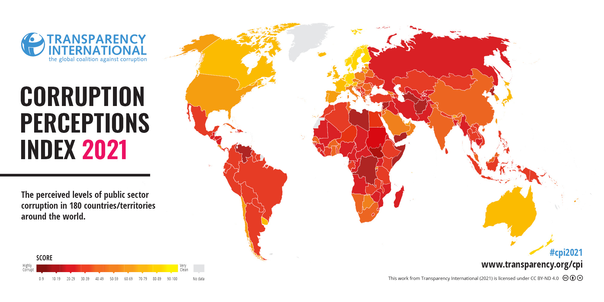
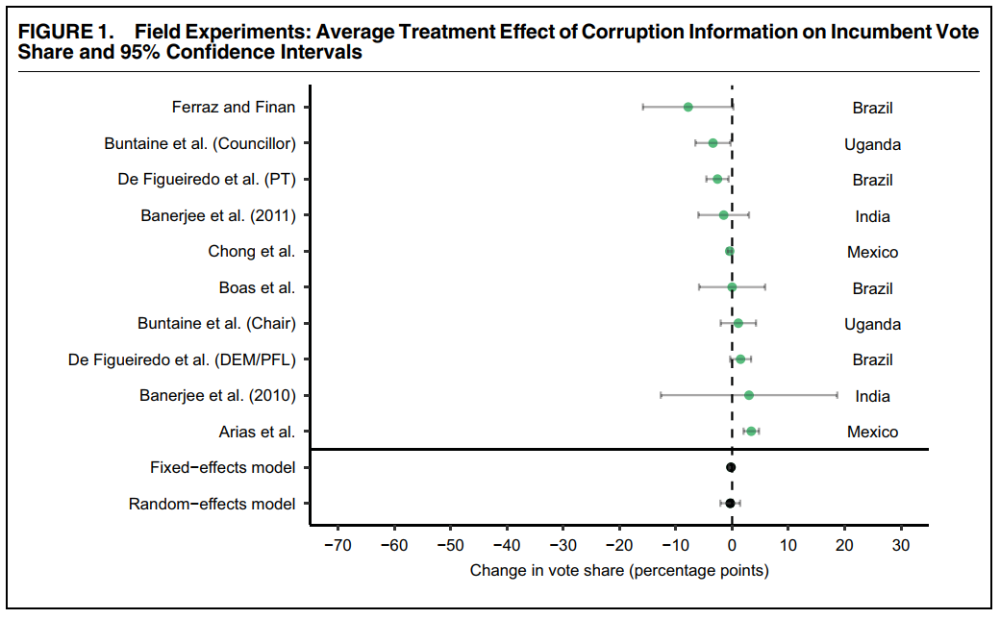
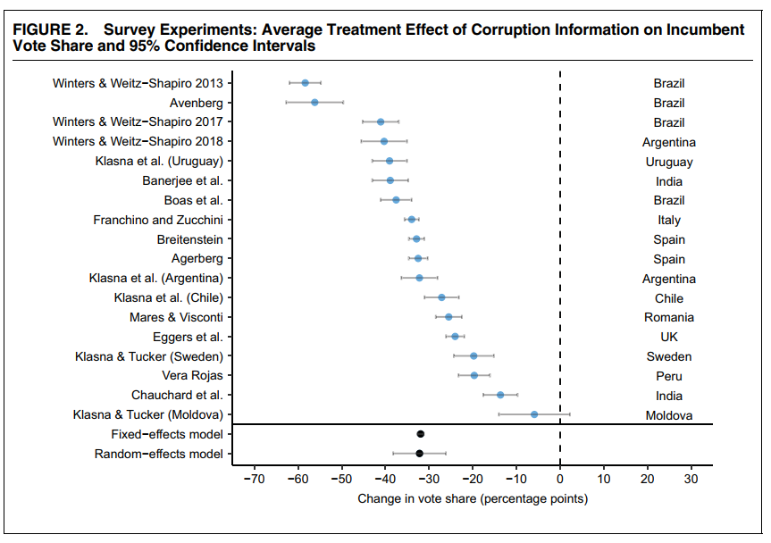
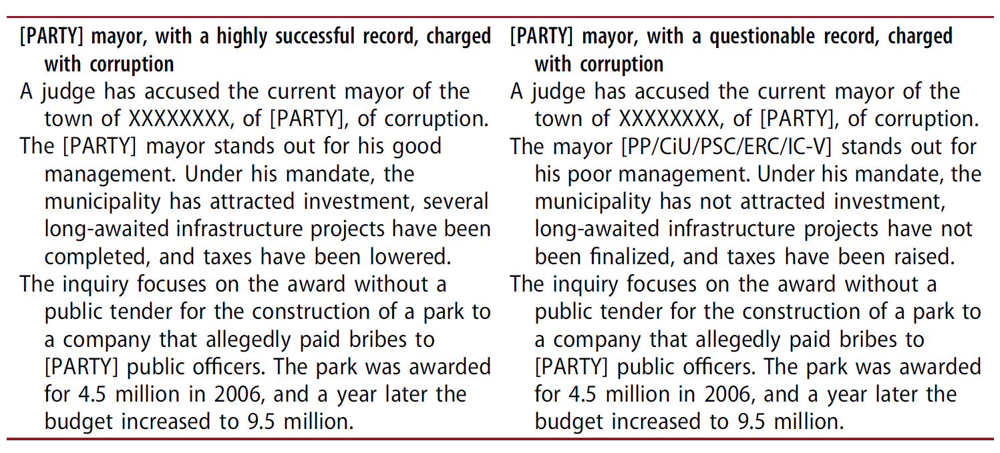
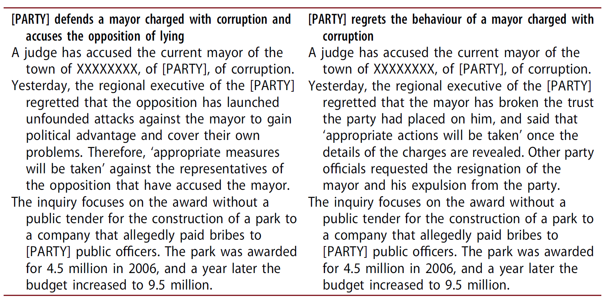
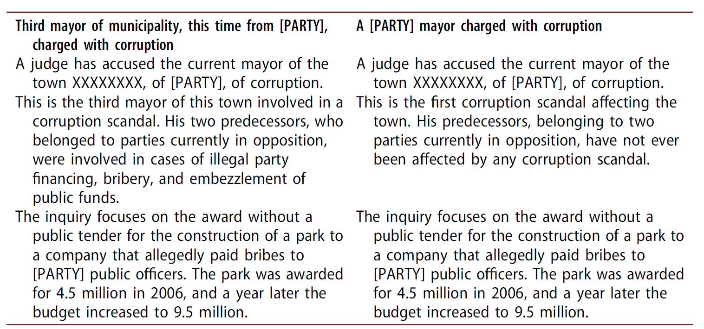
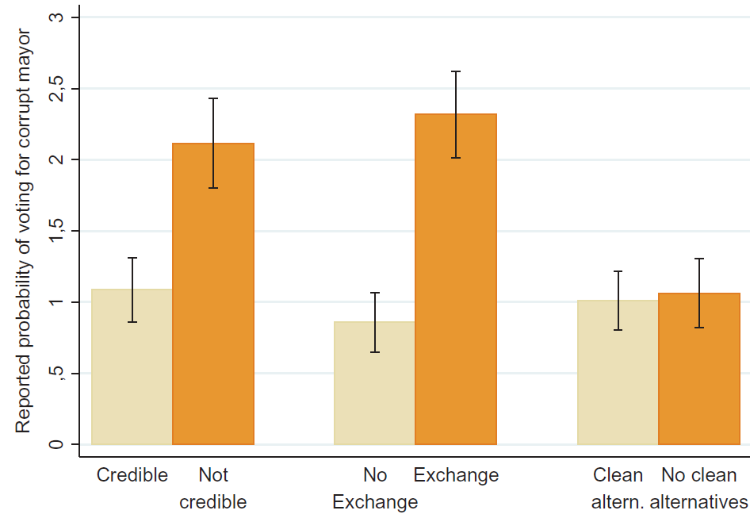

```{r setup, include = FALSE, warning = FALSE}
# Loads knitr and xaringan themer settings
source("theme.R")
```

```{r other-options}
library(tidyverse)
library(kableExtra)
library(fontawesome)

# ggplot global options
theme_set(theme_bw(base_size = 20))
```

class: inverse

## Outline

- **Today:** Causes and consequences

- **Thursday:** Solutions and their limitations

.footnote[**Note:** I am behind on grading. I will catch up next week :( ]

---
## What is corruption?

- **Broad definition:** Use of public office for private gain

--

    - **Public office:** Usually elected office
    
    - **Private gain:** Personal enrichment, favoritism, policy, ideology, or career goals
    
---
## What counts as corruption?

- **Malfeasance:** Misusing public funds or resourcing `(e.g. over-invoicing)`

--

- **Bribes:** Asking or accepting them

--

- **Patronage:** Using public appointments for private gain

--

- **State capture:** Economic interests exerting undue influence on policymaking

---

## What we know about corruption

- Bad for economic growth `(but also "speed money")`

- Can harm the provision of public goods and services `(but also enable them)`

- Hurts trust in government an democracy

- More pronounced in developing countries and in areas with poor access to information

---
## Corruption as a delegation problem

- From the citizen's perspective, corruption is a **principal-agency** problem in which *voters are the principals* and *elected officials are the agents*

--

- We want to elect good politicians' but we cannot monitor what they do in office all the time

--

- **Agency loss:** Agent takes actions against the interest of the principal

--

- Some agency loss is expected since politicians try to please many audiences, but delegation also creates space corruption to go unnoticed and unpunished

--

- To a large extent, the reason why corruption persists is because it is **hard to observe** and **difficult to measure**

---
## How to measure corruption?

.center[
```{r, out.width = "95%"}

```
]

---
## Perceptions of corruption

- **CPI:** Ask experts and executives their perception about barriers to doing business in the country

- Any problems with this?

---

## Alternative ways to uncover corruption

- The problem with CPI is that perceptions may not reflect reality

--

- We would prefer **objective** measures of corruption

--

- **Examples:** Hiring engineers to compare estimated vs. actual project costs, sending auditors to identify missing expenditures

--

- These are expensive to implement and hard to compare across countries

---
## Problem

- Corruption is hard to observe, therefore hard for citizens to vote against corrupt politicians

--

- **Proposal:** If people had better access to information, they would hold corrupt politicians accountable 

--

- A lot of money goes to these information sharing interventions, **and they do not work**

---
## Effect of information sharing informations

.center[
```{r, out.width = "70%"}

```
]

---
## But in surveys...

.center[
```{r, out.width = "70%"}

```
]

---
## Why does this happen?

<!-- Make them talk instead of telling them what these are -->

- Recent research focuses on why voters **"fail"** to punish corruption

.footnote[**Note:** "Failing" is somewhat unfair because lack of punishment does not necessarily mean people making mistakes]

--

- Three explanations:

    1. Implicit exchange
    
    2. Credibility of information
    
    3. Lack of clean alternatives

--

- Muñoz et al (2016) use survey experiments to evaluate the merit of each explanations

--

- Three experiments embedded in an online survey in Catalonia, 2012

- 1,102 respondents `(one experiment each)`

---

## Survey experiments

- Similar logic to an RCT/field experiment

- Randomly assign one or more treatment conditions

- In survey experiments, treatments are usually variations of information presented in a vignette `(e.g. corrupt vs. clean)`

- The outcome of interest is usually how people feel about a particular subject `(e.g. voting for the incumbent mayor)`

--

- **Why would someone want to do a survey experiment?**

---

## Research design: Implicit trading

.center[
```{r, out.width = "90%"}

```
]

---

## Research design: Credibility

.center[
```{r, out.width = "90%"}

```
]

---
## Research design: Clean alternatives

.center[
```{r, out.width = "90%"}

```
]

---
## Results: Incumbent vote probability (0-10 scale)

.left-column[
{{content}}
]

.right-column[
.center[
```{r, out.width = "80%"}

```
]
]

--

- Voting probabilities generally low

{{content}}

--

- Not credible > Credible

{{content}}

--

- Exchange > No exchange

{{content}}

--

- Why would clean alternatives not matter?

---
## Takeaways

 - The problem with corruption is that is hard to observe
 
 - Even when we invest in information-sharing interventions, corrupt politicians continue to get reelected
 
 - A lot of the "solutions" have to do with understanding what drives (lack of) sanctions

---
class: inverse

## Preview of Thursday

- **Boas et al (2018):** Zooming into the norms vs. action gap

- **Avis et al (2018):** Monitoring works because of top-down consequences `(hard to read)`

- **Le Foulon and Reyes-Housholder (2021):** Gendered voter evaluations of corruption `(double bind)`
