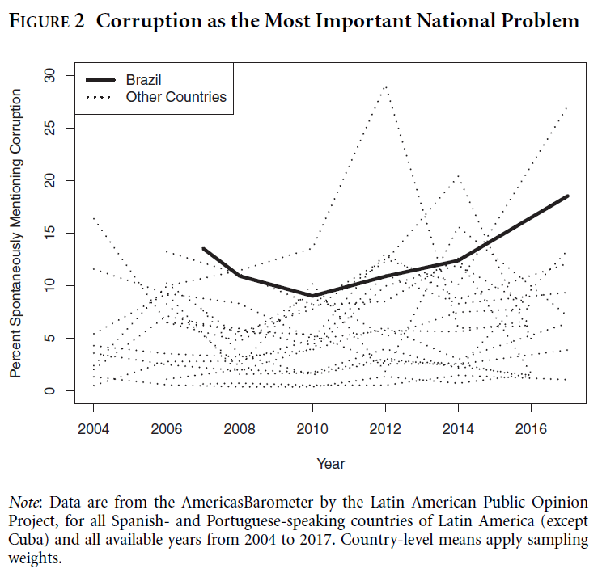
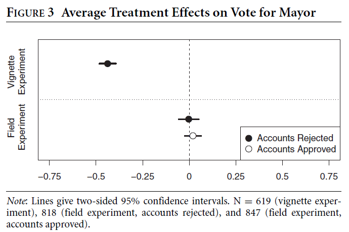
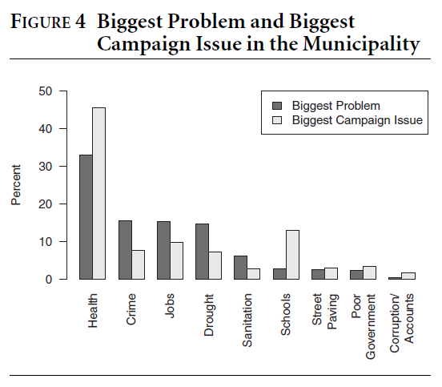
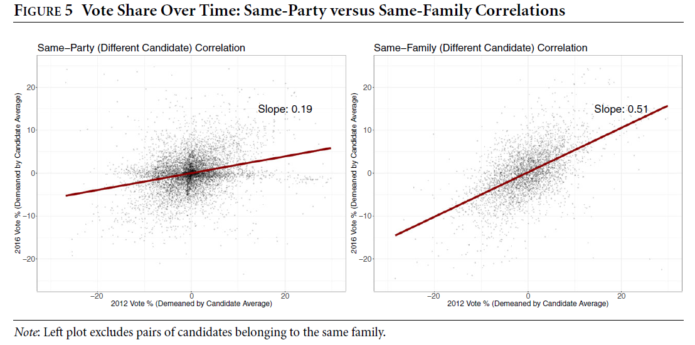
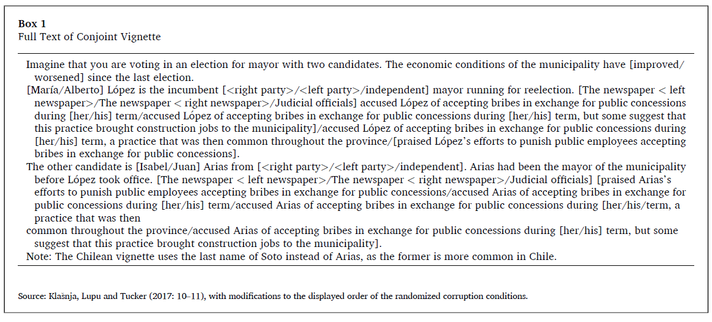
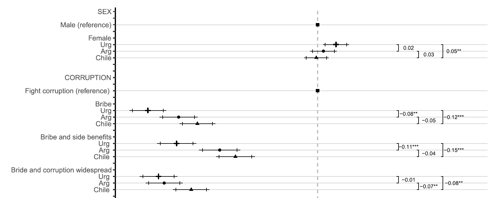
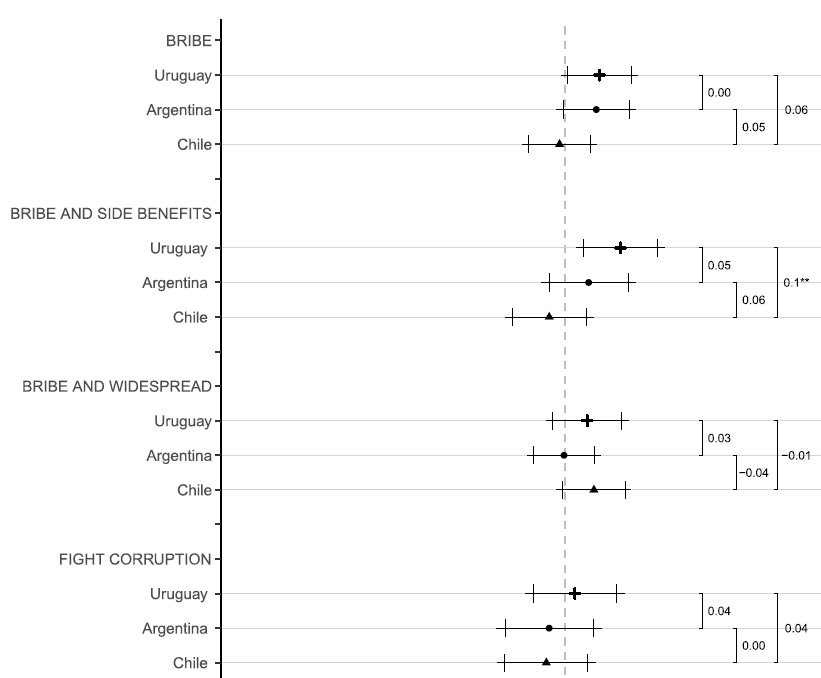

```{r setup, include = FALSE, warning = FALSE}
# Loads knitr and xaringan themer settings
source("theme.R")
```

```{r other-options}
library(tidyverse)
library(kableExtra)
library(fontawesome)

# ggplot global options
theme_set(theme_bw(base_size = 20))
```

class: inverse

## Outline

- **Today:** Causes and consequences

- **Thursday:** Solutions and their limitations [`r fa("external-link-alt")`](#thursday)

---
## What is corruption?

- **Broad definition:** Use of public office for private gain

--

    - **Public office:** Usually elected office
    
    - **Private gain:** Personal enrichment, favoritism, policy, ideology, or career goals
    
---
## What counts as corruption?

- **Malfeasance:** Misusing public funds or resourcing `(e.g. over-invoicing)`

--

- **Bribes:** Asking or accepting them

--

- **Patronage:** Using public appointments for private gain

--

- **State capture:** Economic interests exerting undue influence on policymaking

---

## What we know about corruption

- Bad for economic growth `(but also "speed money")`

- Can harm the provision of public goods and services `(but also enable them)`

- Hurts trust in government an democracy

- More pronounced in developing countries and in areas with poor access to information

---
## Corruption as a delegation problem

- From the citizen's perspective, corruption is a **principal-agency** problem in which *voters are the principals* and *elected officials are the agents*

--

- We want to elect good politicians' but we cannot monitor what they do in office all the time

--

- **Agency loss:** Agent takes actions against the interest of the principal

--

- Some agency loss is expected since politicians try to please many audiences, but delegation also creates space corruption to go unnoticed and unpunished

--

- To a large extent, the reason why corruption persists is because it is **hard to observe** and **difficult to measure**

---
## How to measure corruption?

.center[
```{r, out.width = "95%"}
include_graphics("figs/11_cpi.png")
```
]

---
## Perceptions of corruption

- **CPI:** Ask experts and executives their perception about barriers to doing business in the country

- Any problems with this?

---

## Alternative ways to uncover corruption

- The problem with CPI is that perceptions may not reflect reality

--

- We would prefer **objective** measures of corruption

--

- **Examples:** Hiring engineers to compare estimated vs. actual project costs, sending auditors to identify missing expenditures

--

- These are expensive to implement and hard to compare across countries

---
## Problem

- Corruption is hard to observe, therefore hard for citizens to vote against corrupt politicians

--

- **Proposal:** If people had better access to information, they would hold corrupt politicians accountable 

--

- A lot of money goes to these information sharing interventions, **and they do not work**

---
## Effect of information sharing informations

.center[
```{r, out.width = "70%"}
include_graphics("figs/11_incerti_1.png")
```
]

---
## But in surveys...

.center[
```{r, out.width = "70%"}
include_graphics("figs/11_incerti_2.png")
```
]

---
## Why does this happen?

<!-- Make them talk instead of telling them what these are -->

- Recent research focuses on why voters **"fail"** to punish corruption

.footnote[**Note:** "Failing" is somewhat unfair because lack of punishment does not necessarily mean people making mistakes]

--

- Three explanations:

    1. Implicit exchange
    
    2. Credibility of information
    
    3. Lack of clean alternatives

--

- Muñoz et al (2016) use survey experiments to evaluate the merit of each explanations

--

- Three experiments embedded in an online survey in Catalonia, 2012

- 1,102 respondents `(one experiment each)`

---

## Survey experiments

- Similar logic to an RCT/field experiment

- Randomly assign one or more treatment conditions

- In survey experiments, treatments are usually variations of information presented in a vignette `(e.g. corrupt vs. clean)`

- The outcome of interest is usually how people feel about a particular subject `(e.g. voting for the incumbent mayor)`

--

- **Why would someone want to do a survey experiment?**

---

## Research design: Implicit trading

.center[
```{r, out.width = "90%"}
include_graphics("figs/11_munoz_1.png")
```
]

---

## Research design: Credibility

.center[
```{r, out.width = "90%"}
include_graphics("figs/11_munoz_2.png")
```
]

---
## Research design: Clean alternatives

.center[
```{r, out.width = "90%"}
include_graphics("figs/11_munoz_3.png")
```
]

---
## Results: Incumbent vote probability (0-10 scale)

.left-column[
{{content}}
]

.right-column[
.center[
```{r, out.width = "80%"}
include_graphics("figs/11_munoz_4.png")
```
]
]

--

- Voting probabilities generally low

{{content}}

--

- Not credible > Credible

{{content}}

--

- Exchange > No exchange

{{content}}

--

- Why would clean alternatives not matter?

---
## Takeaways

 - The problem with corruption is that is hard to observe
 
 - Even when we invest in information-sharing interventions, corrupt politicians continue to get reelected
 
 - A lot of the "solutions" have to do with understanding what drives (lack of) sanctions

---
class: inverse

## Preview of Thursday

- **Boas et al (2018):** Zooming into the norms vs. action gap

- **Avis et al (2018):** Monitoring works because of top-down consequences `(hard to read)`

- **Le Foulon and Reyes-Housholder (2021):** Gendered voter evaluations of corruption `(double bind)`

---
name: thursday

## Last time

- The problem with corruption is that is hard to observe
 
 - Even when we invest in information-sharing interventions, corrupt politicians continue to get reelected
 
 - **Today:** Understanding what drives (the absence of) bottom-up sanctions
 
--

- We already mentioned some explanations:

    1. Implicit exchange
    
    2. Credibility of information
    
    3. Lack of clean alternatives
    
- We expand on them today

 
---
## Roadblocks

- We expect information-sharing to help voters hold corrupt politicians accountable

- This **solution** does not seem to work

--

- Three interpretations:

    1. People would like to vote against corruption but stuff gets in the way `(Boas et al 2018)`
    
    2. It depends on what kind of politician is involved in corruption `(Le Foulon and Reyes-Housholder 2021)`
    
    3. Politicians respond better to top-down sanctions `(Avis et al 2018)`
    
---
## Boas et al (2018): Norms vs. Action

- Survey and field experiments in the state of Pernambuco, Brazil

- Work with State Accounts Court so that information is credible

---
## Brazilians dislike corruption

.center[
```{r, out.width = "50%"}

```
]

---
## Boas et al (2018): Norms vs. Actions

- Field and survey experiments in the state of Pernambuco, Brazil

- Work with State Accounts Court so that information is credible

- **Outcome:** Vote for mayor `(based on surveys)`

--

- **Field experiment:** Flyers sharing whether municipality had accounts approved/rejected + % of municipalities with rejected accounts `(real information)`

--

- **Survey (vignette) experiment:** 

Imagine that you live in a neighborhood like yours, but in a different city in Brazil. Let’s call the mayor of the city where you live Carlos. Now imagine that Mayor Carlos is running for reelection. During the four years that he was mayor, the city had various improvements, with economic growth and improved public health and public transport services. *Also in that city, the State Accounts Court rejected the accounts of Mayor Carlos in the year 2013 because it found serious problems in the administration of the budget.*

---

## Norms vs. Actions results

.center[
```{r, out.width = "70%"}

```
]

---
## Why does this happen?

- Two explanations for the discrepancy in norms vs. action:

    1. People prioritize other things over corruption in municipal politics `(implicit trading + lack of alternatives)`
    
    2. Corrupt political dynasties prevent serious competition `(lack of alternatives)`
    
---
## Issue priorities at the local level

.center[
```{r, out.width = "50%"}

```
]

---
## Political dynasties

.center[
```{r, out.width = "90%"}

```
]

---
## Le Foulon and Reyes-Housholder (2021): Candidate sex

- **Background:** Women are perceived as less corrupt, but also face higher voter punishment for comparable corruption `(double bind)`

- But this may depend on the context and other candidate features

- Survey experiments in Argentina, Chile, Uruguay

- Present a vignette describing a campaign between two hypothetical candidates for mayor

- For each candidate, ramdomize **sex**, **corruption** (+ side benefits), **economic performance**, **partisanship**

- Outcome, whether respondents would vote for a given candidate

---
## Vignette

.center[
```{r, out.width = "100%"}

```
]

---
## General

.center[
```{r, out.width = "100%"}

```
]

--

- If we ignore candidate sex, everyone would prefer to vote against corruption

---
## Results by candidate sex

.pull-left[
```{r, out.width = "100%"}

```
]

--

.pull-right[
- Average change in probability of voting for candidate if we keep everything else the same, but **change from male to female**

{{content}}
]

--

- People prefer a woman who accepts bribes over a man who accepts bribes in Argentina and Uruguay

{{content}}

--

- People prefer a woman who accepts bribes but gives side benefits in Uruguay

{{content}}

--

- If corruption is widespread, people prefer a corrupt woman in Chile

---
## Avis et al (2018): Top-down sanctions

.pull-left[

- **Argument:** Anti-corruption interventions still work even if citizens do not use information to hold politicians accountable

- Long-running anti-corruption in Brazil `(2003-2015)`


- Supreme Audit Institution `(CGU)` selects municipalities by lottery to audit use of federal funds

- Release results to media and authorities
]

.pull-right[

```{r, out.width = "100%"}
include_graphics("figs/11_sorteio.png")
```

.footnote[**Image:** Jorge Hage, head of CGU ca. 2010, announces municipalities selected for auditing.]

]

---
## Summary of results

- Being audited in the past reduces corruption by 8% `(based on official labelling of infractions)`

- Same applies for municipalities with audited neighbors and access to TV or radio

- And also to those with mayors from the same party audited in the same state

---

- So mayors are scared about audits even if citizens don't do much about it. **Why?**

---

## Top-down sanctions

```{r, out.width = "50%"}
include_graphics(c("figs/11_avis_1.png", "figs/11_avis_2.png"))
```


--

- Being audited increases the probability of facing legal actions in the future by about 20%

- "Audits increase non-electoral costs of corruption." Electoral accountability alone may not be sufficient

---

## Takeaways

- People would like to vote against corruption but a lot of the time they cannot

- Either because of lack of clean alternatives, or because they need to prioritize other things over corruption `(want it or not)`

- Because of this, the circumstances under which people would hold corrupt politicians accountable vary a lot `(candidate sex being one example)`

- But electoral accountability is not the only path, monitoring efforts may also streamline subsequent legal actions `(But this only applies at the local level)`