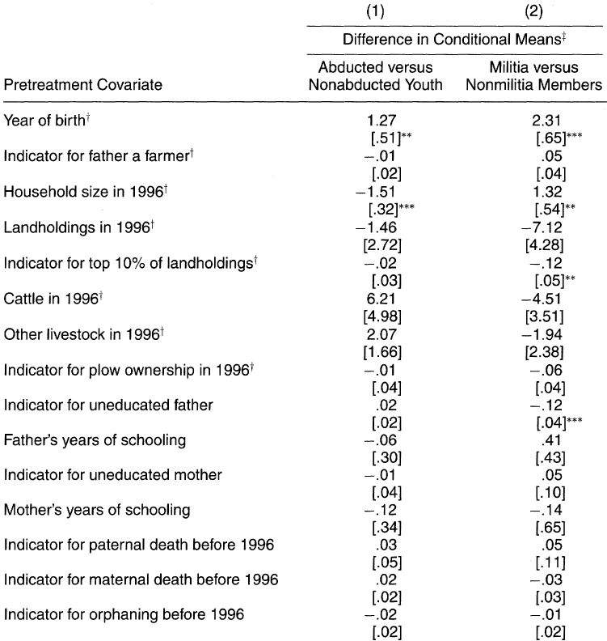
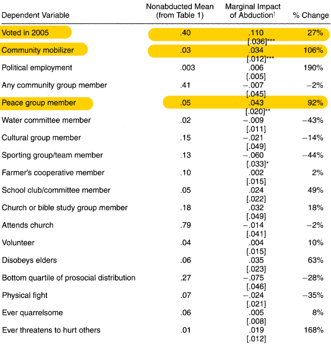
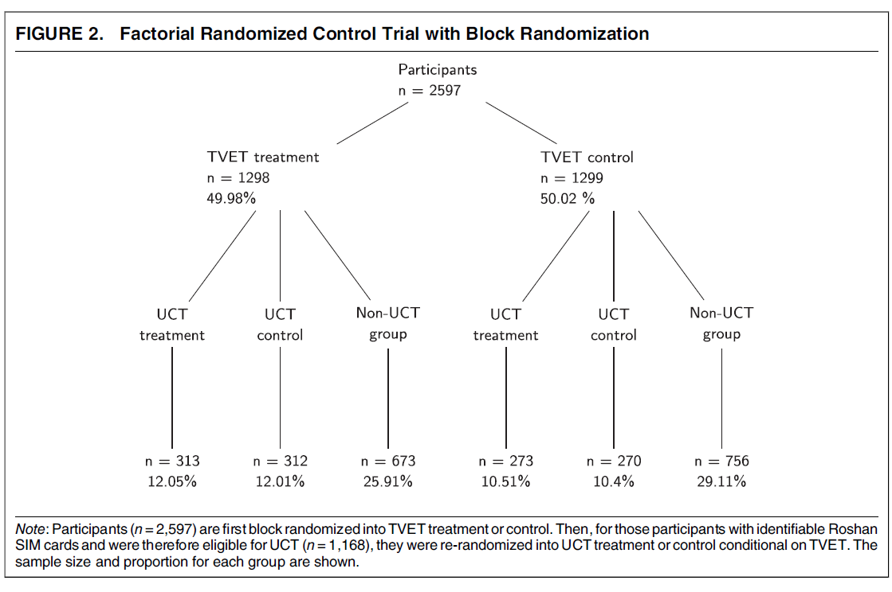
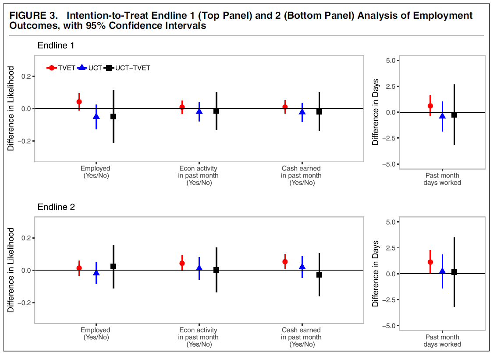
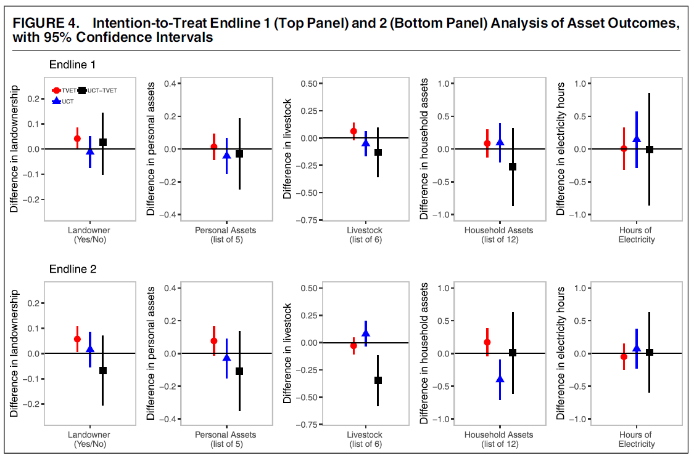
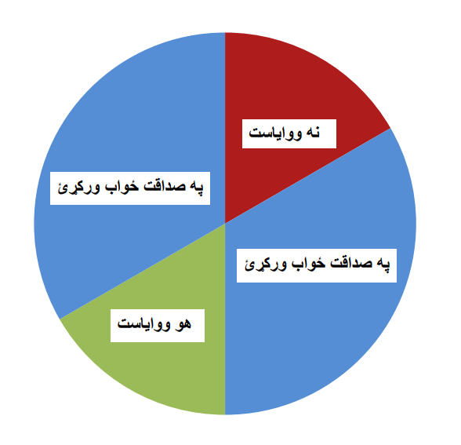
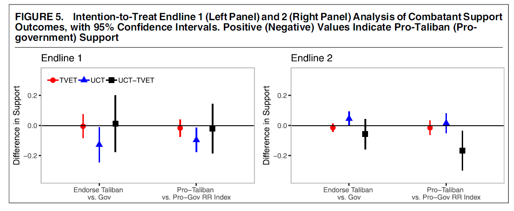

```{r setup, include = FALSE, warning = FALSE}
# Loads knitr and xaringan themer settings
source("theme.R")
```

```{r other-options}
library(tidyverse)
library(kableExtra)
library(fontawesome)

# ggplot global options
theme_set(theme_bw(base_size = 20))
```

## Violence and its Legacies

- Violence can be a problem in two ways

--

- **Post-conflict legacies:**

    - Can amplify other challenges to democracy `(corruption, clientelism, poverty, inequality)`

    - But we discussed how it can also be an opportunity to develop through reconstruction
    
- **Current violence:**

      - International conflicts always involve at least one non-democracy `(democratic peace)`
      
      - Civil conflict betrays democratic problem-solving
      
      - Violence enable by lack of state capacity undermines trust in democratic institutions 
      
---

## Solutions

- **Background:** Post-conflict settings can help or hurt democracy and development

--

- Further our understand on what explains pro-democratic attitudes `(Blattman 2009)`

- Reduce support for insurgent groups `(Lyall et al 2020)`

- Increase trust in democratic systems `(Wilke 2021)`

---

## Blattman 2009: Abductions and political participation

- Forced conscription in northern Uganda

---
## You probably remember this

.center[
<iframe width="660" height="415" src="https://www.youtube.com/embed/vrva2aKW1lU" title="YouTube video player" frameborder="0" allow="accelerometer; autoplay; clipboard-write; encrypted-media; gyroscope; picture-in-picture" allowfullscreen></iframe>
]

.footnote[**Source:** https://youtu.be/vrva2aKW1lU]

---

## Blattman 2009: Abductions and political participation

- Forced conscription in northern Uganda

--

- Sample of 881 *surviving* youth `(Why surviving?)`

--

- 741 interviewed, 462 abducted, 279 non-abducted

- Compare political participation between groups

--

- **Problem:** Abducted and non-abducted are different kinds of people

--

- **Solution:** "Abduction targets tended to be unplanned and arbitrary..." (p. 235)

- So, in this case, abductions look like a **quasi-experiment** `(exogenous treatment)`

- **How do you know you have a quasi-experiment?**

---
## Justifying a quasi-experiment

.pull-left[
```{r, out.width = "90%"}

```
]

.pull-right[
- **Quasi-experiment:** Data looks like an experiment even though it is not

{{content}}
]

--

- Abducted are older and come from smaller households

{{content}}

--

- Groups look similar in other factors, including those that relate to voluntary conscription

{{content}}

--

- If intervention is **exogenous** then treatment and control groups should be similar `(still have to make a case for exogeneity)`

---
## Results

.pull-left[
```{r, out.width = "90%"}

```
]

--

.pull-right[
- Abductees vote more often, and participate in CSOs more often

- Yet they do not engage in non-political participation more often `(so it's a concerted effort)`

{{content}}
]

--

- **Why?**

{{content}}

--

- Mobilization by Elites or NGOs `r fa("fas fa-ban")`
- Differential costs `r fa("fas fa-ban")`
- Pro-social behavior `r fa("fas fa-ban")`
- Augmented information `r fa("fas fa-ban")`
- Exposure to violence `r fa("fas fa-check")`

---
## Lyal et al (2020): Support for insurgent groups

--

- **Intrastate conflict:** People support combatant (often non-state groups) because they play the role the state is unable to perform

- Giving people aid is one way to win hearts and minds and faciliate state-building and democratization/consolidation

--

- Training + cash transfers RCT in Kandahar, Afghanistan

- **Endline 1:** Two weeks after transfer

- **Endline 2:** Eight months later

--

- **Argument:** Program creates employment and income opportunities that help people in distancing themselves from the Taliban

---

## Research design

.center[
```{r, out.width = "70%"}

```
]

---
## Results: Employment

.center[
```{r, out.width = "65%"}

```
]

---
## Results: Assets

.center[
```{r, out.width = "70%"}

```
]

---
## Measuring support for the Taliban

- **Problem:** People may give honest answer in a survey

- If they **support the Taliban** they may get in trouble by saying so publicly

- If they **support the government** they may risk retaliation

--

- Two ways to ask this question indirectly

--

- **Endorsement experiment**

- **Randomized response**

---
## Endorsement experiment

1. It has recently been suggested by **[GROUP]** that expensive new religious schools be constructed in every district to help provide more opportunities to attend religious schools. **Do you oppose or support such a policy, or are you indifferent to this policy? Do you strongly or only somewhat oppose/support?**

2. ... that the weak Independent Election Commission (IEC) be strengthened to prevent election fraud.

3. ... that the weak Office of Oversight for Anti-Corruption be strengthened by allowing it to collect information about government officials suspected of wrong-doing.

4. ...  has recently endorsed calls to remove former mujahedin (guerrilla fighters) from high-ranking government positions.

--

- **[Group]** randomly appears as **Armed Opposition Group** or **Government of Afghanistan**

- This gives an **indirect measure** of support for each group

---
## Randomized response

.pull-left[
For these next questions, Im going to ask about you and the current war. For each question, I want you to answer "yes" or "no" using this spinner and considering where the spinner lands. Do not show me or tell me where the spinner lands. This is neither a game nor gambling.

{{content}}
]

.pull-right[

```{r, out.width = "100%"}

```
]

--

I want you for each question to spin the spinner twice while my back is turned to you. Remember what you received from the first spin. If, for the first spin, the spinner arrow lands on the red area, just tell me "no" to the question I ask. If the spinner arrow lands on the green area, just tell me "yes" to the question I ask. But if the spinner arrow from the first spin lands on either blue area, tell me your true answer to the question.


---
## Results: Support for the Taliban

.center[
```{r, out.width = "70%"}

```
]

--


- Program had (at best) modest impact on employment and assets

- Short-term decrease in support for Taliban in **UCT-only** condition

- Long-term decrease in support for Taliban in **TVET + UCT** condition

--

- **Why?**
--
 Signal of government responsiveness!
 
---
## Wilke (2021): Mob vigilantism

.center[
```{r, out.width = "100%"}

```
]

---
class: inverse

## Takeaways

- Violence and its legacies can promote pro-democracy attitudes and behaviors `(sometimes)`

- An outstanding challenge is that conflict affected states cannot perform all the duties to sustain democracy

- This means insurgent groups or people themselves can fill in, which further undermines democratization/consolidation

- Well-designed foreign aid interventions can win hearts and minds

- Investing in state capacity shapes attitudes toward ineffective state institutions

- Both can help in enabling democracy

