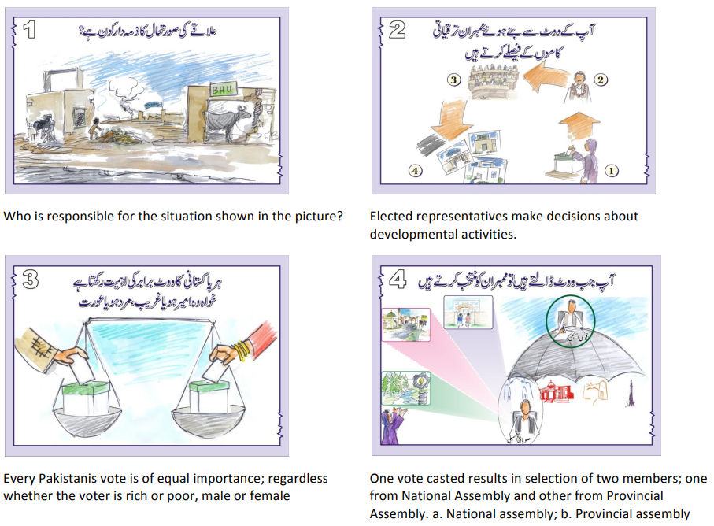
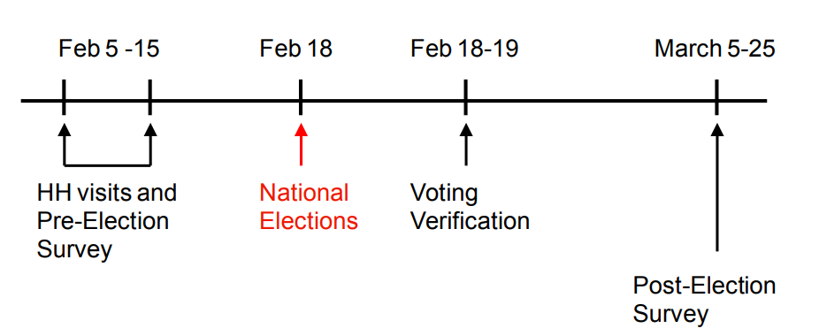

```{r setup, include = FALSE, warning = FALSE}
# Loads knitr and xaringan themer settings
source("theme.R")
```

```{r other-options}
library(tidyverse)
library(kableExtra)
library(fontawesome)

# ggplot global options
theme_set(theme_bw(base_size = 20))
```

## The problem

- Top-down interventions to promote representation are hit or miss `(quotas, reserved seats)`

- Hard to distinguish real inclusion and empowerment from token representation

- Prioritizing some groups harms others and obscures intersectionality

--

- **Alternative:** Bottom-up solutions

    - Promote participation among women `(Giné and Mansuri 2018)`
    
    - Promote intergroup contact `(Conroy-Krutz & Moehler 2015)`
    
---

## Giné and Mansuri 2018: Promote female voting

.pull-left[
- **Problem:** The interest of women are not represented because in many contexts women do not vote

- **Challenge:** Just making them vote is not enough, they may be forced to vote a certain way

{{content}}

]

--

- Door-to-door nonpartisan information campaign before 2008 national elections in Pakistan

- **Message:** Importance of voting and secret ballot `(female canvassers only)`

--

.pull-right[
```{r, out.width = "100%"}

```
]

---

## Research design

.pull-left[

```{r}
data.frame(
  Group = c("T1", "T2", "C"),
  Treatment = c("Voting", "Voting + secret ballot", "Control"),
  Clusters = c(30, 27, 10)
) %>% 
  kbl()
```

]

--

.pull-right[
- Assign treatments to clusters within villages/polling stations

- Survey every fourth household in each cluster

- Leave **gap clusters** around each treated cluster `(Why?)`

- 2,637 women, 991 households
]

--
.pull-left[
```{r, out.width = "100%"}

```
]

--
.pull-right[
- **Outcomes:**

    - Female turnout
    - Candidate choice
]

---
## Results: Female turnout

.center[
```{r, out.width = "90%"}
fem_turnout = data.frame(
  Condition = rep(c("Control", "Voting", "Voting +\nsecret ballot"), 2),
  turnout = c(0.523*100, (0.523 + 0.088)*100, (0.523 + 0.125)*100,
              0.523*100, (0.523 + 0.094)*100, (0.523 + 0.113)*100),
  type = c(rep("Targeted", 3), rep("Untargeted", 3))
)

ggplot(fem_turnout) +
  aes(x = Condition, y = turnout) +
  geom_col() +
  labs(y = "% female turnout") +
  facet_wrap(~ type) +
  theme_xaringan()
```
]

---
## Results: Spillovers beyond clusters

.center[
```{r, out.width = "90%"}
spill = data.frame(
  id = 1:6,
  coef = c(0.005, 0.008, 0.006, 0.005, 0.004, 0.001)*100,
  sd = c(0.002, 0.002, 0.002, 0.003, 0.003, 0.003)*100
) %>% 
  mutate(lo = coef - 1.96*sd,
         hi = coef + 1.96*sd)

ggplot(spill) +
  aes(x = id, y = coef) +
  labs(x = "Number of treated women within radius (km)",
       y = "Effect on % female turnout") +
  geom_hline(yintercept = 0, linetype = "dashed") +
  geom_point(size = 4) +
  geom_linerange(aes(x = id, ymin = lo, ymax = hi), size = 2, color = "#336666") +
  scale_x_continuous(breaks = 1:6,
                     labels = c("0-200", "200-400", "400-600", "600-800", "800-1000", "1000-1200")) +
  theme_xaringan()
```
]

---
## Results: Cross-referencing self-reported vote

<!-- Numbers are super high but that is because they think women are over-reporting voting for PPPP incumbent party -->

```{r, out.width = "90%"}
crossref = data.frame(
  Condition = rep(c("Control", "Voting", "Voting +\nsecret ballot"), 2),
  turnout = c(0.983, 0.983 - 0.028, 0.983 - 0.010,
              0.983 - 0.034, 0.983 - 0.066, 0.983 - 0.072) * 100,
  type = c(rep("Another woman", 3), rep("Male head", 3))
)

ggplot(crossref) +
  aes(x = Condition, y = turnout) +
  geom_col() +
  labs(y = "% guessing target\nfemale vote correctly") +
  coord_cartesian(ylim = c(80, 100)) +
  facet_wrap(~ type) +
  theme_xaringan()
```

