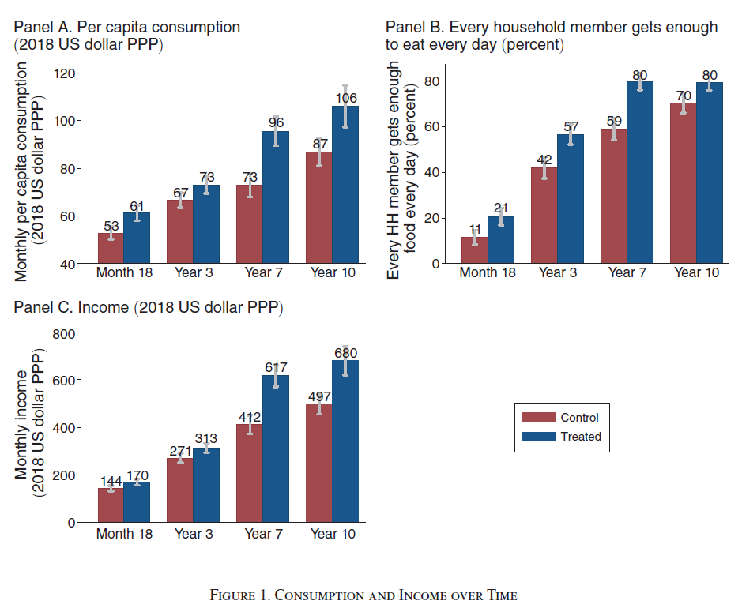
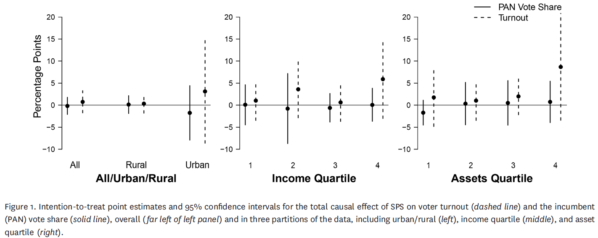
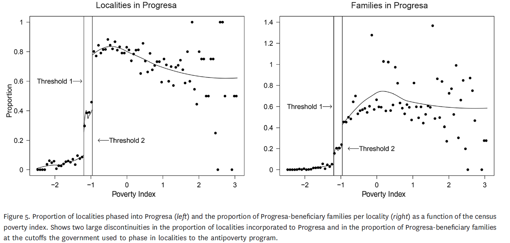
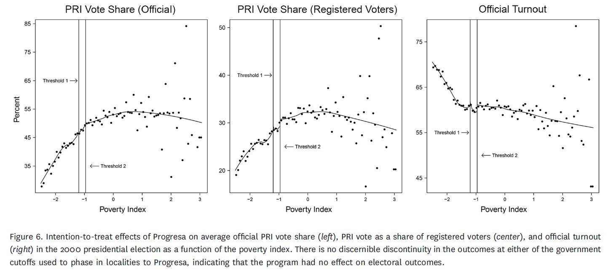

```{r setup, include = FALSE, warning = FALSE}
# Loads knitr and xaringan themer settings
source("theme.R")
```

```{r other-options}
library(tidyverse)
library(kableExtra)
library(fontawesome)

# ggplot global options
theme_set(theme_bw(base_size = 20))
```

## Banarjee, Duflo, and Sharma (2021): Targetting the Ultra Poor

- **Problem:** Poor people do not have money

- **Solution:** Give them money

--

- It doesn't work! People use the money and then remain poor

- We need a "big push" to break poverty trap

--

- Push: Asset transfer, consumption support, savings, training `(multifaceted program)` 

--

- **Challenge:** We know that people are better off in the short term, but hard to tell if this helps in the long run

---

## Research design

--

- Poorest villages in West Bengal, India

- Household eligibility criteria: 

    1. Able-bodied female member `(why?)`
    2. No credit access
    
- **AND** at least three out of

    1. Below 0.2 acres of land `(about 2 basketball courts)`
    2. No productive assets
    3. No able-bodied male member
    4. Kids who work instead of going to school
    5. No formal source of income
    
- 978 eligible, 514 **assigned** to treatment, 266 **accepted** treatment

    - What is the treatment?
    - Why would someone reject?
    
- Track economic and health outcomes after 18 months, 3, 7, 10 years


---
## Results

.center[
```{r, out.width = "80%"}

```
]

---
## Why does it work?

```{r}
tup_tab = data.frame(
  Time = c("18 months", "3 years", "7 years", "10 years"),
  Livestock = c(10.26, 7.68, 27.26, 16.71),
  Micro = c(7.93, 25.12, 67.59, 36.82),
  Self = c(18.67, 31.06, 108.36, 93.87),
  Remittances = c(0.00, 3.70, 8.87, 19.06)
)

colnames(tup_tab) = c("Time", "Livestock", "Micro-enterprise", "Self-employment", "Remittances")

tup_tab %>% 
  kbl(caption = "Difference in means between treatment and control groups")
```


.footnote[**Note:** See Table 3 in the paper for complete results]

--

- People learn to diversify their economic activity over time!

---
## Imai, King, Velasco (2020): Nonpartisan programmatic policies

- We want money to go tho those who need it most

--

- **Problem:** Governments can instead give to those they deem useful `(e.g. in exchange of votes)`

--

- **Solution:** Focus on *programmatic* policies `(i.e. non-partisan)`

--

- **Challenge:** People can still reward governments for policies they do not have discretion on `("attribute responsibility when none exists")`

--

- Evaluate two large scale programs in Mexico

---

## Program 1: *Seguro Popular de Salud*

--
- Universal health insurance $\approx$ Medicaid

- 13 out of 31 states, 7,078 health clusters matched in pairs

- Select 74 pairs, 148 clusters, 1,380 localities, 118,569 households, 534,457 individuals

- Randomly assign treatment to one pair within a cluster

- **Treatment:** Improved facilities, program advertising, enrollment in the program

- 57 out of 74 pairs had endline survey

- The program worked in terms of delivering health insurance and improving people's health

- President wanted to prove that the program would not benefit his party in the next election

---

## Program 1 results

.center[
```{r, out.width = "100%"}

```
]

--

- **Intention-to-treat:**
--
 Effect of *assigning* treatment `(even if not received)`
 
--

- Additional results show that SPS does not seem to change beliefs on the country's economic, political, and social situation

---

## Program 2: PROGRESA

--

- **Conditional** cash transfers `(why conditional?)`

- Average US$35 per month

- 506 rural localities across 7 states

- **Staggered implementation:** 320 randomly selected villages receive the program by 1997, 186 villages receive the program by 1999

- Program improved education, health, and nutrition outcomes among enrolled children

--

- **BUT** election was in July 2000. Not a clear treatment-control comparison to evaluate effect on voting

--

- Instead, leverage a **natural experiment** based on how localities were enrolled in the program

---

## PROGRESA natural experiment

.center[
```{r, out.width = "90%"}

```
]

--

- Implementers prioritized enrolling eligible people in poorest areas first, creating two discontinuities

- This is a **natural experiment** because the researchers did not have direct control on the treatment assignment

---
## PROGRESA regression discontinuity

.center[
```{r, out.width = "100%"}

```
]

- **RDD:** Treatment effect *identified* at the thresholds

- Localities around cutoffs are the same except for being in treatment or control

- If there was an effect, we would see jumps around the discontinuities

---

## Discussion

- What program seems more feasible to overcome poverty and inequality? `(TUP, SPS, CCT)`

- Would a bigger program like TUP be susceptible to partisan electoral effects?

- Under what circumstances should we be worried about politicians trying to take advantage of poverty alleviation efforts?

- Why did **Imai et al (2020)** have to use so many complicated methods?
