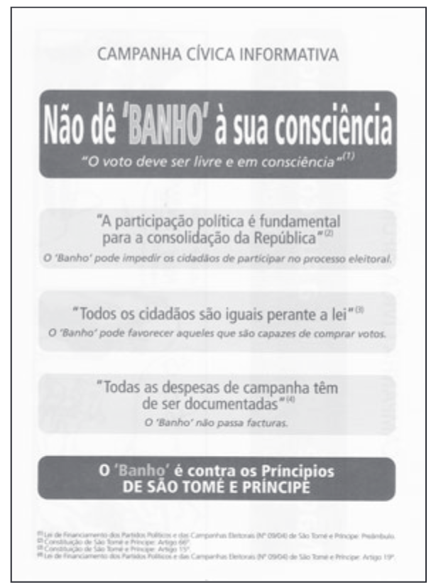
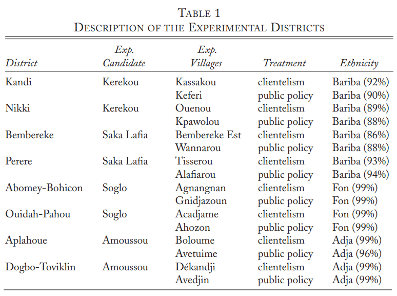
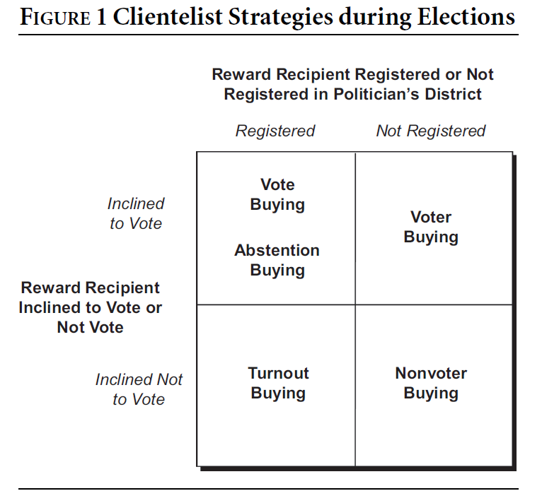
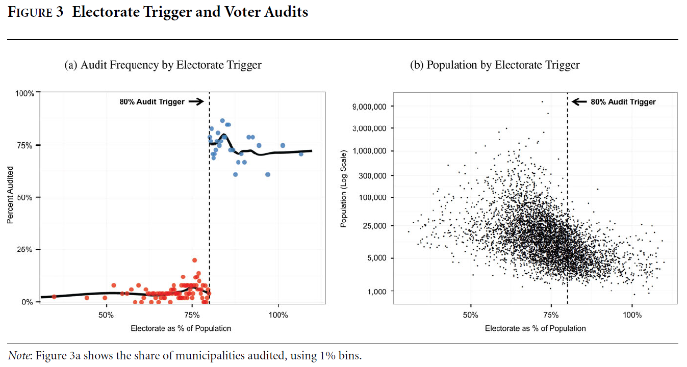
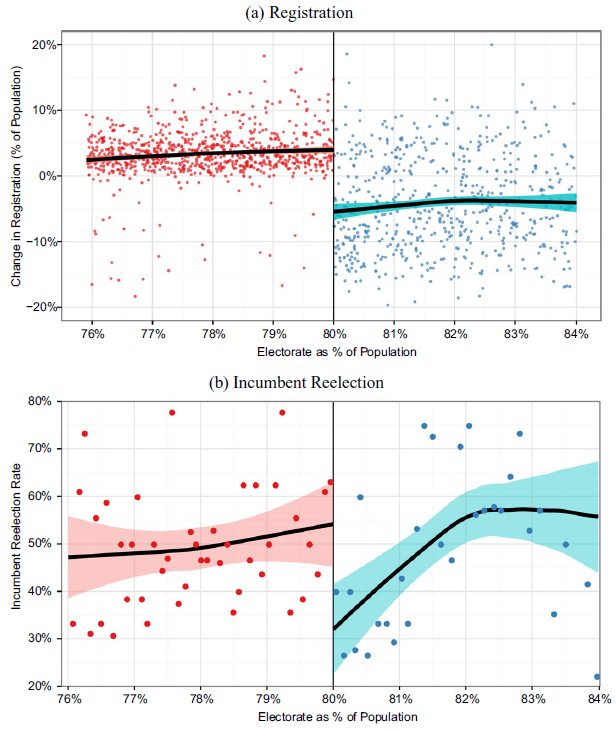

```{r setup, include = FALSE, warning = FALSE}
# Loads knitr and xaringan themer settings
source("theme.R")
```

```{r other-options}
library(tidyverse)
library(kableExtra)
library(fontawesome)

# ggplot global options
theme_set(theme_bw(base_size = 20))
```

## Is Clientelism a Problem?

--

- **Yes**, it conditions the provision of goods and services on electoral considerations

--

- Is that bad?

--

- **Yes:** We should prioritize helping those who need it the most, not those who would benefit us the most

--

- **No:** People get help they wouldn't get otherwise

--

- We should **thread carefully**

---

## Solutions to Curb Clientelism

1. Convince people that it is bad `(Vicente 2014)`

2. Convince politicians not to do it `(Wantchekon 2003)`

3. *Force* politicians not to do it `(Hidalgo and Nichter 2016)`

.footnote[**Note:** These are all men. Sorry!]

---

## Vicente (2014): Convince people

.pull-left[
- Voter education campaign in São Tomé and Príncipe right before the 2006 presidedntial election

- **Treatment:** Flyer reminding people that vote buying is illegal

- Sample 50 enumeration areas, 40 treated, 1,275 households pre-treatment, 1,034 households post-treatment

- **Outcomes:** Survey attitudes, election results, sending back a postcard

]

.pull-right[
.center[
```{r, out.width = "70%"}

```
]
]

---

## Voter education campaign results

- **Surveys:**

    - Less frequent vote-buying and lower value offers
    - Reduced perception that people vote according to money
    
--
    - **Is this real or just social desirability?**
    
--

- **Elections:**

    - 3-6% decrease in turnout
    - 4% increase in incumbent vote shares
    - 4% *decrease* in challenger vote shares
    
--
    - **Some people just voted because of money**
      - **Incumbent had more core supporters, challenger relied more on vote-buying**
    
--

- **Postcards:**

    - No effect
--
      - **Education campaign does not create demand for more accountability**
      - **Only changes voters' beliefs about vote buying**
    
---
## Wantchekon (2003): Convince politicians

- First round of March 2001 presidential election in Benin

- 4 leading candidates

    - 2 nothern, 2 southern
    - 2 national, 2 regional
    - 2 incumbent, 2 opposition
    
- Select 2 non-competitive districts per candidate

- **Treatment:** Convince candidates from four main parties to adopt campaign platforms

    - Purely clientelist (one village)
    - Purely public policy (one village)
    - Control (remaining villages)
    
- **Outcome:** Post-election survey asking who they voted for
    
.footnote[**Note:** Convincing presidential campaigns to alter their campaign message in randomly chosen places is **BONKERS**.]

---
## Campaign platform research design

.center[
```{r, out.width = "60%"}

```
]

---
## Campaign platform results

.center[
```{r, out.width = "90%"}
benin_tab = data.frame(
  Candidate = c("Northern", "Southern", "Incumbent", "Opposition", "Local", "National"),
  Public = c(32.2, 84.0, 69.3, 49.3, 38.5, 81.6),
  Clientelist = c(67.4, 89.0, 89.7, 68.1, 60.3, 96.8),
  Control = c(56.5, 74.1, 83.5, 50.9, 50.9, 83.5)
) %>% 
  pivot_longer(2:4, names_to = "Condition", values_to = "Vote")

benin_tab$Condition = fct_relevel(benin_tab$Condition, "Public", "Control", "Clientelist")

benin_tab$Candidate = fct_relevel(benin_tab$Candidate, 
                                  "Northern", "Southern", 
                                  "Incumbent", "Opposition",
                                  "Local", "National")

ggplot(benin_tab) +
  aes(x = Candidate, y = Vote, fill = Condition) +
  geom_col(position = "dodge2") +
  labs(y = "% Vote") +
  theme(legend.position = "bottom",
        legend.title = element_text(size = 15),
        axis.text.x = element_text(size = 15)) +
  theme_xaringan()
```
]

---
## Results explained

- Everyone benefits from a purely clientelist platform

- Public policy platforms are more credible when they come from parties in the South vs. North `(national opposition parties criticizing current government policy)`

- Public policy platforms do not hurt national parties `(because they reach a broader audience)`

- Public policy platforms do not hurt opposition parties, but they also benefit the most from clientelist appeals

- **Takeaway:** Politicians will be on board with curbing clientelism under very specific circumstances

---
## Hidalgo and Nichter (2016): Forcing politicians

.pull-left[
- 2008 municipal elections in Brazil

- **Voter buying:** Rewarding supporters to register and vote in other districts

- This is illegal, we can force politicians to stop by requiring voters to renew registration `(audit)`

- **Challenge:** Cannot feasibly audit $\approx$ 5,570 municipalities at the time

- **Opportunity:** Focusing on those with an unusually high proportion of registered voters creates a **natural experiment**
]

.pull-right[
.center[
```{r, out.width = "90%"}

```
]
]


---
## Natural experiment

.center[
```{r, out.width = "90%"}

```
]

---
## Natural experiment results

.pull-left[
.center[
```{r, out.width = "85%"}

```
]
]

.pull-right[

- Municipalities right **below** the audit threshold have $\approx$ 5% more registered voters

- Municipalities right **above** the threshold have $\approx$ 5% fewer registered voters

- Audits decrease the proportion of incumbent mayors winning reelection $(53-35 = 18\%)$

{{content}}

]

--

- Monitoring reduces voter-buying

- Since the practice is more common among incumbents, this makes elections more competitive

---

## Takeaways

- **Convincing people:** Hard to know if it works or people just pretend not to like clientelism

- **Convincing politicians:** Works *if* they benefit from it

- **Forcing politicians:** Works, but monitoring is costly and may not be politically feasible

- Also remember that eliminating clientelism can make poor people worse-off!

---
class: inverse center middle

# Enjoy Spring Break!