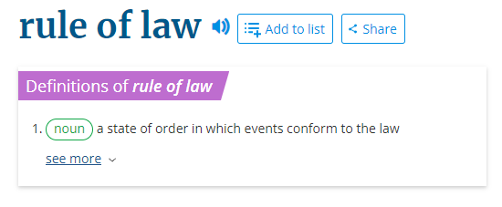
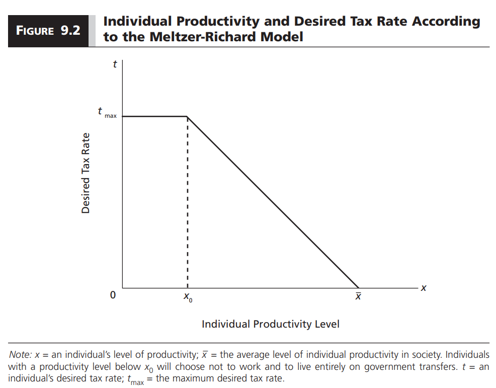
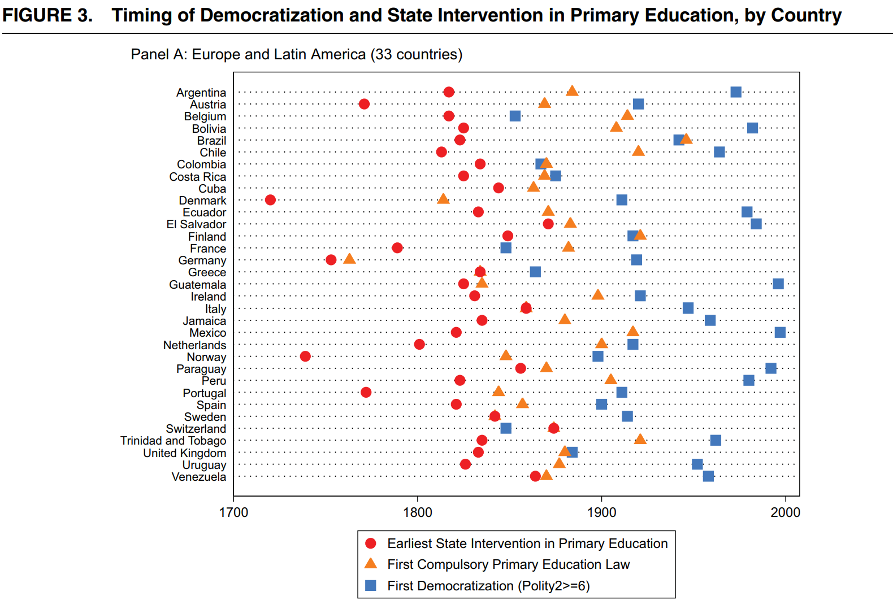

```{r setup, include=FALSE}
options(htmltools.dir.version = FALSE)

library(knitr)
opts_chunk$set(
  fig.width=9, fig.height=5, fig.retina=3,
  out.width = "100%",
  cache = FALSE,
  echo = FALSE,
  message = FALSE, 
  warning = FALSE,
  hiline = TRUE
)
```

```{r xaringan-themer, include=FALSE, warning=FALSE}
# In the future you want to move this to a separate file and source it every time you create a new file
library(xaringanthemer)
style_duo_accent(
  primary_color = "#336666",
  secondary_color = "#71C5E8",
  inverse_header_color = "#FFFFFF",
  background_color = "#EAE9EA",
  link_color = "#71C5E8",
  inverse_link_color = "#FFFFFF",
  # easy to fetch colors
  colors = c( 
    white = "#FFFFFF",
    green = "#336666",
    lblue = "#71C5E8"
    )
)
```

```{r other-options}
library(tidyverse)
library(kableExtra)
library(fontawesome)
library(democracyData) # various democracy scores. See dem_scores.R for a guide

# ggplot global options
theme_set(theme_bw(base_size = 20))
```

##  Prep Work

- Go to [gustavodiaz.org/wm](https://gustavodiaz.org/wm)

- Open the **Jamboard: "What is good about living in a democracy?"**

- Get ready to write!

---
## About me

- <https://pronoun.is/he>

- I study **comparative politics** and **research methods**

- Information, accountability, and representation

- **Ok to address me as**:

    - Prof. Diaz
    
    - Dr. Diaz
    
    - First name

.footnote[**Jamboard:** [gustavodiaz.org/wm](https://gustavodiaz.org/wm)]

---
class: center middle

# Jamboard

## What is good about living in a democracy?

[gustavodiaz.org/wm](https://gustavodiaz.org/wm)

---

## Two approaches

- **Deontological:** Is there anything intrinsically good about democracies?

- **Consequentialist:** Does democracy lead to good outcomes?

--

- **Today:** Focus on the **consequentialist** approach

---

## Background

```{r, cache = TRUE}
polity = download_polity_annual(verbose = FALSE)
```

```{r}
poli = polity %>% filter(year >= 1950 & year <= 2018) %>% 
  select(year, polity_annual_country, polity) %>% 
  mutate(dem = ifelse(polity >= 6, 1, 0),
         ano = ifelse(polity <= 5 & polity >= -5, 1, 0),
         aut = ifelse(polity <= -6, 1, 0)) %>% 
  group_by(year) %>% 
  summarize(Total = n(),
            Democracy = sum(dem, na.rm = TRUE),
            Anocracy = sum(ano, na.rm = TRUE),
            Autocracy = sum(aut, na.rm = TRUE)) %>% 
  pivot_longer(!year, names_to = "Group", values_to = "Count")

poli$Group = fct_relevel(poli$Group, "Total", "Democracy", "Anocracy", "Autocracy")

ggplot(poli) +
  aes(x = year, y = Count, shape = Group, color = Group) +
  geom_point(size = 2) + geom_line(size = 1) +
  labs(title = "Regime types over time (Polity)", x = "Year", y = "Count") +
  theme(legend.position = "bottom",
        plot.title = element_text(size = 20)) +
  theme_xaringan() 
```

---

## But is this a good thing?

- We live in a part of the world that values democracy and believes it makes people's lives better

--

- We also believe that dictatorships are bad because of their poor human rights record

--

- But protests against democratic governments are surprisingly common `(e.g. Chile 2019, Canada 2022)`

--

- So maybe democracy does not always deliver on its promise

---
## What we know

- **Normatively:** We believe that democracy leads to better outcomes

- **In theory:** We have reasons to believe it can go both ways

- **In practice:** Democracy is `sufficient` but `not necessary` to guarantee material well-being

---
## Theoretical explanations

**Do democracies produce higher economic growth?**

1. Property rights story

2. Dictatorial autonomy story

---
## 1. Property rights story

.center[
```{r, out.width = "80%"}
include_graphics("figs/8_proprights.png")
```
]

---

.center[
```{r, out.width = "80%"}

```
]

--

- Democracy generates good economic outcomes by creating a predictable legal environment, which is good for investment

--

- The empirical evidence for this argument is weak:

    - Rule of law **IS** linked with economic growth
    - But electoral democracy **IS NOT** associated with rule of law
    
---
## Some examples (Barro 2000)

```{r}
rol = data.frame(
  elect = c("High", "Low"),
  hi = c("Germany", "Singapore"),
  lo = c("Bolivia", "Afghanistan")
)

colnames(rol) = c("", "High", "Low")

rol %>% 
  kbl() %>% 
  add_header_above(c("", "Rule of law" = 2)) %>% 
  pack_rows("Electoral rights", 1, 2)
```

--

- We can find democracies and dictatorships with high and low electoral rights and rule of law

- Democracies are no more likely than dictatorships to guarantee property rights

---
## Why do democracies fail to protect property rights?

- To answer that, we need to take a step back

- What interests do governments pay attention to?

- Do incentives vary across regimes?

- For this, we need a model

---
## Meltzer-Richard model

- This is a model that explains variation in the **size of a government**

- By "size" we mean how much money they collect in taxes and redistribute

- We assume that more distribution imply governments working harder to ensure people's material well being

---
## Setup

- Everyone in society pays a portion $t$ of their income as tax

--

- Government distributes revenue equally across individuals

--

- Those with below-average income are **net recipients**

--

- Those with above-average income are **net contributors**

--

- **net recipients** are happy with the highest possible tax rate

--

- **net contributors** would prefer to pay no tax at all

--

- People in the middle are ok paying some taxes as long as they end up in the positive

---
## Visualizing preferences for taxation

.center[
```{r, out.width = "80%"}

```
]

---
## What does this mean for democracy vs dictatorship?

- The Meltzer-Richard model is about the distribution of preferences over taxation in a society

--

- We also need to know how governments choose what the tax rate will be

--

- **Democracy:** Governments care more about the preferences of those below average income

--

- **Dictatorship:** Governments care more about the preferences of those above average income

--

- If this is true, then the rich may not be willing to invest in a democracy as much as they would in a dictatorship `(keeping everything else the same)`

--

- From this point of view, democracy is bad for economic growth

---
## 2. Dictatorial autonomy story

--

.pull-left[
### Version I

- Dictators face less pressure from special interests

- No need for inefficient spending to satisfy different constituencies

- Easier to "convince" people to swallow the bitter pill
]

--

.pull-right[
### Version II

- Dictators face less pressure from special interests

- So they are free to predate, which discourages investment

- Regime can survive without promoting material well-being
]

---
class: inverse 

## In practice: A big assumption

- We have been talking about regimes and economic growth `(Usually in terms of GDP per capita)` 

--

- This is an **invalid** yet **reliable** measure of **development** and other forms of **material well-being**

--

- Implicitly, we assume that **economic growth is a necessary condition** for all other good things `(e.g. wages, healthcare, education, pensions, security, infrastructure, freedom)`

--

- Notice that a good economy is **necessary** but **not sufficient** for these things

---
class: inverse

## Necessary and sufficient conditions

- A **necessary** condition is one without which we would not observe the outcome, but that does not imply that it always produces the outcome

- A **sufficient** condition is one with which we would always observe the outcome, but there may be alternative causes

- Conditions can be either **necessary**, **sufficient**, or **both** at the same time

---
class: inverse

## Examples

- If democracy is **necessary** for material well-being:

--

    - All the countries that do well are democracies
    - Not all democracies do well
    
--
    
- If democracy is **sufficient**:

--

    - Not all countries that do well are democracies
    - All democracies do well
    
--
    
- If democracy is **necessary AND sufficient**:

--

    - All the countries that do well are democracies
    - All democracies do well
    
--

- The last example implies that democracy is the only path to material well-being

---
## Empirical evidence

.center[
```{r, out.width = "90%"}
include_graphics("figs/8_evidence_0.png")
```
]

---
count: false

## Empirical evidence

.center[
```{r, out.width = "90%"}
include_graphics("figs/8_evidence_1.png")
```
]

---
## Democracy is sufficient but not necessary

- The triangles of empty space suggest two things:

    1. All democracies have high material well-being
    2. Dictatorships can perform either way
    
--
    
- These are **low bar** indicators of well-being

- We should read these results as democracy being **sufficient** to guarantee **the most basic living conditions**

- These conditions are in turn **necessary** for more ambitious dimensions of well-being `(e.g. education, wages)`

- That still does not mean that democracy is **necessary**

---
## What does this all mean?

- Democracy is **sufficient** but not **necessary** for material well-being

- So we cannot just go and say that democracy **causes** material well-being

--

- Why not? **We tend to look at a fixed or limited point in time**

---
## Newer evidence

.center[
```{r, out.width="80%"}

```
]

.footnote[**Source:** Paglayan, Agustina S. 2021. "The Non-Democratic Roots of Mass Education: Evidence from 200 Years." *American Political Science Review* 115(1): 179-198]

---

## Non-democratic roots

- Most democracies extended universal primary education **before democratization**

- Universal primary education is a **higher bar** than infant mortality, life expectancy, etc

- So democracies appear to improve well-being, but the **relationship comes from the time they were dictatorships**


---
## Takeaways

- In theory, democracy may or may not improve material well-being

    1. Property rights story
    2. Dictatorial autonomy story
    
- In practice, all we know is that democracy is **sufficient** for material well-being

- But we have to make some **caveats**:

    - We are using very **low bars** to measure material well-being
    - Many of the improvements in democracies happened **before democratization**

- We keep going back to why rulers in either democracies or dictatorships would care about promoting material well-being to begin with

---
class: inverse center middle

# Thank you!

### Materials at:
### [gustavodiaz.org/wm](https://gustavodiaz.org/wm)


