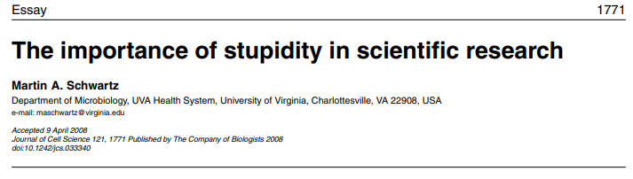
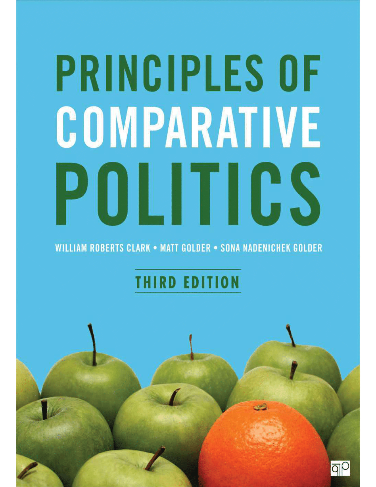
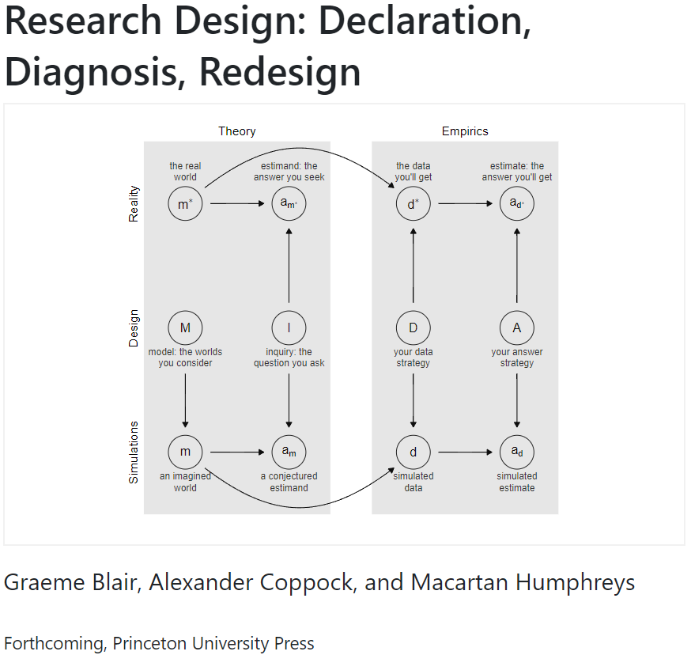

```{r setup, include=FALSE}
options(htmltools.dir.version = FALSE)

library(knitr)
opts_chunk$set(
  fig.width=9, fig.height=5, fig.retina=3,
  out.width = "100%",
  cache = FALSE,
  echo = FALSE,
  message = FALSE, 
  warning = FALSE,
  hiline = TRUE
)
```

```{r xaringan-themer, include=FALSE, warning=FALSE}
# In the future you want to move this to a separate file and source it every time you create a new file
library(xaringanthemer)
style_duo_accent(
  primary_color = "#336666",
  secondary_color = "#71C5E8",
  inverse_header_color = "#FFFFFF",
  background_color = "#EAE9EA",
  link_color = "#71C5E8",
  inverse_link_color = "#FFFFFF",
  # easy to fetch colors
  colors = c( 
    white = "#FFFFFF",
    green = "#336666",
    lblue = "#71C5E8"
    )
)
```

```{r other-options}
library(tidyverse)
library(kableExtra)
library(fontawesome)

# ggplot global options
theme_set(theme_bw(base_size = 20))
```

## About me

- PhD from UIUC Political Science

--

- Teaching Experience:

    - **Comparative:** Intro CP, politics of developing countries
    - **Methods:** Research design, statistics, game theory

--

- First generation scholar

--

- **Challenge:** Communicate both as a social scientist and a non-native English speaker

--

- **Teaching Philosophy:** CP and methods as **learning a language**

---
## The language of productive stupidity

.center[
```{r}

```
]

--

- **Science:** The quest of knowledge that relies on trying to prove ourselves wrong `(e.g.  null hypothesis testing)`

--

- Actively seeking opportunities to feel *productively* stupid

--

- **Goal:** Help students embrace productive stupidity and its tools

---
class: inverse center middle


# Portfolio

---

## Introduction to Comparative Politics

.pull-left[
```{r}

```
]

.pull-right[
{{content}}
]

--

- Flipped classroom during Fall 2021

{{content}}

--

- Focus on models to understand variation in political institution, behavior, public policies

{{content}}

--

- Origins, causes, consequences, and variation in regime types

{{content}}

--

- News reports applying material on a "region" of choice using any creative medium

{{content}}

--

- Podcasts, press releases, op-eds, front pages, infographics

---

## Research Methods

.pull-left[
```{r}

```
]

.pull-right[
{{content}}
]

--

- **Challenge:** Teach research design, statistics, and programming in one course

{{content}}

--

- **Solution:** Flip classroom. Put research design at the forefront

{{content}}

--

- Model $\rightarrow$ Inquiry $\rightarrow$ Data $\rightarrow$ Answer

{{content}}

--

- Complement with applications

{{content}}

--

- Problem sets + reaction papers

{{content}}

--

- Final pre-analysis plan or research note/poster

---

## The Politics of Developing Democracies

- Upper-division course

--

- Challenges that prevent democratic consolidation `(e.g. curbing corruption, overcoming poverty, legacies of violence)`

--

- Emphasis on evidence-informed policy solutions `(Mainly experiments and quasi-experiments)`

--

- **What works? Where? Why?**

--

- Leading discussion, reaction papers, policy briefs $\rightarrow$ Final paper

---

## Variants of this course

- **Regional focus:** Developing countries, Latin  America
    
- **Topics:** Development, accountability and representation, corruption, evidence-informed policy `(causal inference + data science)`
    
- **Methods:** Experiments `(general, field, surveys)`, quasi-experiments, machine learning, data management and visualization

---
class: inverse center middle

# Inclusive Classroom

---
## Principles

### Flexibility

### Accountability

---

## Principles

### Flexibility

--

- Design assignments to celebrate diversity

--

- Encourage unconventional forms of participation

--

- Spread workload

--

- Opportunities to be wrong

---

## Principles

### Accountability

--

- Stay on task

--

- Keep students on track and engaged

--

- Keep myself accountable

--

- Manage racism, sexism, other biases

---
class: inverse center middle

# Outside the classroom

---

## Mentoring and service

- Previous experience:

    - Use research assistance as an opportunity to teach/learn new methods
    
    - Assist with research design and data analysis in honor theses
    
    - Collective learning `(CSS reading group, methods sheets)`
    
--

- Goals:

    - Collaborative workflow
    
    - Contribute to the pipeline
    
    - Safety net
    
---

## Research and teaching

### Information, accountability, and representation

--

- Unintended consequences of investigating and exposing corruption:

    - Mayors try to prevent electoral backlash from corruption even when not connected to it
    
    - Corruption revelation creates more women candidates but not more women in office
    
--

- Connect broad theories with local level politics

- Think carefully about alternative explanations

---
## Research and teaching

### Quantitative methods

--

- Using design based causal inference and machine learning to improve research design:

    - Model selection approach to geographic spillovers
    
    - Detecting unexpected respondent behavior in double list experiments
    
--

- Stay updated with research designs, techniques, software

- Identify opportunities for innovative student projects

---
class: inverse center middle

# Thank you!

### Materials at:
### [gustavodiaz.org/wm](https://gustavodiaz.org/wm)


